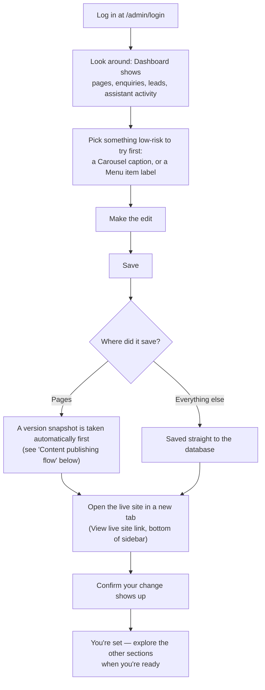
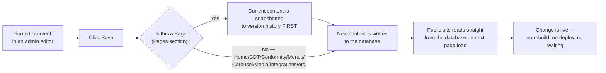

# OXOT Admin — User Manual

A plain-language guide for the OXOT content team: how to log in, what each section
of the admin studio does, and how to make a safe edit. No coding knowledge required.

**Cross-reference:** how the site is organized → `docs/SITEMAP.md`; how the data is
structured → `docs/DATA-MODEL.md`; local setup → `docs/LOCAL-DOCKER-SETUP.md`.

> Written by reading the actual admin code (`src/components/admin/admin-shell.tsx`
> and each manager component). The navigation order and section names below match
> what you see in the sidebar exactly.

---

## Getting in

Go to `/admin/login` on the site (e.g. `https://your-domain/admin/login` or
`http://localhost:3000/admin/login` locally) and sign in with your admin email and
password. Once in, the left sidebar (or the dropdown menu on mobile) lists every
section described below, in the same order they appear on screen.

At the bottom of the sidebar: **View live site** (opens the public site in a new
tab) and your account email with a **sign out** button.

---

## Onboarding — your first day

Tips for your first edit:
- Menus and Carousel captions are the lowest-risk place to practice — no publish
  step, no locale pairing required, easy to undo by typing the old text back.
  **Pages** is the one section with a true safety net (version history + restore),
  so it's also a safe place to experiment once you've read that section below.
- Always check both languages. Nearly everything on this site needs an English
  **and** a Dutch (NL) version — most editors have an EN/NL tab at the top.

---

## Content publishing flow (how an edit reaches the live site)

Every section in this admin saves straight to the database — there is no separate
"publish" button anywhere except inside **Pages**, where **Published** is a checkbox
on the page itself (draft vs published, see below). The moment you click Save,
the change is live: refresh the public page to see it. The one exception is the AI
assistant's *knowledge* of your content, which only updates when you click **Rebuild
now** in AI & Models (see that section).

---

## Dashboard

**What it controls:** nothing — it's read-only.
**What it shows:** KPI cards (published pages, insight articles, contact enquiries
with a "new" badge, assistant replies served, consent-gated visitor sessions,
embedded knowledge chunks) and a 14-day activity chart of enquiries vs. assistant
replies.
**Where it shows on the live site:** nowhere — this is your at-a-glance internal
view of how the site and assistant are performing.

---

## Home page (CRA landing content editor)

**What it controls:** every section of the CRA-readiness home page: the hero
(eyebrow, title, accent line, subtitle, badges, the "2026 reality" callout), the
intake section (eyebrow, title, intro, form heading/subtitle, the "you leave the
call with…" promise), the **departure board** (title, intro, axis date labels,
milestones, the three roads and their coloured segments, legend), the **roads
split** section (each of the three roads — self-declaration, type examination, full
QA — with its status callout and body text), **personas** (the five buyer-segment
cards: title, quote, "buys →" line, CTA), the **retainer** section (three phases,
the "reserved seat" tile, the digital-twin note), the **process strip** (the
numbered steps including the one that names Vincent), and the **final CTA**.

**Where it shows on the live site:** the public home page, `/en` and `/nl` —
this is the site's front door.

**Locale toggle:** the editor has **EN / NL** tabs at the top of the panel. Each
locale's content is completely independent — editing EN does not touch NL. You must
switch tabs and edit both if you want a change reflected in both languages.

**How to edit:**
1. Go to **Home page** in the sidebar.
2. Pick **EN** or **NL** at the top.
3. Edit any field — text boxes are grouped into labelled boxes (Hero, Intake
   section, Departure board, Roads split, Personas, Retainer, Process strip, Final
   CTA) that match the sections on the live page top to bottom.
4. Click **Save [EN/NL] CRA home page**. This overwrites the built-in default with
   your edit, for that locale only.
5. Open `/en` or `/nl` in a new tab to confirm.

**How changes reach the live site:** immediately — the home page reads this content
fresh on every request. No rebuild needed for the text itself. If you want the AI
assistant to know about your change when visitors ask it questions, run **Rebuild
now** in AI & Models afterward.

---

## Cyber Digital Twin

**What it controls:** the Cyber Digital Twin platform page — hero, stat band, the
"living model" seven-layer graph intro and bullet points, the BOMs (bills of
materials) intro, the consequence-analysis intro, the NOW/NEXT/NEVER prioritization
intro, the Monte Carlo intro, the methodology intro and its four steps (Assess →
Model → Improve → Sustain), the outcomes section, and the final CTA.

**Where it shows on the live site:** `/en/cyber-digital-twin` and
`/nl/cyber-digital-twin`.

**How to edit:** same EN/NL tab pattern as Home page. Note: only the top-level
intro/body text fields have dedicated input boxes here. The deeper structured data
(the seven graph layers, the individual BOM type cards, the drill-down table rows,
the consequence-analysis methods, the priority buckets, and the Monte Carlo
simulation bins) doesn't have its own input — it round-trips untouched every time
you save, so it's preserved even though you can't edit it from this screen.
**[UNVERIFIED]** whether a future update exposes those deeper fields; today, changing
them requires a code change.

---

## Conformity page

**What it controls:** the "four regulations, one evidence system" conformity
platform landing page — hero (title, subtitle, primary/secondary CTA, bullets), the
regulation "logo wall", stats, feature grid, the "problem" and "shift" narrative
sections, the before/after comparison, the "how it works" steps, a testimonial, an
FAQ, and the final CTA.

**Where it shows on the live site:** `/en/conformity` and `/nl/conformity`. This was
the site's original home page before the CRA-readiness page (above) took that slot;
it's preserved so nothing already published is lost.

**How to edit:** same EN/NL tab pattern as the other flagship-page editors.

---

## Approach page

**What it controls:** the legacy "industrial operations" / approach landing page
content (`site_blocks.home`).

**Where it shows on the live site:** `/en/industrial-operations` and
`/nl/industrial-operations`. Its entry was removed from the public menu when the
Approach page's content was merged into Cyber Digital Twin, but the page itself
still exists and is still editable here — nothing was deleted.

**How to edit:** same EN/NL tab pattern.

---

## Pages

**What it controls:** general-purpose pages and blog/insights articles — anything
not covered by the four flagship editors above (e.g. the contact page's body text,
one-off legal or informational pages, blog posts). Every page has a **slug**
(the URL segment), a **locale**, a **type** (page or article), a **title**, a rich
**body** (with a Markdown toggle for raw editing — code blocks let you embed `svg`
or `carousel` blocks), and SEO/social fields (meta title, meta description,
excerpt, OG image).

**Where it shows on the live site:** `/{locale}/{slug}` for pages;
`/{locale}/blog` lists everything with type "article".

### Draft vs. Published

Each page/locale row has a **Published** checkbox. Unpublished pages are drafts —
you can save and preview your work without it going live. **Publishing requires
both nl and en** to exist for that slug; the editor's help text reminds you of this.

### Version history + restore — the zero-loss safety net

Every time you save a page, the **previous** content is automatically snapshotted
to version history *before* the new content is written — so nothing you or a
colleague wrote is ever silently overwritten.

**How to use it:**
1. In the pages table, click the **history icon** (clock with a counter-clockwise
   arrow) next to any page/locale row.
2. A panel opens listing every saved version — number, state, an optional note,
   and the date/time.
3. Click **Preview** on any version to read its title and body on the right without
   changing anything live.
4. Click **Restore** to bring that version back. You'll be asked to confirm; the
   *current* content is snapshotted first (so restoring is itself non-destructive —
   you can always undo an accidental restore the same way).

This is also how AI translation is made safe: clicking the **translate** icon
(EN→NL or NL→EN) overwrites the target locale, but its prior content is saved to
version history first, exactly like any other save — so a bad machine translation
is always recoverable.

### The unsaved-changes guard

While you're editing a page, the admin tracks whether your current form differs
from what was last loaded or saved. If you have unsaved edits and try to:
- **load a different page** into the editor, or
- **close or refresh the browser tab**,

you'll get a confirmation prompt first, so you don't lose in-progress work by
accident.

### Adding a page to the navigation

At the bottom of the page editor, a **Navigation** box lets you add the page
currently open in the editor straight into the main menu — optionally nested under
an existing top-level menu item (so it appears in that item's dropdown). The page's
excerpt becomes the dropdown's description text. This is a shortcut for the full
**Menus** section below.

---

## Media

**What it controls:** the image and PDF library used across the site — page bodies,
the hero carousel, etc.

**How to use it:**
1. Click **Upload image or PDF**.
2. For an image, a crop/zoom/pan editor opens: pick an aspect ratio (16:9, 4:3, 1:1,
   3:4), drag to reposition, adjust zoom, add alt text, then **Crop & upload**. Images
   are converted to WebP automatically.
3. PDFs upload directly (no cropper).
4. Every uploaded item shows a **copy reference** button — `media:ID` for images,
   `pdf:ID` for PDFs. Paste that reference into a `carousel` code block in a page's
   Markdown body (see **Pages** above) to embed it.
5. **Delete** removes the file — a warning reminds you that any page or carousel
   slide using it will break, since nothing auto-detects usage.

**Where it shows on the live site:** wherever a page or the carousel references it.

---

## Carousel

**What it controls:** the hero carousel — the rotating slides that appear on the
**right side of the home page hero**.

**How to use it:**
1. Click **Add slide**, paste an image path or URL (or a `media:ID` reference
   copied from the Media library), optionally set EN and NL captions and a link
   URL, and choose whether it's active.
2. Existing slides can be reordered with the up/down arrows, edited in place
   (captions, link, active toggle), or deleted.
3. If there are no slides, or all are hidden, the homepage falls back to the
   shipped default hero deck — the hero never goes blank.

**Where it shows on the live site:** the home page hero, right-hand side, `/en`
and `/nl`.

---

## Menus

**What it controls:** the site's top navigation — **fully database-driven**, not
hardcoded. What you see here is exactly what visitors see in the header.

**How it works:**
- Each menu item has a **label**, an **href** (e.g. `/en/about`), an optional
  **parent** (giving it a **description** turns it into a dropdown/mega-menu
  panel entry), and a **position** (its order within its group).
- Items are grouped and edited **per locale** — EN and NL menus are entirely
  separate lists, shown as separate panels.

**How to:**
- **Add** — fill in the form at the bottom (locale, label, href, optional parent),
  click **Add**.
- **Rename** — edit the label field directly in the list; it saves when you click/
  tab away (on blur).
- **Reorder** — use the up/down arrow buttons next to an item; this only reorders
  within its current group (top-level items reorder among top-level items, children
  reorder among their siblings).
- **Nest** — use the **parent** dropdown on any item to move it under a top-level
  item, turning that parent into a dropdown menu. Choose "— top level —" to un-nest
  it.
- **Delete** — the trash icon; deleting a parent also deletes its children (you're
  asked to confirm).
- Add a short **description** to any item to have it show under the link inside a
  dropdown panel.

**Where it shows on the live site:** the header navigation on every page, both
locales.

---

## Enquiries

**What it controls:** general contact-form submissions (the site's contact page).

**What you can do:**
- Filter **All / New / Handled**, or search by name, email, or message text.
- Click an enquiry to see full details, the **linked chat transcript** if the
  visitor also talked to the AI assistant before submitting, and **similar
  inquiries** (found via vector similarity — useful for spotting a recurring
  question or issue).
- **Mark handled**, **Reply** (opens your email client with a pre-filled subject
  and marks it as responded), and add an internal **note** visible only to the
  admin team.
- A 30-day bar chart shows inquiry volume over time.

**Where it shows on the live site:** feeds from the public contact form.

---

## CRA Leads

**What it controls:** the CRA-readiness intake funnel — every lead who completed
the 45-minute-intake request form on the home page.

**Pipeline stages:** **New → Prospect → Customer → Lost**, set with one click per
lead in the detail panel.

**What's in a lead's detail view:**
- Contact info, segment (manufacturer / OEM / integrator / reseller / operator),
  locale, the page they submitted from, and timestamp.
- Their stated **blocker** (free-text pain point), if given.
- **Tags** — a free-form comma-separated list you can edit and save per lead.
- The **linked chat transcript**, if the visitor talked to the AI assistant during
  their session — shown as a message thread.
- **Similar leads** — other leads with related blockers/segments, found via vector
  similarity, so you can spot patterns across submissions.
- An internal **note** field.
- **Scheduling status** (none / offered / scheduled) — read-only here; it reflects
  what the visitor did with the calendar link, if one was configured (see Intake
  Settings below).
- **Mark handled** and **Reply** (opens your email client).

**Filtering:** by stage (with a live "New" count badge), by segment, or by search
text (name/email/role).

**KPIs + chart:** total leads, new, scheduled, customers, and a 30-day bar chart.

### Intake Settings card

A collapsible card at the top of CRA Leads controls how the intake funnel behaves:

- **Scheduling provider** — None / Cal.com / Calendly — and the **scheduling URL**
  to send leads to for booking their intake call.
- **Segment email autosend** — a toggle: when on, the matching segment's readiness
  PDF is emailed automatically the moment someone submits the intake form (rather
  than only being available for a human to send manually).
- **Segment PDF map** — one file path/ID per segment (manufacturer, OEM, integrator,
  reseller, operator) pointing at the readiness PDF that segment should receive.
- **Notify email** — the internal address that gets pinged whenever a new lead comes
  in.

**How the funnel actually works end to end** (form → admin → follow-up) is described
with the full sales-process detail in `docs/MARKETING-SALES.md` — this section is the
admin controls only.

---

## Newsletter & Social

Three tabs:

**Campaigns** — create, edit (drafts/scheduled/failed only — sent campaigns are
locked), schedule, and **send** email newsletters. Sending prompts you to confirm
("send to all confirmed [locale] subscribers?") and updates delivery/open counts
afterward. Delete removes a campaign entirely.

**Subscribers** — the newsletter subscriber list (email, status, locale, source,
confirmed/unsubscribed timestamps). Subscriptions come from the public newsletter
signup form and are double-opt-in (confirm/unsubscribe links land on
`/newsletter/confirmed` and `/newsletter/unsubscribed`).

**Social** — shows connection status for LinkedIn and X (configured in
**Integrations**, below) and a feed of recent social posts sent from the site
(success/failure, source, timestamp).

**Where it shows on the live site:** newsletters go out by email; social posts go
to your connected LinkedIn/X accounts; the subscribe form appears in the site
footer.

---

## Analytics

**What it controls:** nothing — read-only, first-party site analytics.

**What it shows:** page views, unique visitors, and outbound clicks over a
selectable range (7 / 30 / 90 days), a views-over-time chart, top pages, top
referrers, device breakdown, and top outbound link clicks.

**Where it shows on the live site:** nowhere — internal reporting, sourced from
first-party, consent-gated tracking (see `CLAUDE.md` §4 on behavioral signals).

---

## Affiliate & SEO

Manages outbound affiliate links (name, target URL, description, sponsored flag,
active toggle, keyword triggers per locale, click counts) plus an **AI Link
Insertion** tool that scans a page's Markdown body for keyword matches and suggests
where to insert an affiliate link automatically, so you don't have to manually find
every mention. Each affiliate link's public redirect goes through `/api/go/[id]`
(so clicks are counted), and its short link is copy-to-clipboard from the manager.

**Where it shows on the live site:** wherever a page body contains an inserted
affiliate link.

---

## AI & Models

**What it controls:** the AI visitor assistant's knowledge base, provider
connections, and which model handles each of its jobs.

### Assistant knowledge — "Rebuild now"

The assistant answers visitor questions using your **published** page content,
embedded into a searchable index (see `CLAUDE.md` §4 — pgvector retrieval). This
index does **not** update automatically when you edit content — you have to tell it
to refresh.

**How to use it:**
1. Click **Rebuild now**.
2. The rebuild **runs in the background** — it does not block your browser or time
   out. The button shows "Rebuilding…" and starts polling automatically.
3. **Refresh the page (or just wait) to watch the "Indexed passages" count climb**
   as it works through your published pages. A status line shows live progress
   ("Rebuilding… N page(s), M passage(s) so far").
4. When it finishes, the status turns into a completion message with final counts —
   or an error message if the embedding backend (Ollama or OpenRouter) couldn't be
   reached, in which case the *existing* index is left untouched (nothing is lost by
   a failed rebuild).

**When to run it:** after any bulk content change, after adding a new page you want
the assistant to know about, or after switching the embedding model/provider.

### Provider connections

Two cards, **Ollama (local)** and **OpenRouter (cloud)**:
- **Ollama** — set the host URL (e.g. `http://host.docker.internal:11434` locally),
  click the refresh icon to look up installed models, and set the shared chat model
  (one model serves every "role" when Ollama is the active provider — there's no
  per-role local model).
- **OpenRouter** — paste an API key (shown masked once saved, e.g. "••••ab12"; leave
  blank on future saves to keep the stored key). A key is required for the model
  catalog below, embeddings via OpenRouter, and web search.
- **Primary provider** — choose Ollama-first or OpenRouter-first; whichever isn't
  primary is the automatic fallback (per `CLAUDE.md` §2: "Ollama primary,
  OpenRouter automatic fallback" is the intended default).

### Model assignments

One dropdown per role (Chat, Brief, Translation, Long-context, Search) — each picks
the OpenRouter model used when a call resolves to OpenRouter. Below that, a
dedicated **Embeddings** box lets you set the embedding provider and model; the
**vector dimension is fixed** (shown as "1536 dims" — see
`docs/LOCAL-DOCKER-SETUP.md` for why) and cannot be changed here — the interface
explicitly warns that changing the embedding model still truncates to that fixed
dimension, and that you should click **Rebuild now** afterward.

### API-key field behaviour

Secret fields (the OpenRouter key, SMTP password, OAuth client secrets, etc.,
across this page and Integrations) never display the stored value again — once
saved you see a masked confirmation (e.g. last 4 characters) instead of a text box
with the real value. Leaving the field blank on a later save **keeps** the existing
stored value; typing a new value **replaces** it. A separate "Clear stored key"
action removes it entirely (falling back to any `.env` value, if present).

---

## Integrations

**What it controls:** outbound email, LinkedIn, and X (Twitter) connections.

**Email** — SMTP password auth (host/port/username/password) or Gmail OAuth2. Each
has an in-app **setup guide** (click the "?" style guide button) walking through
exactly what to configure on the provider's side, including the redirect URI to
whitelist (with a copy button). A **connection health badge** (Connected / Not
configured / Error / Disabled) and recent success/failure counts are shown live. A
**"Send a test email"** field lets you verify delivery without leaving the page.

**LinkedIn** — OAuth connect flow (Client ID/Secret → Connect LinkedIn → authorized),
Author URN (who posts appear as), auto-publish toggle, a **Test connection** button,
and a **Company/profile URL** field.

**X** — API key/secret + access token/secret (OAuth 1.0a), username, auto-publish
toggle, and a **Test connection** button.

**Important:** the socials shown on the public site's footer and "Follow Along"
section are **not hardcoded** — they come from the **Company/profile URL** (LinkedIn)
and **username** (X) fields set here. Update them here, not in code.

An **Activity** feed at the bottom of the page shows recent connection tests, sends,
and shares across all three integrations, filterable by type.

---

## Troubleshooting

**"I edited but don't see it on the live site."**
Refresh the public page (hard refresh if your browser cached it). Every editor here
except Pages writes straight to the database and is live immediately — there's no
deploy step. If you edited a **draft** Page, remember unpublished pages don't show
on the live site until **Published** is checked (and both locales exist).

**"I lost content."**
For **Pages**, open the **history icon** next to that page/locale and restore the
version you need — every save is snapshotted first, so nothing is truly gone (see
**Pages → Version history + restore** above). Other sections (Home page, CDT,
Conformity, Approach, Menus, Carousel, Media, Integrations) don't currently have a
version history — be deliberate before overwriting text there, and consider keeping
your own copy of long-form content while editing.

**"The assistant doesn't know about my new page."**
Go to **AI & Models** and click **Rebuild now**. The assistant only knows what's in
its search index, which only updates when a rebuild runs (see **AI & Models**
above). Give it a minute — it runs in the background — then refresh to check the
passage count went up.
