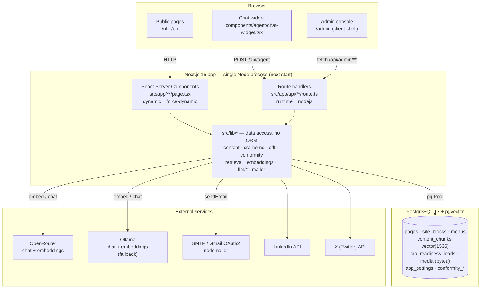
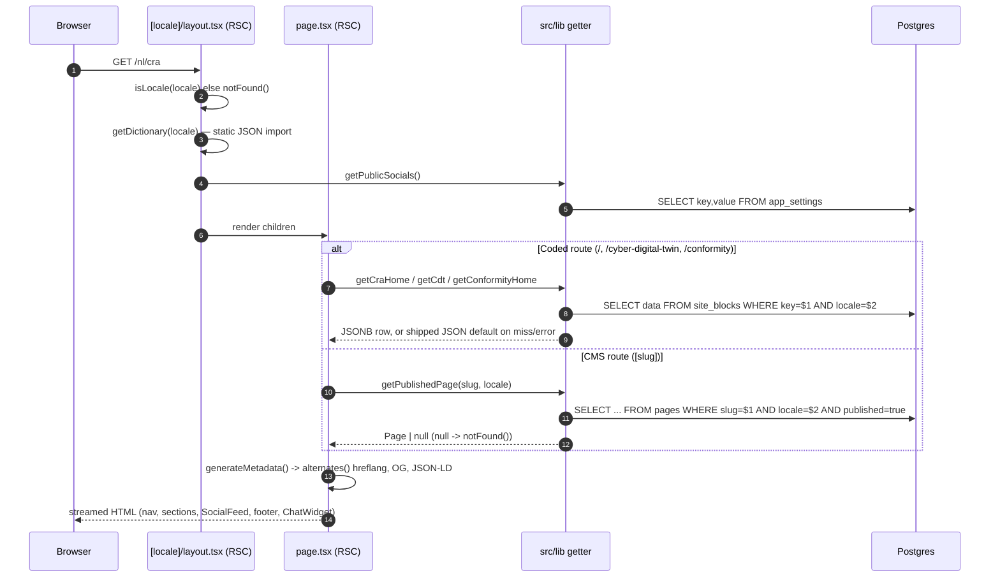
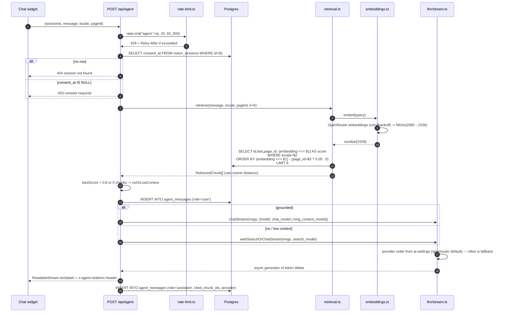
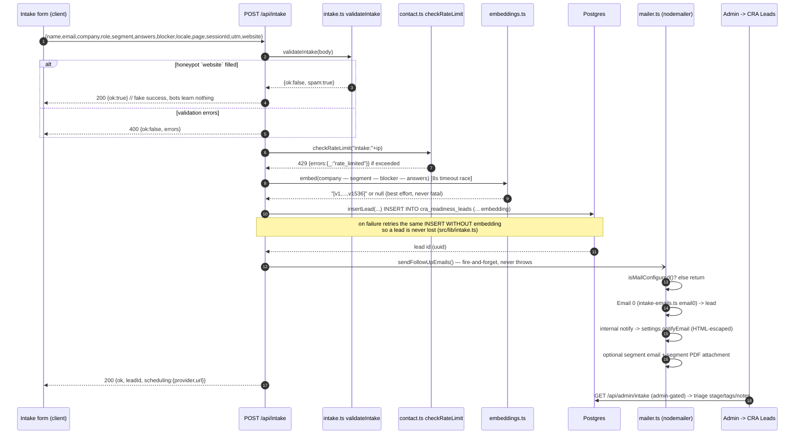
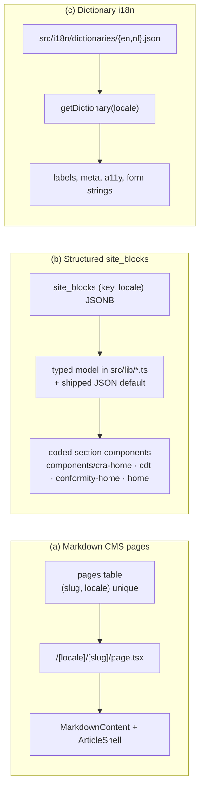
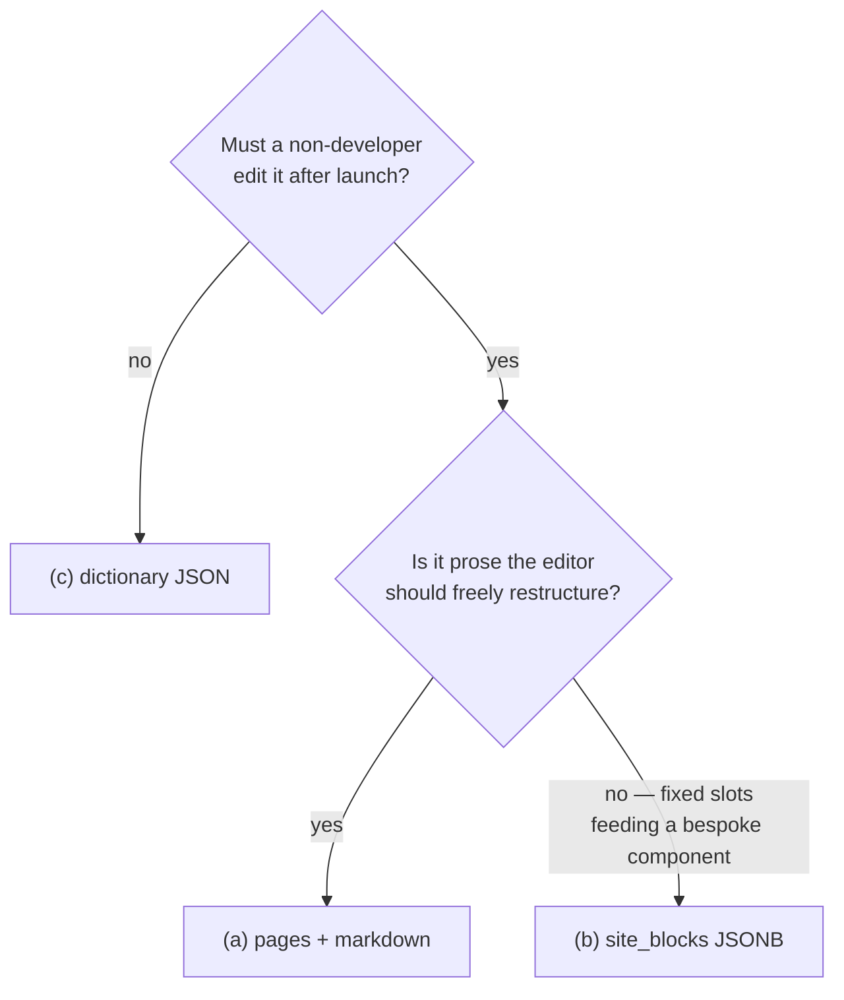
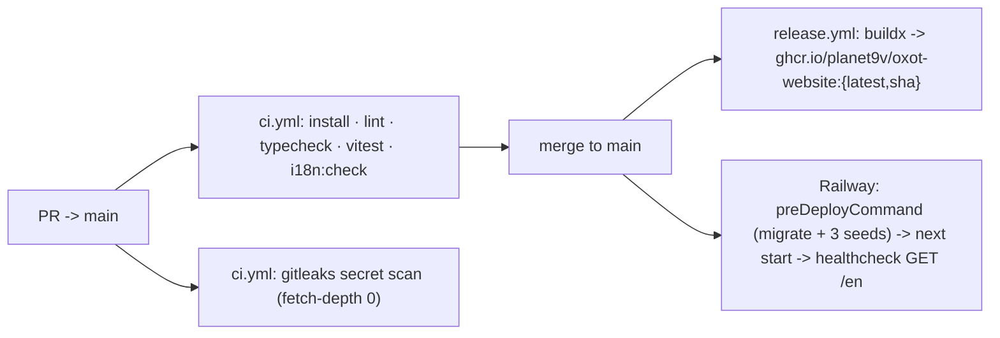

# OXOT Website — Architecture

**Repo:** `Planet9v/OXOT-Website-JULY2026` · **Runtime:** Docker (dev) / Railway (prod)
**Binding rules:** `CLAUDE.md` §1 (Karpathy). On conflict, `CLAUDE.md` wins over this document.

> Every claim in this document is traced to a file in the repository. Where a
> statement could not be verified from code, it is explicitly marked
> **[UNVERIFIED]**.

---

## 1. What the system is

OXOT is a Dutch operational-technology (OT) cybersecurity consultancy. This
repository is the company's public website plus its back office. It is a single
Next.js application that does four distinct jobs:

| Job | Where it lives | Notes |
|---|---|---|
| **Bilingual marketing site** (nl + en) | `src/app/[locale]/**` | Locale-prefixed routing, no un-prefixed public pages. |
| **Conformity / frameworks content hub** | `src/app/[locale]/conformity-platform/**`, `src/lib/conformity.ts` | Regulation, requirement, theme and coverage-matrix views backed by dedicated `conformity_*` tables. |
| **Admin CMS + back office** | `src/app/admin/**`, `src/app/api/admin/**`, `src/components/admin/**` | Pages, menus, media, carousel, SEO, AI settings, integrations, newsletters, analytics, CRA leads. |
| **CRA lead-intake funnel + AI assistant** | `src/app/api/intake/route.ts`, `src/app/api/agent/route.ts` | Segment-based lead capture with fire-and-forget email; pgvector-grounded chat assistant. |

The front door (`/[locale]`, `src/app/[locale]/page.tsx`) is the **CRA readiness
landing page** — a coded, DB-editable page whose content model is
`src/lib/cra-home.ts`. The previous conformity landing page is preserved
verbatim at `/[locale]/conformity` (see the "PHASE C ZERO-LOSS PRESERVE" comment
at the top of `src/app/[locale]/conformity/page.tsx`).

---

## 2. Stack

Versions below are read directly from `package.json` (semver ranges as declared).

### Runtime & framework

| Component | Version | Source |
|---|---|---|
| Next.js (App Router) | `^15.3.0` | `package.json` |
| React / React DOM | `^19.0.0` | `package.json` |
| TypeScript | `^5.7.2` | `package.json` (devDependency) |
| Node | `22` | `Dockerfile` (`node:22-bookworm-slim`), `.github/workflows/ci.yml` |

### UI

| Component | Version | Source |
|---|---|---|
| Tailwind CSS | `^3.4.17` | `package.json` |
| `tailwindcss-animate` | `^1.0.7` | `package.json` |
| shadcn/ui (config, not a package) | style `default`, RSC `true`, CSS variables `true` | `components.json` |
| Radix primitives | slot `^1.1.1`, tabs `^1.1.2`, label `^2.1.1`, separator `^1.1.1`, tooltip `^1.1.6` | `package.json` |
| `motion` (motion/react) | `^11.15.0` | `package.json`; wrappers in `src/components/motion/fx.tsx` |
| `recharts` | `^2.15.0` | `package.json` (admin analytics) |
| `lucide-react` | `^0.469.0` | `package.json` |
| `next-themes` | `^0.4.4` | `package.json`; used by `src/components/theme-provider.tsx` |
| TipTap editor + `tiptap-markdown` | `^2.11.2` / `^0.8.10` | `package.json`; `src/components/admin/editor/rich-editor.tsx` |

### Data & services

| Component | Version / detail | Source |
|---|---|---|
| PostgreSQL + pgvector | `pgvector/pgvector:pg17` image | `docker-compose.yml` |
| Postgres driver | raw `pg` `^8.13.1` — **no ORM** | `package.json`, `src/lib/db.ts` |
| Email | `nodemailer` `^6.9.16` | `package.json`, `src/lib/mailer.ts` |
| Embeddings | OpenRouter `qwen/qwen3-embedding-4b` (default), Ollama `qwen3-embedding:4b` fallback | `src/lib/ai-settings.ts`, `src/lib/embeddings.ts` |
| Generation | OpenRouter (default primary) / Ollama | `src/lib/ai-settings.ts` `ENV.chatProvider`, `src/lib/llm/stream.ts` |
| Tests | `vitest` `^3.0.0` | `package.json`, `vitest.config.ts` |

> **Note on provider order.** `CLAUDE.md` §2 states "local Ollama primary,
> OpenRouter as automatic fallback". The **code default is the opposite**:
> `src/lib/ai-settings.ts` sets `chatProvider` from `LLM_PRIMARY ?? "openrouter"`
> and `embedProvider` from `EMBED_PROVIDER ?? "openrouter"`, with an inline
> comment explaining Ollama is not deployed on Railway. Both are admin-editable
> at runtime (`app_settings`). Treat the DB/env value as authoritative, not the
> prose in `CLAUDE.md`.

### Deployment

| Component | Detail | Source |
|---|---|---|
| Container | Multi-stage `Dockerfile` (`base` → `dev` / `builder` → `runner`) | `Dockerfile` |
| Registry | `ghcr.io/planet9v/oxot-website:{latest,sha}` | `.github/workflows/release.yml` |
| Host | Railway, `builder: DOCKERFILE` | `railway.json` |

---

## 3. System architecture



Key structural facts:

- **One `pg.Pool` per process** (`src/lib/db.ts`), cached on `globalThis` outside
  production to survive dev hot reload.
- **No ORM.** Every query is hand-written SQL in `src/lib/*.ts` or a route
  handler, with `AS "camelCase"` aliases doing the mapping (see
  `src/lib/content.ts`).
- **All API handlers are Node runtime** (`export const runtime = "nodejs"`),
  because they use `node:crypto`, `pg`, and `nodemailer`.
- **No edge/middleware layer.** There is no `middleware.ts`; locale resolution is
  purely route-segment based.

---

## 4. Request / rendering flow (public page)

Every public route and layout declares `export const dynamic = "force-dynamic"`
(verified in `src/app/[locale]/layout.tsx`, `page.tsx`, `[slug]/page.tsx`,
`conformity/page.tsx`, `cyber-digital-twin/page.tsx`, `contact/page.tsx`,
`blog/page.tsx`, `conformity-platform/layout.tsx`, `sitemap.ts`). Nothing is
statically cached: an admin edit is visible on the next request.



The DB reads for the coded landing pages are defensive: `getCraHome`, `getCdt`
and `getConformityHome` each wrap the query in `try/catch` and fall back to the
shipped JSON defaults, so the front door does not 500 when Postgres is
unavailable (comment in `src/app/[locale]/page.tsx`).

---

## 5. AI assistant

`POST /api/agent` (`src/app/api/agent/route.ts`) is the only chat endpoint. It is
**public but consent-gated and rate-limited**.



Behavioural details worth knowing:

- **Page boost is a ranking-only adjustment.** The `-0.05` is applied inside the
  `ORDER BY`, while `score` returned to the caller is the raw cosine distance
  (`src/lib/retrieval.ts`).
- **Low-confidence threshold is `0.8` cosine distance** (`LOW_CONFIDENCE_DISTANCE`
  in the agent route). Above it, the agent switches to a web-search system prompt
  that explicitly instructs the model to disclose that it used live web search.
- **Long-context routing** is a plain character threshold
  (`LONG_CONTEXT_CHAR_THRESHOLD`, default `4000`) that swaps `chat_model` for
  `long_context_model` — OpenRouter leg only.
- **Fallback never duplicates output.** `chatStream` only falls back to the other
  provider if the primary yielded *zero* tokens (`if (yielded) return;`).
- **Retrieval failure degrades, it does not 500.** The `retrieve()` call is in a
  `try/catch`; on failure the agent answers with no context.
- The Ollama leg deliberately ignores per-role model overrides — there is one
  local model (`ollama_chat_model`) shared across roles (comment in
  `src/lib/llm/stream.ts`).

### Provider abstraction

`src/lib/llm/provider.ts` defines a single `LLMProvider` interface
(`name`, `chat(messages, opts)`). `OllamaProvider` and `OpenRouterProvider`
implement it; `src/lib/llm/index.ts` (non-streaming) and `src/lib/llm/stream.ts`
(streaming) each hold **one** ordering decision rather than scattered
conditionals — this is the `CLAUDE.md` §4 requirement, satisfied.

---

## 6. CRA intake funnel



Sources: `src/app/api/intake/route.ts`, `src/lib/intake.ts`, `src/lib/segments.ts`,
`src/lib/intake-emails.ts`, `src/lib/intake-settings.ts`, `src/lib/mailer.ts`,
`src/components/admin/intake-leads-manager.tsx`.

The five segments — `manufacturer`, `oem`, `integrator`, `reseller`, `operator` —
are defined once in `src/lib/segments.ts` (see §10 for why that file exists).

---

## 7. Grounding rebuild

Admin → *AI & Models* → **Rebuild** triggers a full re-embed. Because a full
rebuild through a rate-limited embedding provider can exceed the browser's
request timeout, the POST **starts** the work and returns immediately; the UI
polls GET for progress.

```mermaid
flowchart TD
    START["Admin clicks Rebuild"] --> POST["POST /api/admin/content/reindex"]
    POST --> AUTH{getAdminSession()?}
    AUTH -->|no| U401["401 unauthorized"]
    AUTH -->|yes| LOCK{rebuildRunning?}
    LOCK -->|yes| ALREADY["200 {started:false, alreadyRunning:true}"]
    LOCK -->|no| KICK["set module-level rebuildState<br/>void (async runRebuild())"]
    KICK --> RESP["200 {ok:true, started:true} — returns immediately"]

    KICK -.background.-> P1["SELECT slug, locale, body FROM pages<br/>WHERE published = true"]
    P1 --> P2["stripFences(body)"]
    P2 --> ING["ingestPage(slug, locale, text, 'pages/{locale}/{slug}')"]

    KICK -.background.-> B1["SITE_BLOCK_SOURCES x locales<br/>getCraHome / getCdt / getConformityHome / getHomeContent"]
    B1 --> B2["extractProse(JSONB) — skips *id/*href/*url/*tone/*icon,<br/>code/level/cve/kev, numeric-ish, links"]
    B2 --> ING

    ING --> DEL["DELETE FROM content_chunks WHERE page_id=$1 AND locale=$2"]
    DEL --> CH["chunk(text, max=800) on blank lines"]
    CH --> EMB["embed(part) — src/lib/embeddings.ts"]
    EMB --> ORB["OpenRouter /v1/embeddings<br/>6 attempts, Retry-After or exp backoff (600·2^n, cap 8s)"]
    ORB -->|success| FIT["fitDim: first 1536 dims + L2 renormalize"]
    ORB -->|non-retryable + Ollama configured| OLL["Ollama /api/embeddings"]
    OLL --> FIT
    FIT --> INS["INSERT INTO content_chunks (page_id, locale, text, embedding::vector, source_ref)"]
    INS --> STATE["rebuildState.pagesDone++/chunks+=n"]

    RESP --> POLL["UI polls GET /api/admin/content/reindex"]
    STATE --> POLL
    POLL --> DONE["{running, startedAt, finishedAt, pagesDone, chunks, error}"]
```

Three important design notes, all documented in
`src/app/api/admin/content/reindex/route.ts`:

1. **Background work is safe here** only because the app runs as a persistent
   `next start` process on Railway (`railway.json`, `Dockerfile` CMD), not a
   serverless function. State lives in module-level variables, so it is
   per-process and **does not survive a restart or a second replica**
   (`numReplicas: 1` in `railway.json`).
2. **`site_blocks` chunks use namespaced pseudo page_ids** (`site-blocks-cra-home`,
   `site-blocks-cdt-home`, `site-blocks-conformity-home`, `site-blocks-home`)
   precisely because `ingestPage()` begins with a `DELETE ... WHERE page_id=$1`.
   Reusing the real slug would make the two ingestion passes wipe each other out.
   The tradeoff, stated in the code: those chunks never receive the `+0.05`
   same-page boost.
3. **Incremental reindex** is separate: `src/lib/reindex.ts` `queueReindex()` is
   fire-and-forget and is called on page save/publish, restore, translate and
   affiliate-link application (`src/app/api/admin/pages/route.ts`,
   `.../restore/route.ts`, `.../translate/route.ts`, `src/lib/affiliate.ts`). If
   a page is missing or unpublished, `reindexPage()` **purges** its chunks so the
   assistant can never cite hidden content.

---

## 8. Content architecture — three mechanisms

This is the single most important thing to understand before adding content.



### (a) `pages` — markdown CMS pages

- **Storage:** `pages` table, one row per `(slug, locale)`.
- **Render:** the catch-all `src/app/[locale]/[slug]/page.tsx` via
  `getPublishedPage()` (`src/lib/content.ts`), rendered through
  `MarkdownContent` inside `ArticleShell` (TOC, reading time, source count,
  per-slug kicker map).
- **Edited in:** Admin → *Pages* (`src/components/admin/pages-manager.tsx`,
  `POST /api/admin/pages`).
- **Use for:** long-form editorial content — framework/regulation deep dives,
  service pages, blog articles (`content_type='article'`), legal pages. Anything
  a non-developer must be able to write and restructure.
- **Gets:** version history, AI translate, per-page SEO fields, automatic
  reindexing, blog index inclusion, sitemap inclusion.

### (b) `site_blocks` — structured JSONB + coded sections

- **Storage:** `site_blocks (key, locale) -> data JSONB`.
- **Keys in use** (constants exported next to each model):

  | Key | Model file | Route |
  |---|---|---|
  | `cra_home` | `src/lib/cra-home.ts` (`CRA_HOME_KEY`) | `/[locale]` |
  | `cdt_home` | `src/lib/cdt.ts` (`CDT_HOME_KEY`) | `/[locale]/cyber-digital-twin` |
  | `conformity_home` | `src/lib/conformity-home.ts` (`CONFORMITY_HOME_KEY`) | `/[locale]/conformity` |
  | `home` | `src/lib/site-content.ts` (`HOME_KEY`) | `/[locale]/industrial-operations` |

- **Render:** a coded route imports typed sections (e.g.
  `Hero, StatBand, DepartureBoard, RoadsSplit, Personas, Engine, Retainer,
  WhyOxot, IntakeSection, FinalCta` from `@/components/cra-home/sections`).
- **Edited in:** Admin → *Home page* / *Cyber Digital Twin* / *Conformity page* /
  *Approach page* (`cra-home-editor.tsx`, `cdt-editor.tsx`,
  `conformity-home-editor.tsx`, `home-content-editor.tsx`).
- **Use for:** flagship landing pages with bespoke interactive components
  (departure board, BOM drilldown, coverage rings, Monte Carlo) where the *shape*
  of the content is a contract with the component.
- **Does not get:** `page_versions` history (that table is keyed to `pages`),
  the `[slug]` markdown pipeline, or the same-page retrieval boost.

### (c) Dictionary i18n strings

- **Storage:** `src/i18n/dictionaries/en.json` + `nl.json`, static imports via
  `src/i18n/dictionaries.ts`. `Dictionary` is typed as `typeof en`.
- **Use for:** chrome and micro-copy — nav labels, a11y strings, form labels and
  errors, cookie banner, agent widget strings, page `meta` for coded routes.
- **Enforced by:** `npm run i18n:check` (`scripts/i18n-check.mjs`) fails when the
  flattened key sets of `en` and `nl` differ in either direction. Wired into CI.

### Choosing between them



Rule of thumb: **prose → `pages`; structured slots for a coded layout →
`site_blocks`; UI chrome → dictionary.** Do not add a fourth mechanism.

---

## 9. Environments and deployment

### Local (Docker Compose)

`docker-compose.yml` + `docker-compose.override.yml` (auto-loaded):

- `app` — built from the `dev` Dockerfile stage; source bind-mounted at
  `/workspace`; `node_modules` deliberately in a **container-owned named volume**
  (`oxot_node_modules`) so macOS binaries from the host cannot crash the Linux
  container.
- `db` — `pgvector/pgvector:pg17`, **not** host-published (the compose network
  reaches it at `db:5432`; the comment notes ports 5432/5433 are already used on
  the dev Mac).
- `ollama` — behind the `with-ollama` profile so it does not clash with a host
  Ollama; the override instead points `OLLAMA_HOST` at
  `http://host.docker.internal:11434`.
- The override's PID 1 runs `scripts/docker-init.sh`, then a 5-second watcher that
  re-runs `npm run seed:pages` whenever `content/pages/**` changes, then
  `npm run dev`.
- `memory/` is a named volume (`oxot_memory`) shared across containers.

### Production (Railway)

From `railway.json`:

```json
"build":  { "builder": "DOCKERFILE", "dockerfilePath": "Dockerfile" },
"deploy": {
  "preDeployCommand": "npm run db:migrate && npm run seed:pages && npm run seed:site && npm run seed:admin",
  "healthcheckPath": "/en",
  "healthcheckTimeout": 300,
  "restartPolicyType": "ON_FAILURE",
  "restartPolicyMaxRetries": 3,
  "numReplicas": 1
}
```

Two Dockerfile decisions are load-bearing and documented in the file itself:

1. **No `output: "standalone"`** in `next.config.mjs`. The runner copies the full
   app and runs `next start`; standalone output is incompatible with `next start`
   in Next 15 and produced a crash loop.
2. **The builder installs devDependencies** (`NODE_ENV` stays `development` for
   `npm ci`), because `typescript`, `tailwindcss` and `postcss` are required to
   compile. `NODE_ENV=production` is set only after the copy, before
   `npm run build`.

The runner binds `-H 0.0.0.0 -p ${PORT:-3000}` to avoid Railway's
"502 Application failed to respond".

`next.config.mjs` also sets `eslint.ignoreDuringBuilds` and
`typescript.ignoreBuildErrors` to `true` — production builds will **not** fail on
lint/type errors. CI (`.github/workflows/ci.yml`) runs `lint`, `typecheck`, `test`
and `i18n:check` separately, so type safety is enforced at PR time, not build time.

### CI/CD



### Environment variables

Names only — **never** commit or print values. Sourced from `.env.example`,
`docker-compose.yml` and `process.env` reads across `src/`.

| Variable | Read in | Purpose |
|---|---|---|
| `DATABASE_URL` | `src/lib/db.ts`, `scripts/migrate.mjs`, `scripts/ingest.mjs` | Postgres connection string |
| `POSTGRES_USER` / `POSTGRES_PASSWORD` / `POSTGRES_DB` | `docker-compose.yml` | Compose DB bootstrap |
| `EMBED_DIM` | `src/lib/embeddings.ts`, `src/lib/ai-settings.ts`, `scripts/migrate.mjs`, `scripts/ingest.mjs` | Vector dimension; substituted into `__EMBED_DIM__` |
| `EMBED_PROVIDER` | `src/lib/ai-settings.ts` | `openrouter` (default) or `ollama` |
| `OPENROUTER_API_KEY` | `src/lib/llm/openrouter.ts`, `ai-settings.ts` | OpenRouter auth (env fallback for the DB-stored key) |
| `OPENROUTER_MODEL` | `src/lib/llm/openrouter.ts`, `ai-settings.ts` | Default OpenRouter chat model |
| `OPENROUTER_EMBED_MODEL` | `src/lib/ai-settings.ts` | Default `qwen/qwen3-embedding-4b` |
| `OPENROUTER_TIMEOUT_MS` | `src/lib/llm/stream.ts` | SSE timeout, default 60000 |
| `OLLAMA_HOST` | `src/lib/llm/ollama.ts`, `ai-settings.ts`, `scripts/ingest.mjs` | Ollama base URL |
| `OLLAMA_CHAT_MODEL` / `OLLAMA_EMBED_MODEL` | same | Local model ids |
| `OLLAMA_TIMEOUT_MS` / `OLLAMA_IDLE_TIMEOUT_MS` | `llm/ollama.ts`, `llm/stream.ts` | Hard / idle timeouts |
| `LLM_PRIMARY` | `src/lib/ai-settings.ts` | `openrouter` (default) or `ollama` |
| `LONG_CONTEXT_CHAR_THRESHOLD` | `src/app/api/agent/route.ts` | Default 4000 |
| `AUTH_SECRET` | `src/lib/auth.ts` | HMAC key for the admin session cookie |
| `SETTINGS_SECRET` | `src/lib/ai-settings.ts`, `integration-settings.ts` | AES-256-GCM key for secrets at rest; falls back to `AUTH_SECRET` |
| `ADMIN_EMAIL` / `ADMIN_PASSWORD` | `scripts/seed-admin.mjs` | First-admin bootstrap only (ignored once an admin exists) |
| `CRON_SECRET` | `src/app/api/cron/route.ts` | Gates the scheduler endpoint; unset = endpoint disabled |
| `SITE_URL` / `NEXT_PUBLIC_SITE_URL` | `src/lib/seo.ts` | Canonical origin; defaults to `https://oxot.nl` |
| `DEFAULT_LOCALE` / `SUPPORTED_LOCALES` | `.env.example` | **[UNVERIFIED]** — declared in `.env.example` but `src/i18n/config.ts` hardcodes `["nl","en"]` and `defaultLocale = "en"`; these env vars appear unused by application code. |
| `VALYU_API_KEY` | `.env.example` | **[UNVERIFIED]** — no consumer found under `src/`. Likely tooling-only. |

> `.env.example` still shows `EMBED_DIM=2560`. The authoritative value is
> **1536** (`CLAUDE.md` §2, `scripts/migrate.mjs` default, `src/lib/embeddings.ts`
> default, migration `035`). `.env.example` is stale on this line.

---

## 10. Cross-cutting concerns

### Bilingual nl/en enforcement

- Locales are a closed set: `src/i18n/config.ts` exports
  `locales = ["nl","en"] as const` and the `isLocale()` type guard, used by every
  route to `notFound()` on an unknown locale.
- `pages`, `menu_items`, `content_chunks` and `page_versions` all carry a
  `CHECK (locale IN ('nl','en'))` constraint (migrations `001`, `002`, `036`).
- `site_blocks.locale` has **no** check constraint — it is a plain `TEXT`
  (migration `007`).
- `scripts/i18n-check.mjs` flattens both dictionaries and exits non-zero if key
  sets diverge. Run by CI as `npm run i18n:check`.
- Admin → *Pages* offers AI EN↔NL translation
  (`POST /api/admin/pages/translate`, `src/lib/translate.ts`), routed through the
  `translation_model` role.

### Zero content loss

The invariant: **no `pages` row is ever overwritten without first being
snapshotted.** Implemented by `snapshotCurrent()` in `src/lib/page-versions.ts`,
which inserts into the append-only `page_versions` table at
`MAX(version_number) + 1`.

Verified call sites of `snapshotCurrent()`:

| Path | File:line |
|---|---|
| Page create/update | `src/app/api/admin/pages/route.ts:72`, `:134` |
| SEO field update | `src/app/api/admin/seo/route.ts:70` |
| AI translation | `src/app/api/admin/pages/translate/route.ts:71` |
| Affiliate link application | `src/lib/affiliate.ts:197` |
| Restore (inside the restore transaction) | `src/lib/page-versions.ts` `restoreVersion()` |

`restoreVersion()` runs `BEGIN` → snapshot current → `UPDATE pages` → `COMMIT`,
rolling back on any error. It never deletes. Migration `036` also seeds a v1
"Initial snapshot" for every pre-existing page (`WHERE NOT EXISTS`), so nothing
predating the versioning system is unprotected.

Migrations `038` and `040` extend the same discipline to structural changes: both
carry an explicit **REVERSAL** block in their header comments, and `040`
snapshots the legacy `cyber-digital-twin` markdown page before the coded route
shadows it.

### Theming (dark/light)

`src/app/globals.css` is the single source of truth, declared as such in its
header comment. HSL triples are defined on `:root` (light: paper `60 33% 98%`,
ink `212 51% 11%`, OXOT orange `28 100% 47%`) and overridden under `.dark`
(navy `210 50% 12%`). `tailwind.config.ts` sets `darkMode: "class"` and maps every
colour to `hsl(var(--token))` — it defines **no literal colours**. Elevation
(`--elev-1..3`), motion (`--ease-out`, `--dur-1..3`) and radius are tokens too.
`next-themes` (`src/components/theme-provider.tsx`) toggles the `.dark` class;
`suppressHydrationWarning` is set on `<html>` in `src/app/layout.tsx`.

**Rule:** do not hard-code a colour in a component. Add or use a token.

### The client/server boundary rule

**Client components must not value-import `@/lib/db` — or anything that
transitively imports it.**

This is not theoretical. Commit `8a35128` ("Fix CRA build: client-safe segments
module (no pg in browser bundle)") records the failure: the client component
`src/components/admin/intake-leads-manager.tsx` value-imported `SEGMENTS` from
`src/lib/intake.ts`, which imports the `pg` pool. Webpack then pulled Node
built-ins (`fs`, `dns`, `net`, `tls`) into the browser bundle and **`next build`
failed**.

The fix, still in place, is `src/lib/segments.ts`:

```ts
// Client-safe single source of truth for the 5 CRA intake segments.
// IMPORTANT: this module must NOT import server-only code (no @/lib/db / pg)
export const SEGMENTS = ["manufacturer","oem","integrator","reseller","operator"] as const;
```

`src/lib/intake.ts` re-exports `SEGMENTS`/`Segment`/`isSegment` from it, so
existing server callers are unchanged while the intake form, the admin leads
filter and the email module import from the client-safe module.

The general pattern when a constant is needed on both sides: **extract it into a
dependency-free module**, do not `import type` your way around it (a value import
is what breaks) and do not duplicate the list.

### Security posture

| Control | Implementation |
|---|---|
| Admin auth | `src/lib/auth.ts` — scrypt password hash (`salt:hash` hex), stateless HMAC-SHA256 session token in the `oxot_admin` httpOnly cookie, 8h expiry. **There is no sessions table.** |
| Admin route guard | `getAdminSession()` in every `/api/admin/**` handler; `/admin/page.tsx` redirects to `/admin/login`. |
| Secrets at rest | AES-256-GCM, scrypt-derived from `SETTINGS_SECRET ?? AUTH_SECRET`, tagged `enc:v1:` (`ai-settings.ts`, `integration-settings.ts`). Values without the tag are treated as legacy plaintext. |
| Rate limiting | In-memory fixed window (`src/lib/rate-limit.ts`): agent 20/min, events 600/min, track 300/min, newsletter subscribe. Explicitly **not distributed** — valid only at `numReplicas: 1`. |
| Honeypot | `website` field on both contact and intake; a filled honeypot returns a fake `200`. |
| Bot filtering | `src/lib/bot-detection.ts` `isBotUserAgent()` keeps crawlers out of `page_views`/`link_clicks` while still acking. |
| Consent gating | `/api/events` and `/api/agent` both require `visitor_sessions.consent_at IS NOT NULL`; `/api/session` records consent only when explicitly granted. |
| IP handling | Hashed, never stored raw (`hashIp()` in `src/lib/contact.ts`). |
| Injection into admin email | Lead fields HTML-escaped by `esc()` in the intake route. |
| Secret scanning | `gitleaks` job in `.github/workflows/ci.yml`. |
| Crawler exclusion | `src/app/robots.ts` disallows `/admin` and `/api`. |

---

## 11. Known gaps and uncertainties

Flagged honestly per `CLAUDE.md` rule 6:

1. **`files` table is dead.** Created by migration `001`
   (`id, filename, content_type, bytes, created_at`) but no `SELECT`/`INSERT`
   against it exists anywhere in `src/` or `scripts/`. Binary media actually
   lives in `media` (migration `009`), served by `/api/media/[id]`.
2. **No `admin_sessions` table.** Sessions are stateless signed cookies. A
   logout cannot revoke an already-issued token before its 8h expiry.
3. **Provider-order drift** between `CLAUDE.md` §2 (Ollama primary) and the code
   default (OpenRouter primary). See §2.
4. **`.env.example` states `EMBED_DIM=2560`**, contradicting the authoritative
   1536 decision.
5. **Rebuild state is process-local.** A Railway restart mid-rebuild loses
   progress reporting (the already-written `content_chunks` rows persist).
6. **Seed migrations were reviewed only in summary.** Migrations `003`,
   `012`–`020`, `022`–`024`, `026`–`029` are content/nav seeds; their schema
   effects (none) were confirmed, but their individual seeded rows were not
   exhaustively transcribed into these docs.
7. **`brief_model` has no consumer.** Documented as reserved in
   `src/lib/ai-settings.ts`'s own comment.
8. **`docs/wiki/` and several other `docs/*.md` predate this document** and may
   describe superseded state. This file, `DATA-MODEL.md` and `SITEMAP.md` were
   written from the code as of 2026-07-18.

---

## 12. File map (orientation)

```
src/
  app/
    layout.tsx              root: fonts, metadata, Organization + WebSite JSON-LD
    globals.css             design-token source of truth
    sitemap.ts robots.ts manifest.ts not-found.tsx
    [locale]/               public site (see docs/SITEMAP.md)
    admin/                  admin shell + login
    api/                    all route handlers
  components/
    admin/ (22)             one manager component per admin section
    agent/                  chat-widget.tsx
    cra-home/ cdt/ conformity-home/ home/   site_blocks-driven sections
    conformity/             coverage ring, timeline, matrix, subnav
    article/ motion/ ui/    shells, motion wrappers, shadcn primitives
  lib/                      all data access + integrations (no ORM)
  i18n/                     config.ts, dictionaries.ts, dictionaries/{en,nl}.json
db/migrations/              001..040 — schema source of truth
scripts/                    migrate.mjs, ingest.mjs, i18n-check.mjs, seed-*.mjs
```
