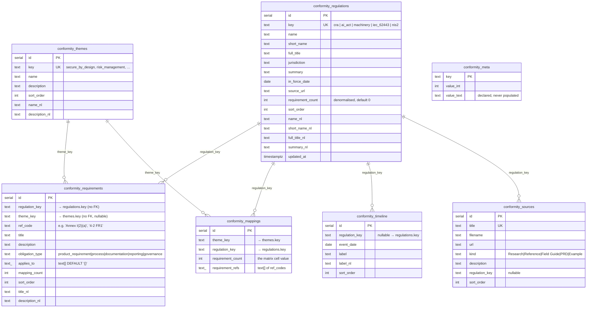
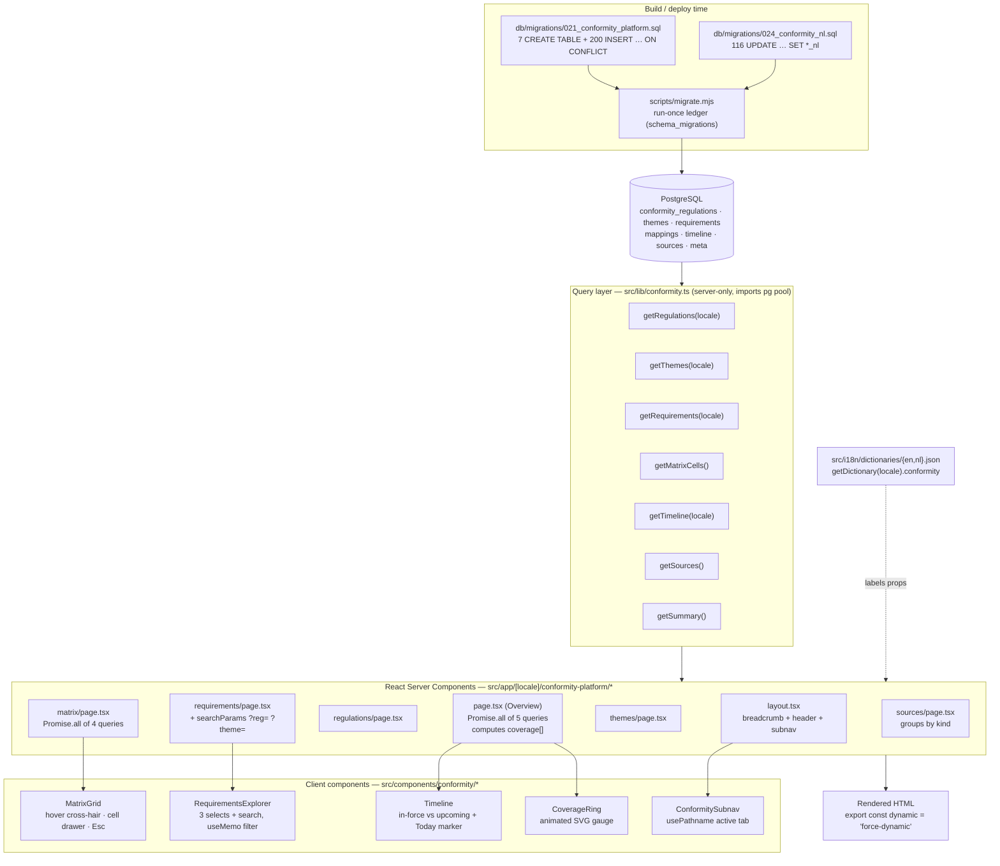
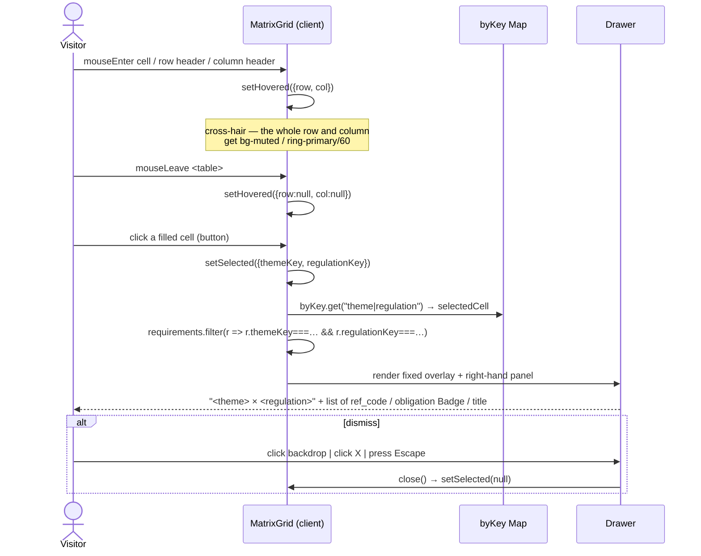
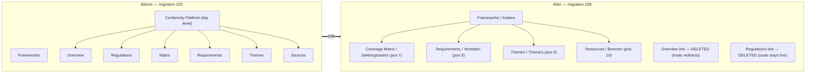

# OXOT — The Conformity Application

**Deep developer reference for the multi-regulation obligation model** that lives at
`/[locale]/conformity-platform/*`: the regulations, themes, requirements and the theme × regulation
coverage matrix.

**Cross-references — read rather than duplicate:**

| For… | Read |
| --- | --- |
| System shape, rendering flow, deployment | [`docs/ARCHITECTURE.md`](./ARCHITECTURE.md) |
| Every table across the whole schema (this doc goes deeper on `conformity_*` only) | [`docs/DATA-MODEL.md`](./DATA-MODEL.md) §2.5 |
| Full route inventory, nav wiring, redirects, SEO | [`docs/SITEMAP.md`](./SITEMAP.md) |
| Working in this codebase safely (build traps, migrations, i18n workflow) | [`docs/DEVELOPER-GUIDE.md`](./DEVELOPER-GUIDE.md) |

> **Naming caution.** Three different things share the word "conformity". Keep them apart:
>
> | Thing | Route | Data | Owner |
> | --- | --- | --- | --- |
> | **The Conformity application** (this doc) | `/[locale]/conformity-platform/*` | `conformity_*` tables | code / migrations |
> | **The conformity home page** | `/[locale]/conformity` | `site_blocks` key `conformity_home` | admin-editable |
> | **The Frameworks hub** | `/[locale]/frameworks` | `pages` markdown row | admin-editable |
>
> They are separate. `src/lib/conformity.ts` powers the first; `src/lib/conformity-home.ts` powers
> the second. This document is about the first.

---

## 1. What it is, in one paragraph

Five EU regulations and standards (CRA, AI Act, Machinery Regulation, IEC 62443, NIS2) each impose
obligations on operational technology. The application maps **every one of those 78 obligations
exactly once** onto a shared set of **15 cross-cutting control themes**, so a manufacturer can see
that "Access Control" is demanded by four of the five frameworks and read all ten requirements
behind that claim in one place. The centrepiece is the **coverage matrix**: a 15 × 5 heatmap where
each cell is the number of requirements mapped to that theme for that regulation, and clicking a
cell opens a drawer listing them. Around it sit an overview dashboard (KPIs, per-regulation bars,
coverage rings, implementation timeline), a regulations index, a filterable requirements explorer,
a themes index, and a source-corpus page.

All data is **static reference data seeded by migration** — there is no admin editor and no write
path. Content changes are code changes.

---

## 2. File map

```
db/migrations/
├── 021_conformity_platform.sql   ← schema (7 tables) + the entire English seed
├── 022_seed_conformity_nav.sql   ← original top-level "Conformity Platform" mega-menu (superseded by 038)
├── 024_conformity_nl.sql         ← Dutch translation backfill into the *_nl columns
└── 038_consolidate_conformity_into_frameworks.sql  ← re-parents 4 views under Frameworks

src/lib/conformity.ts             ← the ONLY query layer (7 exported functions, 6 SQL queries)

src/app/[locale]/conformity-platform/
├── layout.tsx                    ← breadcrumb + header band + ConformitySubnav
├── page.tsx                      ← Overview dashboard  (route redirects — see §7)
├── regulations/page.tsx          ← Regulations index
├── requirements/page.tsx         ← Requirements explorer (server shell)
├── themes/page.tsx               ← Themes index
├── matrix/page.tsx               ← Coverage matrix (server shell)
└── sources/page.tsx              ← Source corpus

src/components/conformity/
├── matrix-grid.tsx               ← "use client" — heatmap + cell drawer
├── requirements-explorer.tsx     ← "use client" — filters + search + table/cards
├── timeline.tsx                  ← "use client" — vertical timeline with a Today marker
├── coverage-ring.tsx             ← "use client" — animated radial gauge
├── conformity-subnav.tsx         ← "use client" — tab bar
└── framework-platform-link.tsx   ← server — cross-link banner on the framework article pages

src/i18n/dictionaries/{en,nl}.json  → the `conformity` namespace (all UI chrome)
```

Note there are stray `.fuse_hidden…` files inside several `conformity-platform/` subdirectories
(FUSE-mount artefacts from the filesystem this repo is edited on). They are not source, and
`git status` shows them as **untracked, not ignored** — so they can be accidentally committed. Add
`.fuse_hidden*` to `.gitignore`, or delete them, before your next commit.

---

## 3. The domain model

### 3.1 ER diagram

Note the deliberate design choice: **there are no foreign keys.** Every relationship is a `text`
natural key (`regulation_key`, `theme_key`, `ref_code`). This keeps the seed migration order-free and
re-runnable, at the cost of referential integrity — see §10.



### 3.2 Uniqueness constraints (these are what make the seed idempotent)

| Table | Constraint | Used by |
| --- | --- | --- |
| `conformity_regulations` | `UNIQUE (key)` | `ON CONFLICT (key) DO UPDATE` |
| `conformity_themes` | `UNIQUE (key)` | `ON CONFLICT (key) DO UPDATE` |
| `conformity_requirements` | `UNIQUE (regulation_key, ref_code)` | `ON CONFLICT … DO UPDATE` |
| `conformity_mappings` | `UNIQUE (theme_key, regulation_key)` | `ON CONFLICT … DO UPDATE` |
| `conformity_timeline` | `UNIQUE (regulation_key, event_date, label)` | `ON CONFLICT … DO UPDATE` |
| `conformity_sources` | `UNIQUE (title)` | `ON CONFLICT (title) DO …` |
| `conformity_meta` | `PRIMARY KEY (key)` | `ON CONFLICT (key) DO UPDATE` |

`021` uses `DO UPDATE` throughout — correct here, because this is code-owned reference data with no
admin editor. **Do not copy that pattern for admin-editable content** (see
`docs/DEVELOPER-GUIDE.md` §5.5).

### 3.3 Seeded data volumes and shape — verified against `021_conformity_platform.sql`

**Regulations (5)** — `key`, `requirement_count`, `sort_order`:

| key | short_name | jurisdiction | in force | `requirement_count` | sort |
| --- | --- | --- | --- | --- | --- |
| `cra` | CRA | European Union | 2024-12-10 | 19 | 1 |
| `ai_act` | AI Act | European Union | 2024-08-01 | 12 | 2 |
| `machinery` | Machinery | European Union | 2023-07-19 | 8 | 3 |
| `iec_62443` | IEC 62443 | International standard | — | 27 | 4 |
| `nis2` | NIS2 | European Union | 2023-01-16 | 12 | 5 |

19 + 12 + 8 + 27 + 12 = **78**. Verified: the actual `conformity_requirements` rows group to exactly
those five counts, so the denormalised column is currently correct.

**Themes (15)**, `sort_order` 1…15:
`secure_by_design`, `risk_management`, `vulnerability_handling`, `secure_update`,
`sbom_supply_chain`, `access_control`, `data_protection`, `logging_monitoring`,
`incident_reporting`, `technical_documentation`, `conformity_declaration`, `human_oversight`,
`data_governance`, `resilience`, `post_market`.

**Requirements (78)**, by `obligation_type`:

| obligation_type | count |
| --- | --- |
| `product_requirement` | 39 |
| `process` | 26 |
| `documentation` | 8 |
| `reporting` | 3 |
| `governance` | 2 |

Every requirement carries exactly **one** `theme_key`. `ref_code` is the human citation
(`Annex I(2)(a)`, `Art 21(2)(b)`, `4-2 FR1`, `3-3 SR 1.1`, `Annex III 1.2.1(c)`).

**Mappings (75 rows = the complete 15 × 5 grid)** — 47 with `requirement_count > 0`, 28 explicitly
seeded as `0` with `'{}'::text[]`. The grid is dense on purpose: seeding the zeroes makes the matrix
a pure lookup with no missing-key handling.

Sum of `requirement_count` across all mappings = **78**, i.e. every requirement appears in exactly
one cell. **Verified**: for all 47 non-empty cells, `conformity_mappings.requirement_count` equals
the number of `conformity_requirements` rows with that `(theme_key, regulation_key)` pair — the
denormalised cell values and the requirement rows are fully consistent as seeded.

Requirements per theme (the number shown on the Themes cards):

| theme | count | | theme | count |
| --- | --- | --- | --- | --- |
| `access_control` | 10 | | `logging_monitoring` | 6 |
| `risk_management` | 9 | | `incident_reporting` | 4 |
| `data_protection` | 8 | | `secure_update` | 4 |
| `resilience` | 8 | | `technical_documentation` | 4 |
| `secure_by_design` | 7 | | `conformity_declaration` | 3 |
| `vulnerability_handling` | 7 | | `sbom_supply_chain` | 3 |
| `human_oversight` | 2 | | `post_market` | 2 |
| `data_governance` | 1 | | | |

**Timeline (18 events)**, 2013-08-01 → 2026-08-02, spanning all five regulations
(IEC 62443 part publications, NIS2 entry into force / transposition / registers, Machinery entry into
force, AI Act entry into force + Art 5 + GPAI + Annex III, CRA entry into force + notified-body rules).

**Sources (25)**, by `kind`: Reference 10, Research 6, Field Guide 6, PRD 2, Example 1.

**Meta (4 rows)** in `conformity_meta`:

```sql
regulation_count  = 5
requirement_count = 78
theme_count       = 15
mapping_count     = 61     -- ⚠ see §10.1
```

### 3.4 The Dutch layer — `024_conformity_nl.sql`

`021` creates the `*_nl` columns but leaves them NULL. `024` fills them with plain, re-runnable
`UPDATE`s keyed on the English natural key:

| Table | `*_nl` columns filled | rows |
| --- | --- | --- |
| `conformity_regulations` | `name_nl, short_name_nl, full_title_nl, summary_nl` | 5 |
| `conformity_themes` | `name_nl, description_nl` | 15 |
| `conformity_requirements` | `title_nl, description_nl` (matched on `regulation_key` + `ref_code`) | 78 |
| `conformity_timeline` | `label_nl` (matched on `regulation_key` + `event_date` + `label`) | 18 |

Wrapped in `BEGIN; … ` and using **dollar quoting** (`$$…$$`) for every value so Dutch apostrophes
(`thema's`, `commando's`) can't break the statement. The migration header states the WHERE-clause
keys were copied verbatim from `data/conformity_source.json` "so nothing silently fails to match" —
a plain `UPDATE` with a wrong key is a silent no-op, which is exactly the failure mode to fear here.

**Not translated:** `conformity_sources` (no `*_nl` columns at all), `jurisdiction`, `ref_code`,
`obligation_type` (labelled from the dictionary instead), `applies_to`. See §10.

---

## 4. Data flow



Every page declares `export const dynamic = "force-dynamic"` — no caching, no ISR, a fresh DB read
per request. Reasonable for a low-traffic reference app; see §10 for the cost.

---

## 5. The query layer — `src/lib/conformity.ts`

216 lines. Seven exported async functions, six distinct SQL statements (`getSummary` issues two),
plus one exported constant. No writes, no mutations, no transactions.

### 5.1 The locale mechanism

```ts
const isNl = (l: Locale) => l === "nl";
```

Every locale-aware query interpolates a `COALESCE` prefix, conditionally:

```sql
COALESCE(NULLIF(name_nl,''), name) AS "name"    -- when locale === "nl"
COALESCE(name)                     AS "name"    -- when locale === "en"
```

Three properties worth internalising:

1. **`NULLIF(x,'')` before `COALESCE`** — an *empty-string* Dutch value falls back to English, not
   just a NULL one. Missing translations degrade to English rather than to blank.
2. The interpolated fragment is a **compile-time literal**, not user input — there is no injection
   surface. `locale` is validated by `isLocale()` in the page before it ever reaches the lib.
3. Aliases are quoted camelCase (`AS "shortName"`) so `pg` returns rows that structurally match the
   TypeScript interfaces with **no mapping layer**. `rows` is returned directly and typed by the
   function's return annotation — which means there is **no runtime validation** (see §10).

### 5.2 Every query

#### `getRegulations(locale): Promise<Regulation[]>`

```sql
SELECT key,
       COALESCE(NULLIF(name_nl,''), name)             AS "name",
       COALESCE(NULLIF(short_name_nl,''), short_name) AS "shortName",
       COALESCE(NULLIF(full_title_nl,''), full_title) AS "fullTitle",
       jurisdiction,
       COALESCE(NULLIF(summary_nl,''), summary)       AS "summary",
       to_char(in_force_date,'YYYY-MM-DD') AS "inForceDate",
       source_url        AS "sourceUrl",
       requirement_count AS "requirementCount",
       sort_order        AS "sortOrder"
  FROM conformity_regulations
 ORDER BY sort_order, short_name
```

Dates are formatted **in SQL** with `to_char(...,'YYYY-MM-DD')` → a `string`, deliberately avoiding
JS `Date` timezone drift across the server/client boundary. → 5 rows.

#### `getRegulation(key, locale): Promise<Regulation | null>`

```ts
const all = await getRegulations(locale);
return all.find((r) => r.key === key) ?? null;
```

No `WHERE` — it fetches all 5 and filters in JS. Fine at this cardinality.

#### `getThemes(locale): Promise<Theme[]>`

```sql
SELECT t.key,
       COALESCE(NULLIF(t.name_nl,''), t.name)              AS "name",
       COALESCE(NULLIF(t.description_nl,''), t.description) AS "description",
       t.sort_order AS "sortOrder",
       COALESCE(SUM(m.requirement_count),0)::int AS "requirementCount"
  FROM conformity_themes t
  LEFT JOIN conformity_mappings m ON m.theme_key = t.key
 GROUP BY t.id
 ORDER BY t.sort_order, t.name
```

**This is where the per-theme requirement count comes from** — `SUM` over the theme's five mapping
rows. `GROUP BY t.id` (the primary key) lets Postgres functionally-dependently select the other `t.*`
columns; this is Postgres-specific and correct here. `LEFT JOIN` + `COALESCE(…,0)` means a theme
with no mappings shows `0` rather than vanishing. → 15 rows.

#### `getRequirements(locale): Promise<Requirement[]>`

```sql
SELECT r.id,
       r.regulation_key AS "regulationKey",
       reg.short_name   AS "regulationShortName",
       r.theme_key      AS "themeKey",
       COALESCE(NULLIF(t.name_nl,''), t.name) AS "themeName",
       r.ref_code        AS "refCode",
       COALESCE(NULLIF(r.title_nl,''), r.title)             AS "title",
       COALESCE(NULLIF(r.description_nl,''), r.description) AS "description",
       r.obligation_type AS "obligationType",
       r.applies_to      AS "appliesTo",
       r.mapping_count   AS "mappingCount",
       r.sort_order      AS "sortOrder"
  FROM conformity_requirements r
  LEFT JOIN conformity_regulations reg ON reg.key = r.regulation_key
  LEFT JOIN conformity_themes t        ON t.key   = r.theme_key
 ORDER BY reg.sort_order, r.sort_order
```

**One query, all 78 rows, no pagination, no filtering.** Every consumer (the explorer, the matrix
drawer, the per-regulation filter) filters the full set in JS. Deliberate at this size — and the
reason the explorer's filtering feels instant. Note `reg.short_name` is **not** locale-aware here,
unlike in `getRegulations` — see §10.5.

#### `getMatrixCells(): Promise<MatrixCell[]>`

```sql
SELECT theme_key         AS "themeKey",
       regulation_key    AS "regulationKey",
       requirement_count AS "requirementCount",
       requirement_refs  AS "requirementRefs"
  FROM conformity_mappings
```

No locale parameter (nothing translatable), **no `ORDER BY`** (the consumer builds a `Map`, so order
is irrelevant). → 75 rows.

#### `getTimeline(locale): Promise<TimelineEvent[]>`

```sql
SELECT regulation_key AS "regulationKey",
       to_char(event_date,'YYYY-MM-DD') AS "date",
       COALESCE(NULLIF(label_nl,''), label) AS "label",
       sort_order AS "sortOrder"
  FROM conformity_timeline
 ORDER BY event_date, sort_order
```

The ascending order is a **contract with `<Timeline>`**, which does a single
`findIndex(e => date > today)` to place the Today marker. Change the order and the marker lands
wrong. → 18 rows.

#### `getSources(): Promise<SourceDoc[]>`

```sql
SELECT title, filename, url, kind, description,
       regulation_key AS "regulationKey",
       sort_order     AS "sortOrder"
  FROM conformity_sources
 ORDER BY sort_order, title
```

No locale parameter — the table has no `*_nl` columns. → 25 rows.

#### `getSummary(): Promise<ConformitySummary>`

Two queries, **always both** (the fallback is not conditional):

```sql
SELECT key, value_int FROM conformity_meta;

SELECT (SELECT count(*) FROM conformity_regulations)  AS regs,
       (SELECT count(*) FROM conformity_requirements) AS reqs,
       (SELECT count(*) FROM conformity_themes)       AS themes;
```

then:

```ts
regulationCount:  m.regulation_count  ?? Number(f.regs),
requirementCount: m.requirement_count ?? Number(f.reqs),
themeCount:       m.theme_count       ?? Number(f.themes),
mappingCount:     m.mapping_count     ?? 0,
```

Note `mappingCount` has **no live fallback** — if the meta row is absent the KPI reads `0`.

#### `OBLIGATION_TYPES`

```ts
export const OBLIGATION_TYPES = [
  "product_requirement", "process", "documentation", "reporting", "governance",
] as const;
```

The display order of the obligation filter. Labels come from `dictionary.conformity.obligationTypes`.

### 5.3 Query cost per page

| Route | Queries | Rows |
| --- | --- | --- |
| Overview | 6 (`getSummary` ×2 + regulations + timeline + themes + cells) | ~118 |
| `/regulations` | 1 | 5 |
| `/requirements` | 3 | 98 |
| `/themes` | 1 | 15 |
| `/matrix` | 4 | 173 |
| `/sources` | 1 | 25 |

The Overview and Matrix pages issue their reads via `Promise.all`, so they're concurrent, not serial.
**No N+1 anywhere** — `getRegulation()` and `getRequirementsForRegulation()` deliberately re-filter a
single full fetch rather than issuing per-key queries.

---

## 6. The views

All six share `layout.tsx`, which renders (in order): a three-level breadcrumb
(Home › Frameworks › Conformity Platform, from `t.breadcrumb`), a header band
(`t.kicker` / `t.title` / `t.subtitle`, the `<h1>` using `style={{ fontFamily: "var(--font-display)" }}`),
then `<ConformitySubnav>`, then `{children}` in a `max-w-6xl` container. `isLocale(locale)` guard →
`notFound()`.

Every page also exports `generateMetadata` producing a title, a description, and
`alternates(locale, "/conformity-platform/…")` from `@/lib/seo` for canonical + hreflang.

### 6.1 Overview — `page.tsx`

Five concurrent queries, then four sections.

**KPI cards** — `summary.{regulationCount, requirementCount, themeCount, mappingCount}`, each in a
`<Card>` inside `<Stagger>/<StaggerItem>`, animated with `<CountUp value={String(k.value)} />`.

**Requirements by regulation** — a horizontal bar per regulation:

```ts
const maxReq = Math.max(1, ...regulations.map((r) => r.requirementCount));
const pct    = Math.round((r.requirementCount / maxReq) * 100);
// width: `${Math.max(pct, 4)}%`  — 4% floor so a zero-count bar is still visible
```

Bars are relative to the largest (IEC 62443, 27), not absolute. Each row is wrapped in a `<Link>` to
the corresponding **framework article page** via a module-level map:

```ts
const FRAMEWORK_SLUG: Record<string, string> = {
  cra: "cra", ai_act: "ai-act", machinery: "machine-act", iec_62443: "iec-62443", nis2: "nis2"
};
```

A regulation without an entry renders as a plain `<div>` (no dead link). This map is the **inverse**
of `SLUG_TO_REG` in `framework-platform-link.tsx` — the two must be kept in sync by hand (§10.4).

**Theme coverage by regulation** — five `<CoverageRing>` gauges. The count is computed **in the page,
not in SQL**:

```ts
const coverage = regulations.map((r) => ({
  key: r.key,
  shortName: r.shortName,
  covered: themes.filter((th) =>
    cells.some((c) => c.themeKey === th.key && c.regulationKey === r.key && c.requirementCount > 0)
  ).length,
  total: themes.length
}));
```

i.e. *how many of the 15 themes does this regulation touch at all* — a **breadth** measure, distinct
from the requirement counts. It is O(regulations × themes × cells) = 5 × 15 × 75 ≈ 5,600 comparisons,
trivial here but the obvious first thing to move into SQL if the data grows.

**Key dates** — `<Timeline>` with `regShortNames` (a `key → shortName` lookup built from
`getRegulations`), `today = new Date().toISOString()` computed **on the server** and passed down as a
prop, and the three status labels from `t.timeline`.

Closes with a `<Link>` to `/[locale]/conformity-platform/regulations` labelled `t.tabs.regulations` —
the only remaining in-app route to a page the subnav no longer lists (§7).

### 6.2 Regulations — `regulations/page.tsx`

One query, one `<Stagger>` grid of `md:grid-cols-2` cards wrapped in `<SpotlightCard>`. Each card:
`shortName` (heading) + `name` (sub), `jurisdiction` as an outline `<Badge>`, the in-force **year**
(`r.inForceDate.slice(0, 4)` — string slice, no `Date` parsing), the requirement count,
`fullTitle`, `summary`, then two actions: an external link to `sourceUrl`
(`target="_blank" rel="noopener noreferrer"` + `<ExternalLink>` icon) and an internal link to the
matrix. All strings conditional-rendered, so a NULL column never prints an empty element.

### 6.3 Requirements — `requirements/page.tsx` + `<RequirementsExplorer>`

**Server half:** three concurrent queries; reads `searchParams` for `?reg=` and `?theme=`; maps
regulations and themes down to `{ value, label }` options; passes `[...OBLIGATION_TYPES]` (spread —
the const is `readonly`); assembles a fully-typed `labels` object including the nested `table` and
`obligationTypes` maps.

**Client half** (`requirements-explorer.tsx`): four state values (`regulation`, `theme`, `obligation`,
`query`), one `useMemo` filter:

```ts
const q = query.trim().toLowerCase();
return requirements.filter((r) => {
  if (regulation && r.regulationKey !== regulation) return false;
  if (theme      && r.themeKey      !== theme)      return false;
  if (obligation && r.obligationType!== obligation) return false;
  if (q) {
    const hay = `${r.title} ${r.description ?? ""} ${r.refCode}`.toLowerCase();
    if (!hay.includes(q)) return false;
  }
  return true;
});
```

Search is a case-insensitive substring over title + description + ref code. Filters AND together.
Everything is in-memory over the 78 rows — no network round-trip per keystroke.

**Deep links are validated before use:**

```ts
const validReg   = regulations.some((o) => o.value === initialRegulation) ? initialRegulation : "";
const validTheme = themes.some((o) => o.value === initialTheme) ? initialTheme : "";
```

so `?reg=garbage` degrades to "all" instead of showing an empty table. Note these seed
`useState` **once** — the component does not re-sync if the query string changes client-side.

**Rendering:** an ARIA-live count (`{filtered.length} of {total} requirements`), then a dashed
empty-state box, or a `<table>` at `md:` and up (`hidden … md:block`) plus a `<ul>` card list below
`md` (`md:hidden`). Two markups, one dataset — worth remembering when you change columns.

### 6.4 Themes — `themes/page.tsx`

One query. A `sm:grid-cols-2 lg:grid-cols-3` grid of cards, each showing the theme name, description,
and `theme.requirementCount` (the SQL `SUM` from §5.2) suffixed by `t.mappedRequirements`. **Every
card links to `/[locale]/conformity-platform/matrix`** — the same destination for all 15, with no
theme parameter, so the matrix cannot pre-focus the clicked row (§10.3).

### 6.5 Matrix — `matrix/page.tsx` + `<MatrixGrid>` ★

The centrepiece.

**Server half** — four concurrent queries, then a narrow projection:

```tsx
<MatrixGrid
  themes={themes.map((th) => ({ key: th.key, label: th.name }))}
  regulations={regulations.map((r) => ({ key: r.key, label: r.shortName }))}
  cells={cells}
  requirements={requirements}
  labels={{ themeColumn, legend, detailTitle, refsLabel, connector, close, heatLess, heatMore }}
  obligationLabels={t.obligationTypes}
/>
```

Note the client component receives only `{key, label}` for rows/columns — the descriptions,
summaries and URLs never cross into the browser bundle. All 78 requirements *do*, because the drawer
needs them.

**Client half** — `src/components/conformity/matrix-grid.tsx`.

*Props:*

| Prop | Type | Purpose |
| --- | --- | --- |
| `themes` | `{key,label}[]` | rows, already ordered by `sort_order` |
| `regulations` | `{key,label}[]` | columns, already ordered by `sort_order` |
| `cells` | `MatrixCell[]` | the 75 counts + ref arrays |
| `requirements` | `Requirement[]` | all 78, for the drawer |
| `labels` | `MatrixLabels` | every visible chrome string |
| `obligationLabels` | `Record<string,string>` | obligation_type → localised label |

*Derived state (memoised):*

```ts
const byKey = React.useMemo(() => {
  const m = new Map<string, MatrixCell>();
  for (const c of cells) m.set(`${c.themeKey}|${c.regulationKey}`, c);
  return m;
}, [cells]);

const maxCount = React.useMemo(() => Math.max(0, ...cells.map((c) => c.requirementCount)), [cells]);
```

O(1) cell lookup on the composite string key `theme|regulation`. `maxCount` normalises the heat
scale (currently 6, from `access_control × iec_62443`).

*How a cell count is computed:* it is **not** computed at render time at all. It is read straight
from `conformity_mappings.requirement_count`, a value seeded by migration 021. The chain is:

```
021 seed  →  conformity_mappings.requirement_count  →  getMatrixCells()  →  byKey Map  →  cell button label
```

The heat tint is derived from it:

```ts
function heatStyle(count: number, max: number): React.CSSProperties {
  if (count <= 0) return {};
  const alpha = 0.12 + 0.6 * (max > 0 ? count / max : 0);
  return { backgroundColor: `hsl(var(--primary) / ${alpha})` };
}
```

Alpha ranges 0.12 (count 1) → 0.72 (count = max). Because it's `hsl(var(--primary) / α)` and not a
literal colour, it re-tints automatically in dark mode. The legend swatches hardcode the same ramp
`[0.15, 0.3, 0.45, 0.6, 0.72]` — **keep them in sync with `heatStyle` if you change the formula.**

*Interaction model:*



*The cell → drawer resolution, precisely:*

```ts
const selectedRequirements = React.useMemo(() => {
  if (!selected) return [];
  return requirements.filter(
    (r) => r.themeKey === selected.themeKey && r.regulationKey === selected.regulationKey
  );
}, [requirements, selected]);
```

The drawer prefers these **full requirement objects**. Only if that list is empty does it fall back
to rendering `selectedCell.requirementRefs` as bare code chips under `labels.refsLabel`. Given the
verified consistency in §3.3 (every non-empty cell's count equals its requirement rows), **that
fallback branch is currently unreachable** — it exists to degrade gracefully if `conformity_mappings`
and `conformity_requirements` ever drift. Keep it.

*Accessibility & structure:* a real `<table>` with `<th scope="row">` for theme names; the theme
column and header row are `sticky` (`sticky left-0` / `sticky top-0`) with a `z-20` corner cell so
they don't collide; horizontal scroll on mobile via `overflow-x-auto`; filled cells are `<button>`
elements with `aria-pressed`; empty cells render a `·` in `text-muted-foreground/40`; the drawer is
`role="dialog" aria-modal="true"` with an `aria-label`led close button and a `keydown` listener for
Escape (registered/torn down in a `useEffect` keyed on `[selected, close]`).

*Not implemented:* focus trapping inside the drawer, focus restore to the triggering cell, and
keyboard navigation between cells (arrow keys). See §10.6.

### 6.6 Sources — `sources/page.tsx`

One query, grouped **in the page** into a fixed display order:

```ts
const KIND_ORDER = ["research", "reference", "field_guide", "prd", "example", "other"] as const;

const kindSlug = (kind: string | null): KindSlug => {
  const s = (kind ?? "").toLowerCase().replace(/\s+/g, "_");
  return (KIND_ORDER as readonly string[]).includes(s) ? (s as KindSlug) : "other";
};
```

So the DB's human-cased `"Field Guide"` normalises to the dictionary slug `field_guide`, and anything
unrecognised buckets to `other`. Empty groups are skipped (`KIND_ORDER.filter(slug => groups.has(slug))`).
Section headings come from `t.sources.kinds[slug]`. Each card shows title, a `regulationKey` badge
(**raw key**, e.g. `iec_62443` — §10.5), the description, and the filename in a monospace chip.

**The filenames are not links.** `conformity_sources.url` is selected and typed but never rendered —
the underlying documents (`/conformity/sources/*.md|pdf|docx|key`) are not served. §10.7.

### 6.7 The cross-link banner — `framework-platform-link.tsx`

A **server** component rendered on the five framework article pages. Maps slug → regulation key
(`SLUG_TO_REG`), calls `getRegulation()`, and renders "N obligations from this framework are mapped
once onto the shared, cross-regulation control model" plus two links:
`…/requirements?reg=<key>` (the deep link the explorer validates) and `…/matrix`. Returns `null` for
non-framework slugs and for an unknown regulation key.

Its strings live in a local `STR = { en: {…}, nl: {…} }` const rather than in the dictionary — see
§10.2.

---

## 7. How it sits under the consolidated Frameworks IA

Originally (`022_seed_conformity_nav.sql`) "Conformity Platform" / "Conformiteitsplatform" was a
**top-level mega-menu parent** with six children. `038_consolidate_conformity_into_frameworks.sql`
folded it into the existing **Frameworks / Kaders** hub.



**Section A of 038** does the nav surgery, and the ordering is the subtle part: `menu_items.parent_id`
is `ON DELETE CASCADE`, so the four keepers are **re-parented first**, and only then is the old
parent deleted — otherwise the cascade would take them with it. The migration says so explicitly.
Both locales, guarded by `IF fw_en IS NOT NULL` / `IF fw_nl IS NOT NULL` and an early `RETURN` if the
`main` menu doesn't exist.

**Section B** appends a "Coverage tools" / "Dekkingsinstrumenten" markdown section to the
`frameworks` pages linking the four views — **after** inserting a `page_versions` snapshot noted
`'Auto-snapshot before 038 coverage-tools enrichment'`, and guarded by
`IF FOUND AND cur.body NOT LIKE '%## Coverage tools%'` so it can't double-append.

**The redirect** lives in `next.config.mjs`:

```js
{ source: "/:locale(en|nl)/conformity-platform", destination: "/:locale/frameworks", permanent: true }
```

The comment on it is load-bearing:

> Only the bare overview path redirects — the `(en|nl)` group **without a trailing wildcard** means
> sub-routes like `/en/conformity-platform/matrix` do NOT match this rule.

So `/en/conformity-platform` → 308 → `/en/frameworks`, while
`/en/conformity-platform/matrix|requirements|themes|sources|regulations` all still serve normally.

**Consequence for the code:** `src/app/[locale]/conformity-platform/page.tsx` (the Overview
dashboard, with the KPI cards, coverage rings and timeline) **is now unreachable in production.**
It is fully built, wired and maintained, but every request to its URL is redirected away before Next
routes it. `<ConformitySubnav>` acknowledges this in a comment:

> The old Overview tab was dropped (its `/conformity-platform` URL now redirects to `/frameworks`, so
> a tab pointing at it would bounce the user out), and Regulations was dropped to match the
> mega-menu (its route stays live).

Verifying the behaviour:

```bash
curl -sSI https://<host>/en/conformity-platform        | head -n 3   # expect 308 → /en/frameworks
curl -sS  -o /dev/null -w '%{http_code}\n' https://<host>/en/conformity-platform/matrix   # expect 200
```

**Reversal** is documented in the header of 038 as four numbered steps (re-run 022; move the four
keepers back to positions 4/2/3/5 with their original labels; strip the appended markdown section or
restore the named `page_versions` snapshot; remove the `next.config.mjs` redirect block).

---

## 8. How to extend it

Everything here is a **migration + code** change. There is no admin UI. All changes must land in
**both locales**.

### 8.1 Add a regulation

1. **New migration** `0NN_add_<key>_regulation.sql`:

```sql
INSERT INTO conformity_regulations
  (key,name,short_name,full_title,jurisdiction,summary,in_force_date,source_url,requirement_count,sort_order)
VALUES ('red','Radio Equipment Directive','RED','Directive 2014/53/EU …','European Union',
        'Cybersecurity essential requirements …','2025-08-01','https://…',0,6)
ON CONFLICT (key) DO UPDATE SET
  name=EXCLUDED.name, short_name=EXCLUDED.short_name, full_title=EXCLUDED.full_title,
  jurisdiction=EXCLUDED.jurisdiction, summary=EXCLUDED.summary,
  in_force_date=EXCLUDED.in_force_date, source_url=EXCLUDED.source_url,
  requirement_count=EXCLUDED.requirement_count, sort_order=EXCLUDED.sort_order;

-- Dutch, dollar-quoted.
UPDATE conformity_regulations SET
  name_nl=$$Richtlijn radioapparatuur$$, short_name_nl=$$RED$$,
  full_title_nl=$$Richtlijn 2014/53/EU …$$, summary_nl=$$…$$
WHERE key='red';

-- Seed the FULL column of the matrix — all 15 themes, zeroes included.
INSERT INTO conformity_mappings (theme_key,regulation_key,requirement_count,requirement_refs)
SELECT t.key, 'red', 0, '{}'::text[] FROM conformity_themes t
ON CONFLICT (theme_key,regulation_key) DO NOTHING;
```

2. **Add the requirements** (§8.3), then **recompute** (§8.5).
3. **Framework page link:** if you also publish a `/[locale]/<slug>` article, add
   `red: "red"` to `FRAMEWORK_SLUG` in `conformity-platform/page.tsx` **and** the inverse
   `"red": "red"` to `SLUG_TO_REG` in `framework-platform-link.tsx`.
4. The matrix gains a column automatically; the coverage rings gain a sixth gauge automatically.

### 8.2 Add a theme

```sql
INSERT INTO conformity_themes (key,name,description,sort_order)
VALUES ('crypto_agility','Cryptographic Agility','Ability to replace algorithms and keys …',16)
ON CONFLICT (key) DO UPDATE SET name=EXCLUDED.name, description=EXCLUDED.description, sort_order=EXCLUDED.sort_order;

UPDATE conformity_themes SET
  name_nl=$$Cryptografische wendbaarheid$$, description_nl=$$…$$
WHERE key='crypto_agility';

-- Seed the FULL row — one mapping per existing regulation.
INSERT INTO conformity_mappings (theme_key,regulation_key,requirement_count,requirement_refs)
SELECT 'crypto_agility', r.key, 0, '{}'::text[] FROM conformity_regulations r
ON CONFLICT (theme_key,regulation_key) DO NOTHING;
```

Bump `conformity_meta.theme_count`. The matrix gains a row, the themes grid a card, and **every
coverage ring's denominator changes** (`total = themes.length`) — expect all five rings to drop.

### 8.3 Add requirements

```sql
INSERT INTO conformity_requirements
  (regulation_key,theme_key,ref_code,title,description,obligation_type,applies_to,mapping_count,sort_order)
VALUES ('cra','access_control','Annex I(2)(m)','…','…','product_requirement',
        ARRAY['manufacturer']::text[],1,80)
ON CONFLICT (regulation_key,ref_code) DO UPDATE SET
  theme_key=EXCLUDED.theme_key, title=EXCLUDED.title, description=EXCLUDED.description,
  obligation_type=EXCLUDED.obligation_type, applies_to=EXCLUDED.applies_to,
  mapping_count=EXCLUDED.mapping_count, sort_order=EXCLUDED.sort_order;

UPDATE conformity_requirements SET title_nl=$$…$$, description_nl=$$…$$
WHERE regulation_key='cra' AND ref_code='Annex I(2)(m)';
```

`obligation_type` **must** be one of the five values in `OBLIGATION_TYPES`, or the UI falls back to
printing the raw key (`obligationLabels[key] ?? key`) — a visible English/snake_case leak.

### 8.4 Re-map a requirement to a different theme

Change `theme_key` on the requirement, then recompute the two affected cells (§8.5). Because the
matrix reads the denormalised `conformity_mappings.requirement_count` while the drawer reads the
`conformity_requirements` rows, **skipping the recompute makes the cell number disagree with its own
drawer contents.** This is the single easiest way to corrupt the app.

### 8.5 The recompute — run this after ANY requirement change

```sql
BEGIN;

-- 1. Matrix cells: counts + ref arrays, derived from the requirement rows.
UPDATE conformity_mappings m SET
  requirement_count = COALESCE(s.n, 0),
  requirement_refs  = COALESCE(s.refs, '{}'::text[])
FROM (
  SELECT theme_key, regulation_key,
         count(*)::int AS n,
         array_agg(ref_code ORDER BY sort_order) AS refs
    FROM conformity_requirements
   WHERE theme_key IS NOT NULL
   GROUP BY theme_key, regulation_key
) s
RIGHT JOIN conformity_mappings m2
       ON m2.theme_key = s.theme_key AND m2.regulation_key = s.regulation_key
WHERE m.theme_key = m2.theme_key AND m.regulation_key = m2.regulation_key;

-- 2. Denormalised per-regulation counter (drives the Overview bars + the cross-link banner).
UPDATE conformity_regulations r SET
  requirement_count = (SELECT count(*) FROM conformity_requirements q WHERE q.regulation_key = r.key);

-- 3. KPI meta.
INSERT INTO conformity_meta (key,value_int) VALUES
  ('regulation_count',  (SELECT count(*) FROM conformity_regulations)),
  ('requirement_count', (SELECT count(*) FROM conformity_requirements)),
  ('theme_count',       (SELECT count(*) FROM conformity_themes)),
  ('mapping_count',     (SELECT count(*) FROM conformity_mappings WHERE requirement_count > 0))
ON CONFLICT (key) DO UPDATE SET value_int = EXCLUDED.value_int;

COMMIT;
```

> ⚠ Step 3's `mapping_count` definition (**non-empty cells**) is *my* reconstruction of the intent.
> It yields **47** against the current seed, whereas the seeded value is **61**. Decide the intended
> definition before adopting this (§10.1).

Then **verify consistency** — this should return zero rows:

```sql
SELECT m.theme_key, m.regulation_key, m.requirement_count AS cell, COALESCE(q.n,0) AS actual
  FROM conformity_mappings m
  LEFT JOIN (SELECT theme_key, regulation_key, count(*)::int AS n
               FROM conformity_requirements GROUP BY 1,2) q
    ON q.theme_key = m.theme_key AND q.regulation_key = m.regulation_key
 WHERE m.requirement_count IS DISTINCT FROM COALESCE(q.n,0);
```

And check nothing dangles:

```sql
SELECT DISTINCT regulation_key FROM conformity_requirements
 WHERE regulation_key NOT IN (SELECT key FROM conformity_regulations);
SELECT DISTINCT theme_key FROM conformity_requirements
 WHERE theme_key IS NOT NULL AND theme_key NOT IN (SELECT key FROM conformity_themes);
```

### 8.6 What must be updated in both locales — the checklist

- [ ] `*_nl` columns on every new row: regulations (4 cols), themes (2), requirements (2), timeline (1)
- [ ] Any new **dictionary** key added under `conformity.*` → both `en.json` and `nl.json`;
      `node scripts/i18n-check.mjs` must pass
- [ ] Any new **nav item** → a `menu_items` row per locale, under the Frameworks parent
      (see migration 038 Section A for the exact pattern)
- [ ] New obligation types → `OBLIGATION_TYPES` **and** `conformity.obligationTypes` in both dictionaries
- [ ] New source `kind` values → `KIND_ORDER` in `sources/page.tsx` **and**
      `conformity.sources.kinds` in both dictionaries
- [ ] Re-run the grounding rebuild if the reference data is meant to feed the AI assistant (§10.8)

### 8.7 Adding a new view

1. `src/app/[locale]/conformity-platform/<view>/page.tsx` — `dynamic = "force-dynamic"`,
   `isLocale` guard, `generateMetadata` with `alternates(locale, "/conformity-platform/<view>")`.
2. Add `<view>` to the `tabs` object in **both** dictionaries and to the `tabs` array + the `labels`
   prop type in `conformity-subnav.tsx`.
3. Add a `menu_items` row per locale under the Frameworks parent, via migration.

---

## 9. Client/server split summary

| File | `"use client"` | Imports from `@/lib/conformity` |
| --- | --- | --- |
| `app/**/page.tsx`, `layout.tsx` | no (RSC) | **value** imports — correct, they run on the server |
| `components/conformity/matrix-grid.tsx` | **yes** | `import type { MatrixCell, Requirement }` — type-only |
| `components/conformity/requirements-explorer.tsx` | **yes** | `import type { Requirement }` |
| `components/conformity/timeline.tsx` | **yes** | `import type { TimelineEvent }` |
| `components/conformity/coverage-ring.tsx` | **yes** | none |
| `components/conformity/conformity-subnav.tsx` | **yes** | none |
| `components/conformity/framework-platform-link.tsx` | no (async RSC) | **value** import of `getRegulation` |

`src/lib/conformity.ts` value-imports `./db` (the `pg` pool). Every client component above therefore
uses **`import type`** only. Breaking that rule fails `next build` with
`Module not found: Can't resolve 'dns'` — the exact incident documented in
`docs/DEVELOPER-GUIDE.md` §3. Run the audit grep there before shipping any change in this folder.

---

## 10. Known gaps and risks

Honest list, from reading the code.

### 10.1 The "Mappings" KPI is an unverified constant

`conformity_meta.mapping_count = 61`. Measured against the seed:

| Candidate definition | Value |
| --- | --- |
| Total `conformity_mappings` rows (15 × 5) | 75 |
| Rows with `requirement_count > 0` | **47** |
| `SUM(requirement_count)` | 78 |
| **Seeded value** | **61** |

61 matches none of them. `getSummary()` has no live fallback for this key (`?? 0`), so it is simply
displayed as-is on the Overview KPI card. `src/app/[locale]/conformity/page.tsx` repeats the same
`61` as its DB-down fallback literal. **Establish the intended definition, then compute it in
migration rather than hardcoding.** (Low blast radius — the Overview page is unreachable in prod
anyway, §10.9 — but the number also appears in the conformity home page's `data-mappings` attribute.)

### 10.2 Untranslated / non-dictionary strings

- **`conformity_sources` has no `*_nl` columns at all.** All 25 titles, descriptions and kind values
  render in English on `/nl/conformity-platform/sources`. This is a direct tension with `CLAUDE.md` §3.
  Fixing it means `ALTER TABLE … ADD COLUMN title_nl, description_nl`, a translation migration, and
  `COALESCE` in `getSources()` (which would also need a `locale` parameter).
- **`framework-platform-link.tsx`** carries its own inline `STR = { en, nl }` object instead of using
  the dictionary. Bilingual, but invisible to `scripts/i18n-check.mjs`.
- **`jurisdiction`** is rendered raw (`"European Union"`, `"International standard"`) with no `_nl`
  column.
- **`ConformitySubnav`'s `aria-label` is the literal `"Conformity Platform"`** — English in both
  locales. `layout.tsx`'s breadcrumb `aria-label="Breadcrumb"` likewise.

### 10.3 Label drift between the subnav and the mega-menu

`ConformitySubnav` was aligned to the post-038 mega-menu (commit `ac58084`), and today they agree:
Coverage Matrix / Requirements / Themes / Resources (EN) and Dekkingsmatrix / Vereisten / Thema's /
Bronnen (NL). But they are **two independent sources of truth**: the subnav reads
`dictionary.conformity.tabs`, the mega-menu reads `menu_items.label` written by migration 038. Change
one and the other silently diverges. There is no test asserting they match.

Related: the themes cards and the regulations cards all link to `/matrix` with **no parameter**, so
the matrix can't highlight the row/column the user just clicked. An obvious, cheap improvement:
accept `?theme=` / `?reg=` and pre-set `hovered`/`selected`.

### 10.4 Two hand-maintained slug↔key maps

`FRAMEWORK_SLUG` in `conformity-platform/page.tsx` and `SLUG_TO_REG` in `framework-platform-link.tsx`
are exact inverses, duplicated. Adding a regulation and updating only one produces either a dead bar
row or a missing cross-link banner, with no type error. Candidate for a single exported const.

### 10.5 Locale inconsistency in `getRequirements`

`getRequirements()` selects `reg.short_name` **without** the NL `COALESCE`, while `getRegulations()`
uses `COALESCE(NULLIF(short_name_nl,''), short_name)`. So the "Regulation" badge in the requirements
table always shows the English short name. In practice the seeded `short_name_nl` values are mostly
identical to the English (`CRA`, `AI Act`, `NIS2`, `IEC 62443`) — except `machinery`, where
`short_name = 'Machinery'` and `short_name_nl = 'Machinery'` too. So the bug is currently invisible;
it will surface the first time a Dutch short name genuinely differs.

Similarly, `sources/page.tsx` renders `s.regulationKey` **raw** in a badge — the visitor sees
`iec_62443` / `ai_act`, not `IEC 62443` / `AI Act`, in both locales.

### 10.6 Missing indexes

`021` and `024` create **no indexes at all** beyond the implicit PK/unique constraints. Every query
in `src/lib/conformity.ts` is a full table scan. At 5/15/78/75/18/25 rows this is genuinely faster
than index lookups, so it is the right call *today* — but if the corpus grows an order of magnitude,
add:

```sql
CREATE INDEX IF NOT EXISTS conformity_requirements_reg_idx   ON conformity_requirements (regulation_key);
CREATE INDEX IF NOT EXISTS conformity_requirements_theme_idx ON conformity_requirements (theme_key);
CREATE INDEX IF NOT EXISTS conformity_mappings_theme_idx     ON conformity_mappings (theme_key);
CREATE INDEX IF NOT EXISTS conformity_sources_kind_idx       ON conformity_sources (kind);
```

The bigger scaling problem is not the indexes — it is that `getRequirements()` ships all 78 rows to
the browser for both the explorer and the matrix drawer, and every page is `force-dynamic` with no
caching. Past a few hundred requirements, move filtering server-side and add `revalidate` or an
explicit cache; the data changes only on deploy, so it is a near-perfect candidate for
`unstable_cache` / a long `revalidate`.

### 10.7 No referential integrity

No foreign keys anywhere. A typo in a `theme_key` inside a future migration produces a requirement
that is silently invisible in the matrix (its cell count won't include it, and the `LEFT JOIN` gives
`themeName = null` → the explorer shows `—`). The consistency queries in §8.5 are the only guard, and
nothing runs them automatically. Consider either real FKs (they'd be cheap here) or a CI check.

### 10.8 Sources are described but not served

`conformity_sources.url` points at `/conformity/sources/<filename>` for all 25 rows. Those paths are
not served by the app (nothing in `public/conformity/` — `[UNVERIFIED]` whether they exist elsewhere),
and `sources/page.tsx` never renders `s.url` anyway: the filename is shown as an inert monospace chip.
So the page is a bibliography, not a download index. Either wire the files up or the `url` column is
dead weight.

### 10.9 The Overview page is built but unreachable

Per §7, `/[locale]/conformity-platform` is 308-redirected to `/frameworks`, so the KPI cards,
per-regulation bars, `CoverageRing` gauges and `Timeline` never render in production. That's roughly
190 lines of page plus two components with no live surface. Three defensible options: (a) accept it
as intentional and note it in-file, (b) move the overview to a non-redirected path such as
`/conformity-platform/overview` and restore the subnav tab, or (c) port the KPIs and timeline into
the Frameworks hub page. Right now it's ambiguous — and the Overview page's own closing link points
at `/regulations`, which is also absent from the subnav, so both are orphaned from navigation while
staying live.

### 10.10 No runtime validation of query results

`return rows;` typed as `Promise<Regulation[]>` is an unchecked assertion. If a migration renames a
column, TypeScript stays happy and the failure surfaces as `undefined` in the UI. No Zod, no runtime
guard. Acceptable for code-owned data with no external writers — worth knowing when debugging a
"why is this blank" report.

### 10.11 Matrix drawer accessibility

`role="dialog" aria-modal="true"` and Escape-to-close are present, but there is **no focus trap**, no
focus move into the drawer on open, and no focus restore to the triggering cell on close. Keyboard
users can tab out of the modal into the page behind it. There is also no keyboard navigation between
matrix cells (each is individually tabbable, which means 47 tab stops).

### 10.12 The heat legend is a hardcoded duplicate

`heatStyle()` computes `0.12 + 0.6 * (count/max)`; the legend swatches hardcode
`[0.15, 0.3, 0.45, 0.6, 0.72]`. They approximate each other but are not derived from one another.
Change the formula and the legend silently lies.
