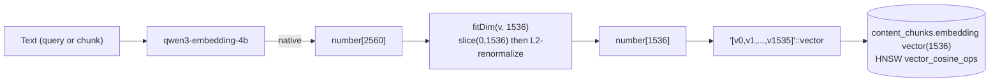
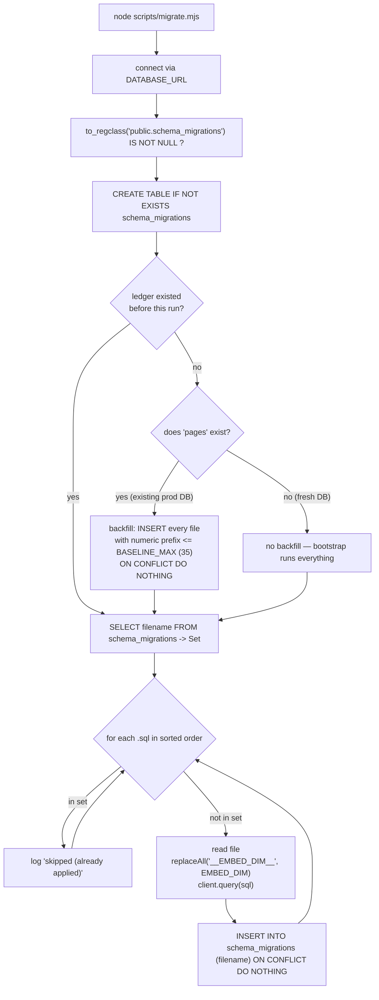
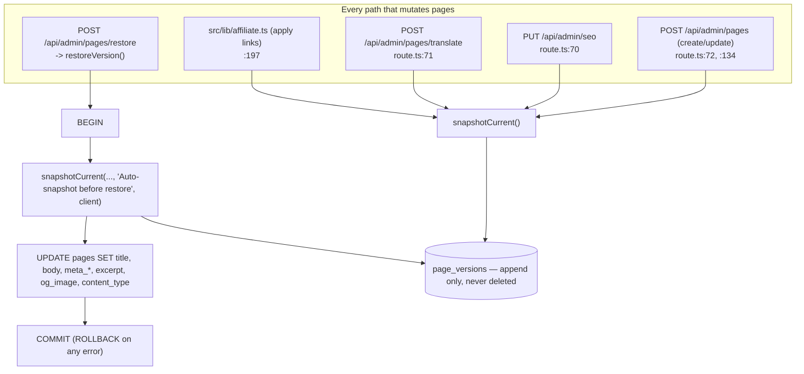

# OXOT Website — Data Model

**Source of truth:** `db/migrations/001_init.sql` … `040_consolidate_approach_into_cdt.sql`.
There is **no ORM and no generated schema file**. If this document and a migration
disagree, the migration wins.

Every table below was read from its `CREATE TABLE` / `ALTER TABLE` statement.
Where a column's writer or reader could not be located in `src/`, it is marked
**[UNVERIFIED]**.

---

## 1. Entity overview

```mermaid
erDiagram
    admin_users {
        uuid id PK
        text email UK
        text password_hash
    }

    pages {
        bigint id PK
        text slug
        text locale
        text title
        text body
        bool published
        text content_type
    }
    page_versions {
        bigint id PK
        text slug
        text locale
        int version_number
        text state
    }
    pages ||--o{ page_versions : "snapshotted by slug+locale (no FK)"

    menus {
        bigint id PK
        text key UK
    }
    menu_items {
        bigint id PK
        bigint menu_id FK
        bigint parent_id FK
        text locale
        text label
        text href
        int position
    }
    menus ||--o{ menu_items : contains
    menu_items ||--o{ menu_items : "parent_id (mega-menu)"

    site_blocks {
        text key PK
        text locale PK
        jsonb data
    }

    visitor_sessions {
        uuid id PK
        text locale
        timestamptz consent_at
    }
    visitor_events {
        bigint id PK
        uuid session_id FK
        text type
        text page_id
    }
    agent_messages {
        bigint id PK
        uuid session_id FK
        text role
        text text
        bigint_arr cited_chunk_ids
        text provider
    }
    visitor_sessions ||--o{ visitor_events : emits
    visitor_sessions ||--o{ agent_messages : converses

    content_chunks {
        bigint id PK
        text page_id
        text locale
        text text
        vector embedding
        text source_ref
    }
    agent_messages }o..o{ content_chunks : "cited_chunk_ids (array, no FK)"
    pages ||..o{ content_chunks : "page_id = slug (no FK)"
    site_blocks ||..o{ content_chunks : "page_id = site-blocks-* (no FK)"

    contact_messages {
        uuid id PK
        text name
        text email
        text message
        uuid session_id
        vector embedding
    }
    cra_readiness_leads {
        uuid id PK
        text segment
        text stage
        text email
        jsonb answers
        jsonb utm
        uuid session_id
        vector embedding
    }
    visitor_sessions ||..o{ contact_messages : "session_id (no FK)"
    visitor_sessions ||..o{ cra_readiness_leads : "session_id (no FK)"

    newsletter_subscribers {
        serial id PK
        text email UK
        text status
        text confirm_token
        text unsubscribe_token
    }
    newsletters {
        serial id PK
        text subject
        text status
        timestamptz scheduled_at
    }
    newsletter_sends {
        serial id PK
        int newsletter_id FK
        int subscriber_id FK
        text status
    }
    newsletters ||--o{ newsletter_sends : "on delete cascade"
    newsletter_subscribers ||--o{ newsletter_sends : "on delete cascade"

    affiliate_links {
        serial id PK
        text name
        text target_url
        bool sponsored
        bool active
    }
    affiliate_keywords {
        serial id PK
        int affiliate_link_id FK
        text keyword
        text locale
    }
    link_clicks {
        serial id PK
        text href
        text kind
        int affiliate_link_id FK
    }
    affiliate_links ||--o{ affiliate_keywords : "on delete cascade"
    affiliate_links ||--o{ link_clicks : "nullable, on delete cascade"

    conformity_regulations {
        serial id PK
        text key UK
        text short_name
    }
    conformity_themes {
        serial id PK
        text key UK
    }
    conformity_requirements {
        serial id PK
        text regulation_key
        text theme_key
        text ref_code
    }
    conformity_mappings {
        serial id PK
        text theme_key
        text regulation_key
    }
    conformity_timeline {
        serial id PK
        text regulation_key
        date event_date
    }
    conformity_sources {
        serial id PK
        text title UK
        text regulation_key
    }
    conformity_regulations ||..o{ conformity_requirements : "regulation_key (logical, no FK)"
    conformity_themes ||..o{ conformity_requirements : "theme_key (logical, no FK)"
    conformity_themes ||..o{ conformity_mappings : "theme_key (logical, no FK)"
    conformity_regulations ||..o{ conformity_mappings : "regulation_key (logical, no FK)"
    conformity_regulations ||..o{ conformity_timeline : "regulation_key (logical, no FK)"
    conformity_regulations ||..o{ conformity_sources : "regulation_key (logical, no FK)"

    app_settings {
        text key PK
        text value
    }
    media {
        bigserial id PK
        text filename
        text mime
        bytea bytes
    }
    carousel_slides {
        serial id PK
        int sort_order
        text image_path
        bool active
    }
    integration_events {
        bigint id PK
        text integration
        text kind
        bool success
    }
    page_views {
        serial id PK
        text path
        text locale
    }
    social_posts {
        serial id PK
        text platform
        bool success
    }
    schema_migrations {
        text filename PK
        timestamptz applied_at
    }
```



> **Important:** most cross-table links in this schema are **logical, not
> enforced.** Real foreign keys exist only on `menu_items.menu_id`,
> `menu_items.parent_id`, `visitor_events.session_id`, `agent_messages.session_id`,
> `newsletter_sends.newsletter_id/subscriber_id`,
> `affiliate_keywords.affiliate_link_id` and `link_clicks.affiliate_link_id`.
> `content_chunks.page_id`, `contact_messages.session_id`,
> `cra_readiness_leads.session_id`, `page_versions.slug/locale` and every
> `conformity_*.*_key` are unenforced string joins.

---

## 2. Table reference

### 2.1 Content & CMS

#### `pages` — markdown CMS pages

Created in `002_admin_cms.sql`; extended by `004_seo_fields.sql` and
`032_affiliate_seo.sql`.

| Column | Type | Default / constraint | Added by |
|---|---|---|---|
| `id` | `BIGINT GENERATED ALWAYS AS IDENTITY` | PK | 002 |
| `slug` | `TEXT` | NOT NULL | 002 |
| `locale` | `TEXT` | NOT NULL, `CHECK (locale IN ('nl','en'))` | 002 |
| `title` | `TEXT` | NOT NULL | 002 |
| `body` | `TEXT` | NOT NULL DEFAULT `''` | 002 |
| `published` | `BOOLEAN` | NOT NULL DEFAULT `false` | 002 |
| `updated_at` | `TIMESTAMPTZ` | NOT NULL DEFAULT `now()` | 002 |
| `meta_title` | `TEXT` | — | 004 |
| `meta_description` | `TEXT` | — | 004 |
| `excerpt` | `TEXT` | — | 004 |
| `og_image` | `TEXT` | — | 004 |
| `content_type` | `TEXT` | NOT NULL DEFAULT `'page'`, `CHECK IN ('page','article')` (`pages_content_type_chk`) | 004 |
| `published_at` | `TIMESTAMPTZ` | — | 004 |
| `og_title` | `text` | — | 032 |
| `og_description` | `text` | — | 032 |
| `canonical_url` | `text` | — | 032 |
| `meta_keywords` | `text` | — | 032 |
| `noindex` | `boolean` | NOT NULL DEFAULT `false` | 032 |

**Constraints / indexes:** `UNIQUE (slug, locale)`;
`pages_content_type_idx (content_type, locale, published)`.

**Read by:** `getPublishedPage()`, `listPublishedRefs()`, `listArticles()`
(`src/lib/content.ts`); `src/app/[locale]/[slug]/page.tsx`,
`contact/page.tsx`, `blog/page.tsx`, `sitemap.ts`;
`runRebuild()` in `src/app/api/admin/content/reindex/route.ts`;
`reindexPage()` in `src/lib/reindex.ts`.
**Written by:** `POST/DELETE /api/admin/pages`, `PUT /api/admin/seo`,
`POST /api/admin/pages/translate`, `restoreVersion()` in
`src/lib/page-versions.ts`, `src/lib/affiliate.ts`, `scripts/seed-pages.mjs`,
and the seed migrations (003, 016–020, 026, 028).

> The `page_content_type_chk` constraint is added inside a `DO $$ … pg_constraint`
> guard so re-running `004` is safe.

#### `page_versions` — append-only zero-loss history

`036_page_versions.sql`.

| Column | Type | Notes |
|---|---|---|
| `id` | `BIGINT GENERATED ALWAYS AS IDENTITY` | PK |
| `slug` | `TEXT` | NOT NULL |
| `locale` | `TEXT` | NOT NULL, `CHECK IN ('nl','en')` |
| `version_number` | `INT` | NOT NULL |
| `state` | `TEXT` | NOT NULL DEFAULT `'archived'`, `CHECK IN ('draft','published','archived')` |
| `title` | `TEXT` | NOT NULL |
| `body` | `TEXT` | NOT NULL DEFAULT `''` |
| `meta_title`, `meta_description`, `excerpt`, `og_image` | `TEXT` | — |
| `content_type` | `TEXT` | NOT NULL DEFAULT `'page'` |
| `note` | `TEXT` | free-text reason, e.g. `'Auto-snapshot before restore'` |
| `created_at` | `TIMESTAMPTZ` | NOT NULL DEFAULT `now()` |

`UNIQUE (slug, locale, version_number)`;
index `page_versions_slug_locale_idx (slug, locale, version_number DESC)`.

Migration 036 seeds a v1 `'Initial snapshot'` for every existing page via
`WHERE NOT EXISTS`. See §6 for the write paths.

#### `site_blocks` — structured JSONB content

`007_site_blocks.sql`.

| Column | Type | Notes |
|---|---|---|
| `key` | `TEXT` | NOT NULL, part of PK |
| `locale` | `TEXT` | NOT NULL, part of PK — **no CHECK constraint** |
| `data` | `JSONB` | NOT NULL |
| `updated_at` | `TIMESTAMPTZ` | NOT NULL DEFAULT `now()` |

`PRIMARY KEY (key, locale)`. No secondary indexes. See §5 for the JSONB shapes.

#### `menus` / `menu_items`

`002_admin_cms.sql`, extended by `011_menu_nesting.sql`.

`menus`: `id BIGINT IDENTITY PK`, `key TEXT NOT NULL UNIQUE` (values in use:
`'main'`; `'footer'` is named in the migration comment — **[UNVERIFIED]** whether
a footer menu row is actually seeded).

`menu_items`:

| Column | Type | Notes |
|---|---|---|
| `id` | `BIGINT IDENTITY` | PK |
| `menu_id` | `BIGINT` | NOT NULL, FK → `menus(id)` **ON DELETE CASCADE** |
| `locale` | `TEXT` | NOT NULL, `CHECK IN ('nl','en')` |
| `label` | `TEXT` | NOT NULL |
| `href` | `TEXT` | NOT NULL — absolute, locale-prefixed (`/en/frameworks`) |
| `position` | `INT` | NOT NULL DEFAULT `0` |
| `parent_id` | `BIGINT` | FK → `menu_items(id)` **ON DELETE CASCADE** (011) |
| `description` | `TEXT` | mega-menu sub-label (011) |

Indexes: `menu_items_menu_idx (menu_id, locale, position)`,
`menu_items_parent_idx (parent_id)`.

**Read by:** `getMenu()` (flat, `parent_id IS NULL` — footer) and `getMenuTree()`
(nested — mega-menu) in `src/lib/content.ts`.
**Written by:** `/api/admin/menu-items` (GET/POST/PATCH/DELETE) and the nav seed
migrations 005, 012, 013, 014, 015, 022, 023, 038, 040.

> `parent_id`'s `ON DELETE CASCADE` is why migration `038` re-parents the four
> conformity sub-items **before** deleting the old parent — otherwise they would
> have been cascade-deleted.

#### `media`

`009_media.sql`. Binaries live in Postgres per the project brief.

`id BIGSERIAL PK`, `filename TEXT NOT NULL`, `mime TEXT NOT NULL`,
`bytes BYTEA NOT NULL`, `size INTEGER NOT NULL`, `width INTEGER`,
`height INTEGER`, `alt TEXT`, `created_at TIMESTAMPTZ NOT NULL DEFAULT now()`.
Index `media_created_idx (created_at DESC)`.

Served by `GET /api/media/[id]`; managed via `/api/admin/media`;
seeded by `scripts/seed-media.mjs`.

#### `files` — **unused**

`001_init.sql`: `id UUID PK DEFAULT gen_random_uuid()`, `filename TEXT NOT NULL`,
`content_type TEXT`, `bytes BYTEA NOT NULL`, `created_at TIMESTAMPTZ`.
No `SELECT`/`INSERT` against `files` exists in `src/` or `scripts/` — it was
superseded by `media`. Left in place; do not build on it.

#### `carousel_slides`

`033_carousel.sql`.

| Column | Type | Notes |
|---|---|---|
| `id` | `serial` | PK |
| `sort_order` | `integer` | NOT NULL DEFAULT `0` |
| `kind` | `text` | NOT NULL DEFAULT `'image'` (`'image'` \| `'pdf'`) |
| `image_path` | `text` | NOT NULL |
| `media_asset_id` | `integer` | nullable, **deliberately no FK** (see migration comment: `media` is `BIGSERIAL`, type mismatch avoided) |
| `group_id` | `text` | — |
| `page_index` | `integer` | — |
| `caption_en`, `caption_nl` | `text` | — |
| `link_url` | `text` | — |
| `active` | `boolean` | NOT NULL DEFAULT `true` |
| `created_at`, `updated_at` | `timestamptz` | NOT NULL DEFAULT `now()` |

Indexes on `sort_order` and `active`. Seeded with the six `/hero/en/slide-N.png`
rows, guarded per-row by `WHERE NOT EXISTS ... image_path`. Read publicly via
`GET /api/carousel`; managed via `/api/admin/carousel` (+ `/[id]`, `/reorder`).
The hero component falls back to the static PNG set when the table is empty.

---

### 2.2 Retrieval & the AI agent

#### `content_chunks` — the pgvector corpus

`001_init.sql`, retyped by `035_embed_dim_1536.sql`.

| Column | Type | Notes |
|---|---|---|
| `id` | `BIGINT GENERATED ALWAYS AS IDENTITY` | PK — this is the `[id]` the agent cites |
| `page_id` | `TEXT` | NOT NULL — a `pages.slug`, a `content/**` filename stem, or a `site-blocks-*` pseudo-id |
| `locale` | `TEXT` | NOT NULL, `CHECK IN ('nl','en')` |
| `text` | `TEXT` | NOT NULL — the chunk itself |
| `embedding` | `vector(__EMBED_DIM__)` → `vector(1536)` | NOT NULL |
| `source_ref` | `TEXT` | provenance, e.g. `pages/nl/cra`, `site_blocks/en/cdt_home` |
| `created_at` | `TIMESTAMPTZ` | NOT NULL DEFAULT `now()` |

Indexes: `content_chunks_locale_idx (locale)`;
`content_chunks_embedding_hnsw` — `USING hnsw (embedding vector_cosine_ops)`,
created by 035.

#### `visitor_sessions` / `visitor_events`

`001_init.sql`.

`visitor_sessions`: `id UUID PK DEFAULT gen_random_uuid()`,
`locale TEXT NOT NULL CHECK IN ('nl','en')`, `consent_at TIMESTAMPTZ` (NULL =
no consent), `created_at TIMESTAMPTZ NOT NULL DEFAULT now()`.

`visitor_events`: `id BIGINT IDENTITY PK`,
`session_id UUID NOT NULL REFERENCES visitor_sessions(id) ON DELETE CASCADE`,
`type TEXT NOT NULL` (app-enforced to `page|click|scroll|dwell` by
`src/app/api/events/route.ts`), `page_id TEXT`, `element TEXT`, `meta JSONB`
(capped at 4096 bytes of JSON by `sanitizeMeta()`), `ts TIMESTAMPTZ`.
Index `visitor_events_session_idx (session_id)`.

Written by `POST /api/session`, `PATCH /api/session`, `POST /api/events`.
Read by `POST /api/agent` (consent check) and `GET /api/admin/stats`.

> There is **no `agent_sessions` table** — `visitor_sessions` serves that role.

#### `agent_messages`

`001_init.sql`. `id BIGINT IDENTITY PK`,
`session_id UUID NOT NULL REFERENCES visitor_sessions(id) ON DELETE CASCADE`,
`role TEXT NOT NULL CHECK IN ('system','user','assistant')`, `text TEXT NOT NULL`,
`cited_chunk_ids BIGINT[]`, `provider TEXT` (`ollama` | `openrouter` |
`openrouter-search` | `unknown`), `ts TIMESTAMPTZ NOT NULL DEFAULT now()`.

Both turns are written by `src/app/api/agent/route.ts` — the user turn before
generation, the assistant turn in the stream's `finally` block.

---

### 2.3 Leads, enquiries, subscribers

#### `contact_messages`

`006_contact.sql`, extended by `008_inquiries.sql` and retyped by `035`.

| Column | Type | Notes |
|---|---|---|
| `id` | `UUID` | PK DEFAULT `gen_random_uuid()` |
| `name`, `email`, `message` | `TEXT` | NOT NULL |
| `company` | `TEXT` | — |
| `locale` | `TEXT` | NOT NULL DEFAULT `'en'` |
| `page` | `TEXT` | originating path |
| `ip_hash` | `TEXT` | hashed, never raw (`hashIp()`) |
| `handled` | `BOOLEAN` | NOT NULL DEFAULT `false` |
| `created_at` | `TIMESTAMPTZ` | NOT NULL DEFAULT `now()` |
| `session_id` | `UUID` | 008 — links to a chat session, **no FK** |
| `admin_note` | `TEXT` | 008 |
| `responded_at` | `TIMESTAMPTZ` | 008 |
| `embedding` | `vector(1536)` | 008; nullable — nulled and retyped by 035 |

Indexes: `contact_messages_created_idx (created_at DESC)`,
`contact_messages_handled_idx (handled, created_at DESC)`,
`contact_messages_session_idx (session_id)`.

Written by `POST /api/contact`; read/updated by `GET|PATCH /api/admin/contact`.

#### `cra_readiness_leads`

`039_cra_intake.sql`.

| Column | Type | Default / notes |
|---|---|---|
| `id` | `UUID` | PK DEFAULT `gen_random_uuid()` |
| `segment` | `TEXT` | NOT NULL — one of the five in `src/lib/segments.ts` (app-enforced, no CHECK) |
| `stage` | `TEXT` | NOT NULL DEFAULT `'new'` |
| `tags` | `TEXT[]` | NOT NULL DEFAULT `'{}'` |
| `name`, `email` | `TEXT` | NOT NULL |
| `company`, `role` | `TEXT` | — |
| `answers` | `JSONB` | NOT NULL DEFAULT `'{}'` |
| `blocker` | `TEXT` | free text, ≤5000 chars (app-validated) |
| `locale` | `TEXT` | NOT NULL DEFAULT `'en'` |
| `page` | `TEXT` | — |
| `utm` | `JSONB` | NOT NULL DEFAULT `'{}'` |
| `ip_hash` | `TEXT` | — |
| `session_id` | `UUID` | no FK |
| `scheduling_status` | `TEXT` | NOT NULL DEFAULT `'none'` |
| `scheduled_at` | `TIMESTAMPTZ` | — |
| `handled` | `BOOLEAN` | NOT NULL DEFAULT `false` |
| `admin_note` | `TEXT` | — |
| `responded_at` | `TIMESTAMPTZ` | — |
| `created_at` | `TIMESTAMPTZ` | NOT NULL DEFAULT `now()` |
| `embedding` | `vector(1536)` | nullable |

Indexes: `(created_at DESC)`, `(stage, created_at DESC)`,
`(segment, created_at DESC)`, `(session_id)`, plus the guarded
`cra_readiness_leads_embedding_hnsw` HNSW cosine index.

Written by `insertLead()` (`src/lib/intake.ts`) via `POST /api/intake`, which
**retries the insert without `embedding`** if the first attempt fails, so a lead
is never lost. Read/updated by `GET|PATCH /api/admin/intake`.

#### `newsletter_subscribers`

`025_newsletter_subscribers.sql`, extended by `030_newsletter_social.sql`.

`id serial PK`, `email text NOT NULL UNIQUE`, `locale text`,
`status text NOT NULL DEFAULT 'pending'`, `source text`, `token text`,
`created_at timestamptz DEFAULT now()`, `confirmed_at timestamptz`;
plus from 030: `confirm_token text`, `unsubscribe_token text`, `consent_ip text`,
`unsubscribed_at timestamptz`, `updated_at timestamptz DEFAULT now()`.
Migration 030 backfills `unsubscribe_token` with an `md5(random()…)` value where
NULL, and indexes both token columns.

Written by `POST /api/newsletter/subscribe`, `GET /api/newsletter/confirm`,
`GET /api/newsletter/unsubscribe`; managed via
`/api/admin/newsletter-subscribers`.

#### `newsletters` / `newsletter_sends` / `social_posts`

`030_newsletter_social.sql`.

`newsletters`: `id serial PK`, `subject text NOT NULL`, `preheader text`,
`content_markdown text NOT NULL DEFAULT ''`, `topic text`,
`locale text NOT NULL DEFAULT 'en'`, `status text NOT NULL DEFAULT 'draft'`,
`scheduled_at`, `sent_at`, `recipient_count/sent_count/failed_count int NOT NULL
DEFAULT 0`, `created_at`, `updated_at`.

`newsletter_sends`: `id serial PK`,
`newsletter_id int NOT NULL REFERENCES newsletters(id) ON DELETE CASCADE`,
`subscriber_id int NOT NULL REFERENCES newsletter_subscribers(id) ON DELETE
CASCADE`, `status text DEFAULT 'sent'`, `error text`, `opened_at`,
`sent_at DEFAULT now()`, `UNIQUE (newsletter_id, subscriber_id)`.

`social_posts`: `id serial PK`, `platform text`, `success boolean NOT NULL`,
`error text`, `text text NOT NULL DEFAULT ''`,
`source text NOT NULL DEFAULT 'manual'`, `created_at`.

Written by `/api/admin/newsletters*` and `/api/admin/social*`; scheduled sends are
driven by `/api/cron` (gated on `CRON_SECRET`).

---

### 2.4 Analytics, affiliate, integrations, settings

#### `page_views` / `link_clicks`

`031_analytics.sql`; `link_clicks` extended by `032_affiliate_seo.sql`.

`page_views`: `id serial PK`, `path text NOT NULL`,
`locale text NOT NULL DEFAULT 'en'`, `session_id text`, `referrer text`,
`device text`, `created_at timestamptz NOT NULL DEFAULT now()`.
Indexes on `created_at` and `path`.

`link_clicks`: `id serial PK`, `href text NOT NULL`,
`kind text NOT NULL DEFAULT 'outbound'` (app-narrowed to
`internal|outbound|affiliate`), `path text`, `locale text`, `session_id text`,
`referrer text`, `created_at`; plus `affiliate_link_id integer` (032, nullable,
FK `link_clicks_affiliate_link_id_fkey` → `affiliate_links(id) ON DELETE CASCADE`,
added inside a `pg_constraint` guard). Indexes on `created_at`, `href`,
`affiliate_link_id`.

Written by `POST /api/track` (bot-filtered, rate-limited, always acks) and
`GET /api/go/[id]`. Read by `GET /api/admin/analytics`.

> `session_id` is `text` here, not `uuid` — these are **not** the same identifiers
> as `visitor_sessions.id`. **[UNVERIFIED]** what generates them client-side.

#### `affiliate_links` / `affiliate_keywords`

`032_affiliate_seo.sql`, ported from the Celestial-Agent-Nexus Drizzle schemas.

`affiliate_links`: `id serial PK`, `name text NOT NULL`,
`target_url text NOT NULL`, `description text`,
`sponsored boolean NOT NULL DEFAULT true` (drives `rel="sponsored"` vs
`nofollow`), `active boolean NOT NULL DEFAULT true`, `created_at`, `updated_at`.
**No denormalized click counter** — totals are derived from `link_clicks`.

`affiliate_keywords`: `id serial PK`,
`affiliate_link_id integer NOT NULL REFERENCES affiliate_links(id) ON DELETE
CASCADE`, `keyword text NOT NULL`, `locale text NOT NULL DEFAULT 'en'`,
`active boolean NOT NULL DEFAULT true`, `created_at`.
Index `affiliate_keywords_link_idx`.

Managed by `/api/admin/affiliate` (+ `/[id]`, `/apply`, `/suggest`) and
`src/lib/affiliate.ts`. Public clicks route through `/api/go/[id]`, never the
raw `target_url`.

#### `integration_events`

`037_integration_events.sql`. `id BIGINT IDENTITY PK`,
`integration TEXT NOT NULL CHECK IN ('email','linkedin','x')`,
`kind TEXT NOT NULL`, `success BOOLEAN NOT NULL DEFAULT true`, `detail TEXT`,
`created_at TIMESTAMPTZ NOT NULL DEFAULT now()`.
Indexes `(created_at DESC)` and `(integration, created_at DESC)`.

Written best-effort by `src/lib/integration-observability.ts`; the admin activity
feed (`GET /api/admin/integrations/activity`) **merges this with
`social_posts`**.

#### `app_settings`

`010_ai_settings.sql`. `key TEXT PRIMARY KEY`, `value TEXT`,
`updated_at TIMESTAMPTZ NOT NULL DEFAULT now()`.

A flat key/value store, read at request time and merged **over** `.env` defaults.
Two disjoint key namespaces:

- **AI** — `AI_SETTING_KEYS` in `src/lib/ai-settings.ts`: `ollama_host`,
  `embed_model`, `embed_provider`, `openrouter_embed_model`, `chat_provider`,
  `ollama_chat_model`, `openrouter_model`, `openrouter_api_key`, `chat_model`,
  `brief_model`, `translation_model`, `long_context_model`, `search_model`.
- **Integrations** — `INTEGRATION_SETTING_KEYS` in
  `src/lib/integration-settings.ts`: `email_enabled`, `smtp_from_name`,
  `smtp_from_email`, `smtp_host`, `smtp_port`, `smtp_username`, `smtp_password`,
  `smtp_alert_email`, `smtp_secure`, `email_auth_type`,
  `email_oauth_client_id/_secret/_refresh_token/_user`, `linkedin_enabled`,
  `linkedin_access_token`, `linkedin_token_expires_at`, `linkedin_author_urn`,
  `linkedin_auto_publish`, `linkedin_client_id`, `linkedin_client_secret`,
  `linkedin_profile_url`, `x_enabled`, `x_api_key`, `x_api_secret`,
  `x_access_token`, `x_access_secret`, `x_username`, `x_auto_publish`.

Secret-valued keys are stored **AES-256-GCM encrypted**, tagged `enc:v1:` with
base64 `salt:iv:tag:ciphertext`, keyed from `SETTINGS_SECRET ?? AUTH_SECRET` via
scrypt. Untagged values are read as legacy plaintext. Rotating the secret
silently invalidates stored keys (decrypt returns `""` and the env fallback is
used).

> `EMBED_DIM` is deliberately **not** in `app_settings`: the pgvector column
> dimension is fixed by migration, so changing it requires a migration plus a
> full re-ingest.

#### `admin_users`

`002_admin_cms.sql`. `id UUID PK DEFAULT gen_random_uuid()`,
`email TEXT NOT NULL UNIQUE`, `password_hash TEXT NOT NULL` (scrypt,
`salt:hash` hex — see `hashPassword()` in `src/lib/auth.ts`),
`created_at TIMESTAMPTZ NOT NULL DEFAULT now()`.

Seeded idempotently by `scripts/seed-admin.mjs` / `scripts/create-admin.mjs` and
migration `018_seed_admin_user.sql`.

> **There is no sessions table.** `src/lib/auth.ts` issues a stateless
> `base64url(payload).HMAC-SHA256(payload)` token in the httpOnly `oxot_admin`
> cookie with an 8-hour `exp`. Consequence: logout clears the cookie but cannot
> revoke an already-issued token server-side.

---

### 2.5 Conformity reference data

All from `021_conformity_platform.sql`; Dutch columns are in the same migration,
values populated by `024_conformity_nl.sql`. Read by `src/lib/conformity.ts` for
the `/[locale]/conformity-platform/**` routes.

| Table | Key columns |
|---|---|
| `conformity_regulations` | `id serial PK`, `key text UNIQUE NOT NULL`, `name`, `short_name`, `full_title`, `jurisdiction`, `summary`, `in_force_date date`, `source_url`, `requirement_count int DEFAULT 0`, `sort_order int DEFAULT 0`, `name_nl`, `short_name_nl`, `full_title_nl`, `summary_nl`, `updated_at` |
| `conformity_themes` | `id serial PK`, `key text UNIQUE NOT NULL`, `name`, `description`, `sort_order`, `name_nl`, `description_nl` |
| `conformity_requirements` | `id serial PK`, `regulation_key NOT NULL`, `theme_key`, `ref_code NOT NULL`, `title NOT NULL`, `description`, `obligation_type`, `applies_to text[] DEFAULT '{}'`, `mapping_count`, `sort_order`, `title_nl`, `description_nl`, `UNIQUE (regulation_key, ref_code)` |
| `conformity_mappings` | `id serial PK`, `theme_key NOT NULL`, `regulation_key NOT NULL`, `requirement_count`, `requirement_refs text[] DEFAULT '{}'`, `UNIQUE (theme_key, regulation_key)` |
| `conformity_timeline` | `id serial PK`, `regulation_key`, `event_date date NOT NULL`, `label NOT NULL`, `label_nl`, `sort_order`, `UNIQUE (regulation_key, event_date, label)` |
| `conformity_sources` | `id serial PK`, `title text NOT NULL UNIQUE`, `filename`, `url`, `kind`, `description`, `regulation_key`, `sort_order` |
| `conformity_meta` | `key text PK`, `value_int int`, `value_text text` |

Seeded regulation keys: `cra`, `ai_act`, `machinery`, `iec_62443`, `nis2`.
`src/app/[locale]/conformity-platform/page.tsx` maps them to framework page slugs
via `FRAMEWORK_SLUG` (`machinery → machine-act`, `ai_act → ai-act`,
`iec_62443 → iec-62443`).

Seeds are written as `INSERT … ON CONFLICT (key) DO UPDATE SET …`, so re-running
`021` refreshes rather than duplicating. This is a deliberate exception to the
run-once ledger's protection — but 021 is below `BASELINE_MAX`, so on an existing
production DB it is backfilled as applied and never re-runs.

---

### 2.6 `schema_migrations`

Created by `scripts/migrate.mjs`, not by a migration file:

```sql
CREATE TABLE IF NOT EXISTS schema_migrations (
  filename   TEXT PRIMARY KEY,
  applied_at TIMESTAMPTZ NOT NULL DEFAULT now()
);
```

---

## 3. pgvector specifics

### Dimension: 1536



Four things must agree on `1536`, or retrieval silently returns garbage:

| # | Location | How |
|---|---|---|
| 1 | `db/migrations/001_init.sql` | `embedding vector(__EMBED_DIM__) NOT NULL` |
| 2 | `scripts/migrate.mjs` | `const dim = Number(process.env.EMBED_DIM ?? 1536); sql.replaceAll("__EMBED_DIM__", String(dim))` |
| 3 | `src/lib/embeddings.ts` | `export const EMBED_DIM = Number(process.env.EMBED_DIM ?? 1536)` and `fitDim()` |
| 4 | `scripts/ingest.mjs` | `const EMBED_DIM = Number(process.env.EMBED_DIM ?? 1536)` and its own `fitDim()` |

`__EMBED_DIM__` also appears in `008_inquiries.sql` and `039_cra_intake.sql`.

### Matryoshka (MRL) truncation

`qwen3-embedding-4b` emits **2560** dimensions natively. `fitDim` keeps the first
1536 components and L2-renormalizes. Because the model is MRL-trained, a
normalized prefix is a valid lower-dimensional embedding. The two implementations
are byte-equivalent in behaviour and **must stay in sync**:

```ts
// src/lib/embeddings.ts
export function fitDim(v: number[], dim = EMBED_DIM): number[] {
  if (!Array.isArray(v) || v.length <= dim) return v;
  const t = v.slice(0, dim);
  const norm = Math.sqrt(t.reduce((s, x) => s + x * x, 0)) || 1;
  return t.map((x) => x / norm);
}
```

```js
// scripts/ingest.mjs
function fitDim(v, dim = EMBED_DIM) {
  if (!Array.isArray(v) || v.length <= dim) return v;
  const t = v.slice(0, dim);
  const n = Math.sqrt(t.reduce((s, x) => s + x * x, 0)) || 1;
  return t.map((x) => x / n);
}
```

If they ever diverge, **query and index vectors live in different spaces** and
similarity becomes meaningless. This is called out in the comments of both files.

Note also: the OpenRouter path deliberately does **not** send the OpenAI
`dimensions` parameter. Doing so caused `data[0].embedding` to be absent for
`qwen3-embedding-4b` (documented at length in `src/lib/embeddings.ts`).

### Why 1536, and the HNSW index

pgvector's HNSW/IVFFlat cap at **2000 dimensions**. At 2560 no ANN index was
possible: `001_init.sql` explicitly documents "No ANN index" and suggests a
`halfvec(2560)` workaround. `034_hnsw_index.sql` was that halfvec attempt — it is
now a deliberate **no-op (`SELECT 1;`)**, retained only to preserve migration
numbering.

`035_embed_dim_1536.sql` supersedes it and does three conditional things:

1. If `content_chunks.embedding`'s live dimension differs from `__EMBED_DIM__`:
   drop the HNSW index, `TRUNCATE content_chunks` (fully regenerable via
   re-ingest), `ALTER COLUMN ... TYPE vector(1536)`.
2. Same conditional retype for `contact_messages.embedding`, nulling values first.
3. `CREATE INDEX IF NOT EXISTS content_chunks_embedding_hnsw ON content_chunks
   USING hnsw (embedding vector_cosine_ops)` inside an
   `EXCEPTION WHEN others THEN RAISE NOTICE` block, so a still-oversized column
   or a pgvector build without HNSW produces a notice, not a failed deploy.

The dimension check reads `atttypmod - 4` from `pg_attribute`, so the migration is
a total no-op when the column is already at the target — safe to re-run.

`src/lib/retrieval.ts` uses the plain `<=>` cosine operator with **no halfvec
cast**, deliberately: an unverifiable halfvec cast on the live instance could
have silently stripped the agent's grounding.

### Changing the dimension

Changing `EMBED_DIM` **requires a full re-ingest** (migration 035 truncates
`content_chunks`). The steps:

1. Change `EMBED_DIM` in the environment.
2. Redeploy — `preDeployCommand` runs `migrate.mjs`, and 035 re-runs only if it
   is not in `schema_migrations`. On an existing DB **you must first delete its
   ledger row** (`DELETE FROM schema_migrations WHERE filename = '035_embed_dim_1536.sql';`)
   or add a new migration.
3. Trigger the admin rebuild (`POST /api/admin/content/reindex`) or run
   `npm run ingest`.

---

## 4. The migration system

### Layout

`db/migrations/NNN_description.sql`, zero-padded to three digits, applied in
`readdirSync(...).sort()` order — i.e. **lexicographic on filename**. Numbers must
stay three digits or ordering breaks.

### Run-once ledger



**Why `BASELINE_MAX = 35` matters:** migrations 001–035 predate the ledger and
had already run against production. Many of them are *seed* migrations that
overwrite `pages`/`menu_items`. Without the backfill, the first ledger-aware
deploy would have re-run them and clobbered live admin edits. The backfill only
happens when `pages` already exists, so a genuinely fresh database still
bootstraps from 001.

**Each migration is applied as a single `client.query(sql)`** — a multi-statement
simple query. Postgres wraps that in an implicit transaction, so a mid-file
failure rolls the whole file back, and the ledger row is not written. There is
**no explicit `BEGIN`/`COMMIT`** in `migrate.mjs`.

### Idempotency conventions in use

| Pattern | Example |
|---|---|
| `CREATE TABLE IF NOT EXISTS` | every table |
| `ADD COLUMN IF NOT EXISTS` | 004, 008, 011, 030, 032 |
| `CREATE INDEX IF NOT EXISTS` | throughout |
| `DO $$ … pg_constraint …` guard before `ADD CONSTRAINT` | 004 (`pages_content_type_chk`), 032 (`link_clicks_affiliate_link_id_fkey`) |
| `INSERT … ON CONFLICT (key) DO UPDATE` | 021 conformity seeds |
| `INSERT … SELECT … WHERE NOT EXISTS` | 033 carousel seed, 036 v1 snapshot, 040 snapshot |
| `DO $$ … EXCEPTION WHEN others THEN RAISE NOTICE` | 035 and 039 HNSW index creation |
| Conditional retype via `pg_attribute.atttypmod` | 035 |
| No-op placeholder to preserve numbering | 034 (`SELECT 1;`) |
| Explicit **REVERSAL:** header comment | 038, 039, 040 |

### Template for a new migration

```sql
-- 041_short_description.sql — one-line purpose.
-- Idempotent: CREATE TABLE / COLUMN / INDEX IF NOT EXISTS, guarded constraints.
--
-- REVERSAL: exact statements to undo this migration, e.g.
--   DROP TABLE IF EXISTS my_new_table;   -- drops its indexes with it
-- List every table/column this migration touches; note anything it does NOT touch.

-- 1. New table.
CREATE TABLE IF NOT EXISTS my_new_table (
  id         BIGINT GENERATED ALWAYS AS IDENTITY PRIMARY KEY,
  locale     TEXT NOT NULL CHECK (locale IN ('nl','en')),
  data       JSONB NOT NULL DEFAULT '{}',
  created_at TIMESTAMPTZ NOT NULL DEFAULT now()
);

CREATE INDEX IF NOT EXISTS my_new_table_created_idx
  ON my_new_table (created_at DESC);

-- 2. Adding a column to an existing table.
ALTER TABLE pages ADD COLUMN IF NOT EXISTS my_field TEXT;

-- 3. Adding a constraint — always guard, ADD CONSTRAINT has no IF NOT EXISTS.
DO $$ BEGIN
  IF NOT EXISTS (SELECT 1 FROM pg_constraint WHERE conname = 'my_new_table_chk') THEN
    ALTER TABLE my_new_table ADD CONSTRAINT my_new_table_chk CHECK (jsonb_typeof(data) = 'object');
  END IF;
END $$;

-- 4. If this migration touches `pages` content, snapshot first (zero-loss).
INSERT INTO page_versions
  (slug, locale, version_number, state, title, body,
   meta_title, meta_description, excerpt, og_image, content_type, note)
SELECT p.slug, p.locale,
       COALESCE((SELECT MAX(v.version_number) FROM page_versions v
                  WHERE v.slug = p.slug AND v.locale = p.locale), 0) + 1,
       CASE WHEN p.published THEN 'published' ELSE 'draft' END,
       p.title, p.body, p.meta_title, p.meta_description, p.excerpt,
       p.og_image, p.content_type,
       'Auto-snapshot before 041'
  FROM pages p
 WHERE p.slug IN ('the','slugs','you','touch')
   AND NOT EXISTS (SELECT 1 FROM page_versions v
                    WHERE v.slug = p.slug AND v.locale = p.locale
                      AND v.note = 'Auto-snapshot before 041');

-- 5. Seeded content: guard so a re-run refreshes or no-ops, never duplicates.
INSERT INTO my_new_table (locale, data)
SELECT s.locale, s.data
  FROM (VALUES ('en', '{}'::jsonb), ('nl', '{}'::jsonb)) AS s(locale, data)
 WHERE NOT EXISTS (SELECT 1 FROM my_new_table t WHERE t.locale = s.locale);
```

Checklist before merging a migration:

- [ ] Filename is `NNN_` with three digits, one higher than the current maximum.
- [ ] Re-running it against an already-migrated DB is a no-op (test it twice).
- [ ] A **REVERSAL:** comment block is present.
- [ ] Any `pages` write is preceded by a `page_versions` snapshot.
- [ ] Any new vector column uses `vector(__EMBED_DIM__)`, never a hardcoded number.
- [ ] Any new locale column has `CHECK (locale IN ('nl','en'))`.
- [ ] Any HNSW index creation is wrapped in an exception-swallowing `DO $$` block.
- [ ] `BASELINE_MAX` in `scripts/migrate.mjs` is **not** changed.

---

## 5. JSONB shapes in `site_blocks`

Each key's shape is defined by an exported TypeScript interface plus a shipped
JSON default. The reader (`getX(locale)`) wraps the DB query in `try/catch` and
returns the default on miss or error; the writer is a `PUT` on the corresponding
admin route.

| `key` | Model | Default | Reader / writer | Admin route |
|---|---|---|---|---|
| `cra_home` | `CraHome`, `src/lib/cra-home.ts` (`CRA_HOME_KEY`) | `defaultCraHome(locale)` | `getCraHome` / `saveCraHome` | `GET\|PUT /api/admin/cra-home` |
| `cdt_home` | `Cdt`, `src/lib/cdt.ts` (`CDT_HOME_KEY`) | `defaultCdt(locale)` | `getCdt` / save | `GET\|PUT /api/admin/cdt` |
| `conformity_home` | `ConformityHome`, `src/lib/conformity-home.ts` (`CONFORMITY_HOME_KEY`) | `defaultConformityHome(locale)` | `getConformityHome` / save | `GET\|PUT /api/admin/conformity-home` |
| `home` | `HomeContent`, `src/lib/site-content.ts` (`HOME_KEY`) | `defaultHomeContent(locale)` | `getHomeContent` / `saveHomeContent` | `GET\|POST /api/admin/site-content` |

### `cra_home` — CRA readiness landing (`/[locale]`)

Sections, in the render order used by `src/app/[locale]/page.tsx`:

```
CraHome {
  hero            // Hero
  statBand        // StatBand
  departureBoard: CraHomeDepartureBoard {
                    title, intro, axisLabels: string[],
                    milestones: DepartureMilestone[]  // {pct, dateLabel, note,
                                                      //  tone: start|info|warning|end}
                    roads: DepartureRoad[]            // {id, label, sub,
                                                      //  segments: RoadSegment[]}
                    // RoadSegment {startPct, widthPct, caption,
                    //              tone: safe|tight|late|closed}
                    legend: DepartureBoardLegendItem[]
                  }
  roadsSplit: CraHomeRoadsSplit {
                    title, intro, startBadge,
                    roads: RoadsSplitRoad[]  // {id, laneLabel, title, body,
                                             //  ceMarkNote, segment, status,
                                             //  statusTone: closed|reserved|scales,
                                             //  oxotDoes}
                    destinationLabel, wrongTurnsTitle, wrongTurns, footnote,
                    statBar: RoadStatItem[], oxotDoesLabel, startIntakeLabel
                  }
  personas: CraHomePersonas {
                    title, intro, buysLabel,
                    cards: PersonaCard[]  // {segment, title, quote, buys, cta}
                  }
  engine
  retainer: CraHomeRetainer {
                    title, intro,
                    phases: RetainerPhase[],      // {tag, title, body}
                    reservedSeat: {tag, title, body},
                    digitalTwin
                  }
  whyOxot
  intake, process: ProcessStep[]   // IntakeSection
  finalCta
}
```

### `cdt_home` — Cyber Digital Twin (`/[locale]/cyber-digital-twin`)

```
Cdt {
  hero: CdtHero { eyebrow, title, titleAccent, subtitle, badges[], ctaLabel }
  statBand: { items: CdtStat[] }            // {value, label, sub?}
  livingModel: CdtLivingModel {
       eyebrow, title, body, points[],
       layers: GraphLayer[],                // {id, name, caption,
                                            //  tone: asset|risk|control|dependency}
       graphHint, graphAriaLabel }
  boms: CdtBoms {
       eyebrow, title, intro, standardNote, dependencyNote,
       boms: BomType[] }                    // code: SBOM|HBOM|CBOM|SaaS-BOM|Ops-BOM
  drilldown: CdtDrilldown {
       title, intro, columns, legend, levelNames, sortOptions,
       rows: BomRow[] }                     // {id, parentId, level, label,
                                            //  version?, cve?, kev, epss, cvss,
                                            //  consequence?, priority: now|next|never}
  consequence, priority, monteCarlo, methodology, outcomes, finalCta
}
```

`BomRow` is a self-referencing tree via `parentId`, with `level` in
`organization | facility | productLine | equipment | component`.

### `conformity_home` — preserved conformity landing (`/[locale]/conformity`)

```
ConformityHome {
  hero: { eyebrow, title, subtitle, primaryCta: CtaLink, secondaryCta: CtaLink, bullets[] }
  logoWall: { title, logos[] }
  stats: ConformityHomeStat[]                    // {value, label, sublabel}
  featureGrid: { eyebrow, title, subtitle, features: {title, description, icon}[] }
  problem: ConformityHomeProblemShift            // {eyebrow, title, body, bullets[], cta}
  shift:   ConformityHomeProblemShift            // same shape
  comparison: { eyebrow, title, subtitle, columns[], rows: {label, left, right: boolean}[] }
  steps: { eyebrow, title, steps: {number, title, description}[] }
  quote: { quote, author, role }
  faq: { eyebrow, title, items: {question, answer}[] }
  cta: { title, subtitle, primaryCta, secondaryCta }
}
```

`CtaLink = { label, href }`.

### `home` — legacy home, now `/[locale]/industrial-operations`

```
HomeContent {
  hero: HomeHero {
    kicker, title, subtitle, cta, trustLabel, industries[],
    card: { title, tag, findingsLabel, stats: HomeStat[] },  // HomeStat {n, l, accent}
    heroPdf?: number | null
  }
  services: HomeServices {
    eyebrow, heading, intro, more,
    cta: { title, body, button },
    items: HomeServiceItem[],          // {name, desc, href}
    frameworks?: HomeFrameworkLink[]   // {label, href}
  }
}
```

### How these shapes reach the AI corpus

`extractProse()` in `src/lib/ingest.ts` walks the parsed JSONB in document order
and collects string leaves, skipping:

- keys ending in `id`, `href`, `url`, `tone`, `icon` (whole subtree skipped);
- the exact keys `code`, `level`, `cve`, `kev`;
- values that are URLs / start with `/`;
- values matching `^[-+]?[\d.,%:/\s]+$` (numeric-ish).

The result is joined with `\n\n`, fence-stripped, chunked at 800 characters and
embedded under a `site-blocks-*` pseudo page id.

---

## 6. Zero-loss: `page_versions` in practice

**Invariant:** a `pages` row is never overwritten without a preceding snapshot.

`snapshotCurrent(slug, locale, state, note, client?)` in
`src/lib/page-versions.ts`:

1. `SELECT title, body, meta_title, meta_description, excerpt, og_image,
   content_type FROM pages WHERE slug=$1 AND locale=$2`.
2. No row → **no-op** (nothing to lose yet).
3. `INSERT INTO page_versions (...) VALUES (..., COALESCE(MAX(version_number),0)+1, ...)`.

It accepts an optional `PoolClient` so it can participate in a caller's
transaction; otherwise it uses the shared pool.



`restoreVersion(slug, locale, versionId)` additionally validates that the target
version's `slug`/`locale` match the request (rejecting a cross-page restore) and
leaves `pages.published` untouched — a restore changes content only.

After any of these writes, `queueReindex(slug, locale)` is fired (never awaited,
never throws) so the AI corpus follows the content. Deletion or unpublishing
causes `reindexPage()` to **purge** the page's chunks instead.

Structural migrations follow the same rule: `038` snapshots the `frameworks`
pages before appending the "Coverage tools" section; `040` snapshots
`cyber-digital-twin` before the coded route shadows it. Both carry REVERSAL
instructions.

---

## 7. Open questions / unverified items

1. `menus.key = 'footer'` is named in the 002 comment but no seeding of a footer
   menu was located. The footer currently renders `getMenu('main', locale)` —
   **[UNVERIFIED]** whether a separate footer menu is intended.
2. `link_clicks.session_id` and `page_views.session_id` are `text`, distinct from
   `visitor_sessions.id` (`uuid`). Their client-side origin was not traced.
3. `carousel_slides.group_id` / `page_index` have no located consumer —
   **[UNVERIFIED]**; likely reserved for multi-page PDF decks.
4. `conformity_meta` has no located reader in `src/lib/conformity.ts` —
   **[UNVERIFIED]**.
5. `newsletter_sends.opened_at` has no located writer (no open-tracking pixel
   route was found) — **[UNVERIFIED]**.
6. `files` (migration 001) is dead; `media` superseded it.
7. `visitor_events` is written and counted but was not observed feeding the agent
   prompt — the agent route reads `visitor_sessions.consent_at` only.
   **[UNVERIFIED]** whether behavioural signals currently influence retrieval, as
   `CLAUDE.md` §4 describes.
8. Row-level content of the seed migrations (003, 012–020, 022–024, 026–029) was
   sampled, not exhaustively transcribed.
