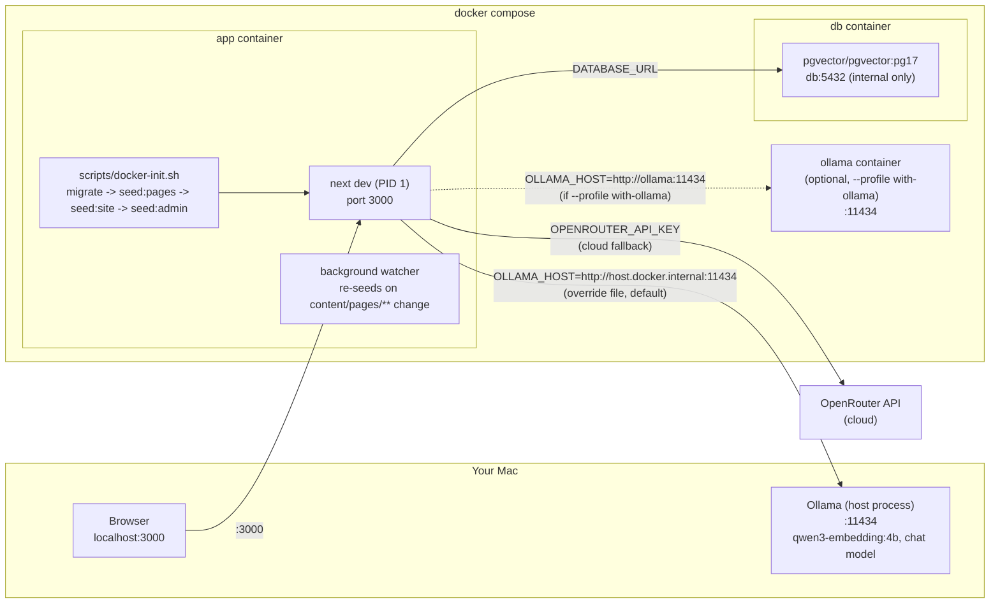

# OXOT Website — Local Docker Setup

**Repo:** `Planet9v/OXOT-Website-JULY2026` (public) · Everything runs in Docker.
**Cross-reference:** system architecture → `docs/ARCHITECTURE.md`; database schema →
`docs/DATA-MODEL.md`; route inventory → `docs/SITEMAP.md`.

> Verified against `Dockerfile`, `docker-compose.yml`, `docker-compose.override.yml`,
> `.env.example`, `package.json`, `scripts/migrate.mjs`, `scripts/seed-admin.mjs`,
> `scripts/docker-init.sh`, `railway.json`, and `SETUP.md` in this repo. Anything not
> directly confirmed in those files is marked **[UNVERIFIED]**.

---

## 1. Prerequisites

- **Docker Desktop** with Compose v2, installed and running.
- **git**.
- Optional, for the AI visitor agent only: **Ollama**, running on the host, with
  `qwen3-embedding:4b` and a chat model pulled. The site and admin work fully without
  it — only embeddings/chat generation need a model backend (local Ollama or
  OpenRouter).

---

## 2. Clone and configure

```bash
git clone https://github.com/Planet9v/OXOT-Website-JULY2026.git
cd OXOT-Website-JULY2026
cp .env.example .env.local
```

`.env.local` is gitignored — never commit it. Edit at least `POSTGRES_PASSWORD` and
`AUTH_SECRET` before starting (see the full variable table below).

### The EMBED_DIM discrepancy — use 1536, not 2560

`.env.example` currently ships `EMBED_DIM=2560` (the embedding model's native output
size). **The authoritative project value is `EMBED_DIM=1536`** (decision 2026-07-14,
recorded in `CLAUDE.md` §2 and applied by migration `db/migrations/035_embed_dim_1536.sql`).
qwen3-embedding:4b natively emits 2560 dimensions; the app truncates to the first 1536
and L2-renormalizes (Matryoshka/MRL truncation) via a shared `fitDim` helper applied
identically in `src/lib/embeddings.ts` (query time) and `scripts/ingest.mjs` (index
time), so query and index vectors always share the same space. 1536 ≤ 2000 is what
lets Postgres use a plain pgvector **HNSW** index (see migration 035 and
`docs/DATA-MODEL.md`).

**Action:** in your `.env.local`, set

```
EMBED_DIM=1536
```

If you leave it at the `.env.example` default of 2560, migration 035 is a no-op (it
only retypes the column when the live dimension differs from `EMBED_DIM`), the
`content_chunks.embedding` column stays at `vector(2560)`, and no HNSW index is built
— retrieval still works (exact cosine search) but is slower and disagrees with the
documented, currently-shipped configuration. The pgvector column, `fitDim`/`EMBED_DIM`,
migration 001's placeholder, and migration 035 must all agree at 1536. **Changing the
dimension requires a full re-ingest** (`npm run ingest`, or Admin → AI & Models →
"Rebuild now").

### Ollama wiring on a new machine

The repo ships `docker-compose.override.yml` (auto-loaded by `docker compose`) tuned
for a Mac that already runs Ollama on the host:
`OLLAMA_HOST=http://host.docker.internal:11434`. On a different machine you have two
options:

- **A — bundled Ollama container** (self-contained, ~7GB download). Set
  `OLLAMA_HOST=http://ollama:11434` in `.env.local`, then after step 3:
  ```bash
  docker compose --profile with-ollama up -d ollama
  docker compose exec ollama ollama pull qwen3-embedding:4b
  docker compose exec ollama ollama pull qwen3.5:9b
  ```
- **B — no Ollama at all.** The site and admin work; the AI chat agent won't answer
  until you set an OpenRouter key (Admin → AI & Models, or `OPENROUTER_API_KEY`).

---

## 3. Start the stack

```bash
docker compose up -d
```

`docker-compose.yml` defines three services (`app`, `db`, optional `ollama`);
`docker-compose.override.yml` is merged in automatically for local dev. What happens:

- **`db`** — `pgvector/pgvector:pg17`, not published to the host (reached internally
  at `db:5432`; the Mac may already have a Postgres on 5432/5433). For a host shell:
  `docker compose exec db psql -U oxot -d oxot`.
- **`app`** — Node 22, `next dev` as the container's main process (PID 1), so it
  restarts cleanly. On first boot it installs dependencies into a **container-owned**
  named volume (`oxot_node_modules`) — this deliberately masks the host's macOS
  `node_modules` from the Linux container (a raw bind mount of Darwin binaries would
  crash `next dev` on boot). Give it **30–60 seconds** the first time.
- A background watcher re-runs `npm run seed:pages` whenever a file under
  `content/pages/**` changes, so file-based content edits publish themselves.

Check status:

```bash
docker compose ps
docker compose logs -f app        # Ctrl-C to stop following; watch for [init] lines
```

---

## 4. Database provisioning — automatic

Before the dev server starts, the `app` container runs `scripts/docker-init.sh`, which:

1. Waits for Postgres to accept connections (up to ~2 minutes).
2. `npm run db:migrate` — applies every `*.sql` file in `db/migrations/` in order
   (see below).
3. `npm run seed:pages` — upserts CMS pages from `content/pages/**`.
4. `npm run seed:site` — inserts default `site_blocks` rows (`INSERT ... ON CONFLICT
   DO NOTHING`).
5. `npm run seed:admin` — ensures the default admin user exists (see §6).

Every step is idempotent (`IF NOT EXISTS` / upsert / insert-if-absent), so it is safe
to run on **every** container boot — a fresh clone needs **zero manual DB steps**.

### How migrations work (`scripts/migrate.mjs`)

- Reads every `db/migrations/*.sql` file, sorted by filename (numeric prefix).
- Tracks applied files in a `schema_migrations` ledger table (created on first run).
- On an **existing** database that predates the ledger (has a `pages` table already),
  it backfills the ledger for all migrations numbered ≤ 35 without re-running them,
  then applies anything newer. On a **fresh** database it just runs everything.
- Each `.sql` file has `__EMBED_DIM__` substituted with the `EMBED_DIM` env var
  (default `1536` if unset) before execution — this is how the vector column
  dimension and the HNSW index in migration 035 stay in sync with your `.env.local`.
- Migration 001 creates the `vector` extension and the base schema; the repo currently
  ships 40 migrations through `040_consolidate_approach_into_cdt.sql` — see
  `docs/DATA-MODEL.md` for the full schema.

Re-run any step manually at any time:

```bash
docker compose exec app npm run db:migrate
docker compose exec app npm run seed:pages
docker compose exec app npm run seed:site
docker compose exec app npm run seed:admin
```

---

## 5. Environment variables

Read from `.env.example` plus a full `process.env.*` scan of `src/` and `scripts/`.
Every variable the running app actually reads is listed; **placeholders below are
examples, never real secrets.**

### Database

| Variable | Required | Purpose | Example |
|---|---|---|---|
| `POSTGRES_USER` | Yes | Postgres role for the bundled `db` container | `oxot` |
| `POSTGRES_PASSWORD` | Yes | Postgres password — **change from the default** | `a-strong-password` |
| `POSTGRES_DB` | Yes | Database name | `oxot` |
| `DATABASE_URL` | Yes | Full connection string the app uses (built from the three above by default) | `postgres://oxot:pw@db:5432/oxot` |
| `DATABASE_PUBLIC_URL` | No | **[UNVERIFIED]** Railway-provided public DB URL, referenced in code but not required locally | — |

### Ollama (local embeddings + generation)

| Variable | Required | Purpose | Example |
|---|---|---|---|
| `OLLAMA_HOST` | No (needed for local AI) | Base URL of the Ollama server the app calls | `http://host.docker.internal:11434` |
| `OLLAMA_EMBED_MODEL` | No | Embedding model name | `qwen3-embedding:4b` |
| `OLLAMA_CHAT_MODEL` | No | Local chat/generation model | `qwen3.5:9b` |
| `OLLAMA_TIMEOUT_MS` | No | Request timeout for Ollama calls | `30000` |
| `OLLAMA_IDLE_TIMEOUT_MS` | No | Idle-connection timeout | `120000` |
| `EMBED_PROVIDER` | No | Which backend serves embeddings (`ollama` \| `openrouter`); also settable in Admin → AI & Models | `ollama` |
| `EMBED_DIM` | Yes | **Use `1536`** (see §2 above) — must match the DB column & `fitDim` truncation | `1536` |

### OpenRouter (cloud fallback / primary)

| Variable | Required | Purpose | Example |
|---|---|---|---|
| `OPENROUTER_API_KEY` | No (or set later in Admin → AI & Models) | Cloud generation/embedding fallback key | `sk-or-...` |
| `OPENROUTER_MODEL` | No | Default OpenRouter chat model | `openai/gpt-4o-mini` |
| `OPENROUTER_EMBED_MODEL` | No | OpenRouter embedding model | `qwen/qwen3-embedding-4b` |
| `OPENROUTER_TIMEOUT_MS` | No | Request timeout for OpenRouter calls | `30000` |
| `LLM_PRIMARY` | No | Which provider tries first (`ollama` \| `openrouter`) — also settable in Admin → AI & Models | `openrouter` |
| `CHAT_MODEL` / `BRIEF_MODEL` / `TRANSLATION_MODEL` / `LONG_CONTEXT_MODEL` / `SEARCH_MODEL` | No | Per-role OpenRouter model overrides — all settable in Admin → AI & Models instead | — |
| `LONG_CONTEXT_CHAR_THRESHOLD` | No | Character count above which the long-context model is used | **[UNVERIFIED]** default |

### Research (optional)

| Variable | Required | Purpose | Example |
|---|---|---|---|
| `VALYU_API_KEY` | No | Deep-search/research provider key | — |

### App / locale

| Variable | Required | Purpose | Example |
|---|---|---|---|
| `NODE_ENV` | Yes (set by Docker stages) | `development` locally, `production` in the built image | `development` |
| `DEFAULT_LOCALE` | No | Fallback locale | `en` |
| `SUPPORTED_LOCALES` | No | Comma-separated locale list | `nl,en` |
| `NEXT_PUBLIC_SITE_URL` / `SITE_URL` | No | Absolute site URL used for OG/canonical/sitemap generation | `http://localhost:3000` |

### Admin auth & secrets

| Variable | Required | Purpose | Example |
|---|---|---|---|
| `AUTH_SECRET` | Yes | Signs admin session cookies — **use a long random string** | `openssl rand -hex 32` output |
| `SETTINGS_SECRET` | No | AES-256-GCM key for the admin-stored OpenRouter key; falls back to `AUTH_SECRET` if unset. Rotating it invalidates any key saved via the admin panel | — |
| `ADMIN_EMAIL` | No | Default dev admin email (only used by `scripts/seed-admin.mjs`'s fixed defaults — see note in §6) | `admin@oxot.local` |
| `ADMIN_PASSWORD` | No | Default dev admin password | `OxotDev!2026` |

### Cron

| Variable | Required | Purpose | Example |
|---|---|---|---|
| `CRON_SECRET` | No | Enables `POST`/`GET /api/cron` (scheduled newsletter sends, LinkedIn token-expiry checks) when a scheduler sends it as `x-cron-secret` header or `?key=`. Leave unset to keep the endpoint disabled | — |

### Railway-only (production, not needed locally)

| Variable | Required | Purpose |
|---|---|---|
| `RAILWAY_TCP_PROXY_DOMAIN` / `RAILWAY_TCP_PROXY_PORT` | No | **[UNVERIFIED]** read somewhere in the codebase for Railway's TCP proxy; not relevant to local Docker |

---

## 6. First admin login

`scripts/seed-admin.mjs` runs automatically as part of `docker-init.sh` (§4). Read
its source: this is a **private/dev deployment**, so it deliberately uses **fixed,
hardcoded** credentials (not read from `ADMIN_EMAIL`/`ADMIN_PASSWORD` env vars) and
force-sets the password on every run — so the documented login always works even
after a DB reset:

| | |
|---|---|
| **URL** | `http://localhost:3000/admin/login` |
| **email** | `admin@oxot.local` |
| **password** | `OxotDev!2026` |

To change the default, edit the two literals at the top of `scripts/seed-admin.mjs`
(comment there explains why env vars are intentionally not used for this script).

To add a **separate** admin whose password won't be reset by every deploy:

```bash
docker compose exec app node scripts/create-admin.mjs you@example.com 'a-strong-password'
```

---

## 7. Access the site

- Public site: `http://localhost:3000/en` or `http://localhost:3000/nl`
- Admin: `http://localhost:3000/admin/login`

From the admin you manage pages, the mega-menu, the homepage/CDT/conformity content,
media, leads, inquiries and AI/model settings — see `docs/ADMIN-USER-MANUAL.md` for
the full walkthrough.

---

## 8. Embeddings — Ollama vs OpenRouter

Two independent choices, both settable via env vars **or** overridden at runtime in
**Admin → AI & Models** (DB-stored settings take priority over `.env`, apply within
~10 seconds, no restart needed):

- **Local (Ollama):** set `OLLAMA_HOST`, `OLLAMA_EMBED_MODEL=qwen3-embedding:4b`,
  `EMBED_PROVIDER=ollama`. Requires Ollama reachable from the container (see §2's
  Ollama wiring options).
- **Cloud (OpenRouter):** set `OPENROUTER_API_KEY`, `OPENROUTER_EMBED_MODEL`,
  `EMBED_PROVIDER=openrouter`. No local model required.

Whichever backend is active, output is always truncated/renormalized to `EMBED_DIM`
(1536) via the shared `fitDim` helper before being written to or compared against
`content_chunks.embedding`. After changing the embedding model or provider, re-embed
everything: `docker compose exec app npm run ingest`, or click **Rebuild now** in
Admin → AI & Models (runs in the background; refresh to watch the passage count
climb — see `docs/ADMIN-USER-MANUAL.md` §"AI & Models").

Generation (chat) follows the same local-primary/cloud-fallback pattern, behind one
swappable `LLMProvider` interface per `CLAUDE.md` §4.

---

## 9. Verifying it works

```bash
docker compose exec app npm run typecheck    # tsc --noEmit
docker compose exec app npm run lint         # next lint
docker compose exec app npm run i18n:check   # fails if nl/en dictionary keys differ
docker compose exec app npm test             # vitest run
```

`scripts/i18n-check.mjs` flattens `src/i18n/dictionaries/{en,nl}.json` and fails the
build if either locale is missing a key the other has — this is the automated form of
`CLAUDE.md` §3's "no user-facing string ships in only one language" rule.

**Healthcheck:** `railway.json` defines `healthcheckPath: "/en"` for production; the
same path works as a manual local liveness check:

```bash
curl -sf http://localhost:3000/en > /dev/null && echo OK
```

---

## 10. Local stack diagram



---

## 11. Troubleshooting

| Symptom | Cause | Fix |
|---|---|---|
| `app` container exits or `next dev` crashes on boot | Host `node_modules` (macOS binaries) bind-mounted into the Linux container | Already handled by the `oxot_node_modules` named volume in `docker-compose.override.yml` — if it still happens, `docker compose down -v && docker compose up -d` to force a clean reinstall. |
| Port 3000 already in use | Another process on the host holds 3000 | Stop it, or change the host-side mapping in `docker-compose.yml`'s `ports: ["3000:3000"]`. |
| Postgres port conflict | Not applicable by default — `db` is **not** published to the host (only reachable at `db:5432` inside the compose network) | If you added `ports: ["5434:5432"]` yourself and it conflicts, pick a free host port. |
| `CREATE EXTENSION vector` fails / pgvector missing | Using a plain `postgres` image instead of `pgvector/pgvector:pg17` | Confirm `docker-compose.yml` still points `db.image` at `pgvector/pgvector:pg17`; Railway's plain Postgres plugin lacks this extension too (see `SETUP.md`'s Railway section). |
| Migrations "not applied" / schema looks stale | `schema_migrations` ledger already has the filename recorded (idempotent skip) — or the container never reached `docker-init.sh` | Check `docker compose logs -f app` for `[init]` lines; manually run `docker compose exec app npm run db:migrate` and read its `applying ...` / `skipped ...` output. |
| EMBED_DIM mismatch (retrieval broken, or index missing) | `.env.local` still has the `.env.example` default of `2560`, or was changed without re-running migrations/ingest | Set `EMBED_DIM=1536` in `.env.local`, `docker compose exec app npm run db:migrate` (applies migration 035's conditional retype), then `docker compose exec app npm run ingest` (or Admin → AI & Models → Rebuild now) to re-embed everything at the new dimension. |
| Admin login fails | Wrong URL/credentials, or `seed:admin` never ran | Confirm you're at `/admin/login` (not `/admin`) with `admin@oxot.local` / `OxotDev!2026`; re-run `docker compose exec app npm run seed:admin` and check its console output for the credentials it just set. |
| AI chat agent gives no answer / errors | No Ollama reachable and no OpenRouter key set | Either wire up Ollama (§2) or set an OpenRouter key in Admin → AI & Models; the site itself still works without either. |

---

## 12. Deploying (reference)

Production deploys to Railway from the same `Dockerfile` (multi-stage:
`dev` → `builder` → `runner`). `railway.json`'s `preDeployCommand` runs
`npm run db:migrate && npm run seed:pages && npm run seed:site && npm run seed:admin`
— the identical bootstrap sequence as local Docker, just without the file-watcher.
Railway's Postgres must be the `pgvector/pgvector:pg17` image (a plain Railway
Postgres plugin lacks the `vector` extension); see `SETUP.md` in the repo root for
the one-time `railway-provision.command` setup and full deploy walkthrough — this
document covers local Docker only.
