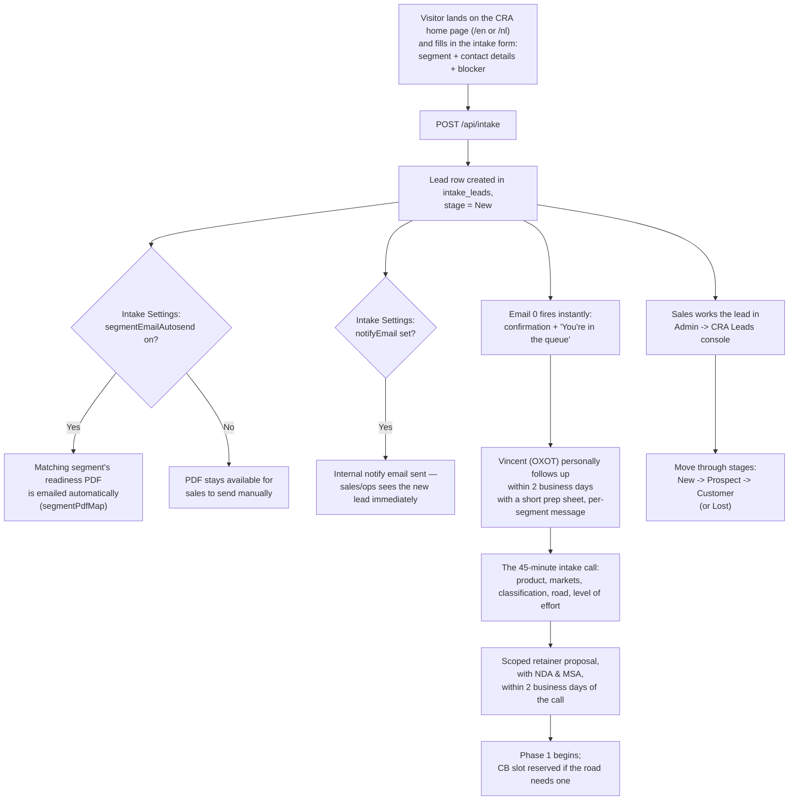

# OXOT — Marketing & Sales Reference

A plain-language reference for marketing and sales, built directly from the live
site copy — not paraphrased or invented. Quoted lines are exact copy from
`data/cra_home_en.json` (the home page) and `data/cdt_en.json` (the Cyber Digital
Twin page) unless noted otherwise, so sales stays consistent with what visitors
actually read.

**Cross-reference:** where each block of copy lives in the admin (to edit it) →
`docs/ADMIN-USER-MANUAL.md`; which URL each page lives at → `docs/SITEMAP.md`.

---

## 1. What OXOT offers

### The CRA Readiness programme

OXOT is described on the home page as: **"an operational-technology compliance
specialist. We classify your products, build defensible technical files on IEC
62443, and hold reserved assessment slots with our Conformity Body partners — so
you're prepared, not queued."**

The programme is built around the EU **Cyber Resilience Act** (Reg (EU) 2024/2847),
with a hard deadline the whole page is organized around: **"By 11 December 2027,
every product with digital elements needs a security case."**

**How a client gets there — three phases, always starting with the free intake:**

| Phase | What it covers (site copy) |
|---|---|
| **Phase 1 — Classify & scope** (always OXOT) | "Classification with written rationale, gap assessment, IRA · ZCR · SL-T, testing scope — and your road." |
| **Phase 2 — Test & evidence** | "The 13 properties and 8 processes, evidenced — on our bench, or a dossier the CB waves through, not sends back." |
| **Phase 3 — File & lifecycle** | "Annex VII technical file, Declaration of Conformity, PSIRT, 5-year updates, 10-year retention." |

**The 45-minute intake** is the entry point to everything: *"45 minutes, free, with
an OT compliance specialist. You leave with a live classification read, your likely
road (A / B+C / H), and a level-of-effort estimate — a scoped retainer proposal with
NDA & MSA within 2 business days. You keep all three answers either way."*

**The three roads to the CE mark** (a client is routed to exactly one, decided in
Phase 1):

1. **Road A — Self-declaration** (Module A). "Default products · Class I with a
   harmonised standard · 17–32 wks." Currently **closed for Class I** — the site
   flags this prominently: *"⚠ CLOSED FOR CLASS I — until standards are cited
   (~Q2 2027)."* OXOT still runs all three phases on the client's bench; the client
   signs their own Declaration of Conformity.
2. **Road B+C — Type examination.** "Class I today · all Class II · Critical (until
   EUCC) · 4–8 mo." OXOT's pitch here is capacity: *"⛟ RESERVED SLOT — OXOT CB
   partnerships skip the public queue; formal handover, clean dossier."* Result: "CE
   MARK · EU-type certificate + CB number."
3. **Road H — Full quality assurance.** "Multi-product portfolios — one audited QMS
   · 8–14 mo build." Positioned for scale: *"⟳ SCALES — new products join the
   approved QMS in 4–8 weeks."* Result: "CE MARK · QMS approval, portfolio-wide."

**The retainer** (how it's sold, and priced): *"A bucket of specialist hours against
a transparent rate card, sized by the intake — **typical engagements start around
€20K**. Hours draw down against the phases; retainer clients hold priority on our
bench and our Conformity Body slots."* The retainer includes **"the reserved
seat"** — held Conformity Body slots — pitched as: *"Our Phase-1 output arrives in
the format the bench expects — less churn, fewer loops, shorter queue."*

### The Cyber Digital Twin platform

Positioned as the engine underneath the CRA programme (and sellable on its own).
Site copy: *"A living model of your OT estate — prioritized by data, bounded by
confidence intervals."* Longer version: *"The Cyber Digital Twin is a seven-layer
graph of everything you operate: assets, software, dependencies, threats and
controls, held as one structured view. On top of it runs a Monte Carlo prediction
pipeline that stress-tests how an adversary could actually move through your
specific facility — so you invest against probable, high-consequence paths, not an
isolated CVSS score."*

Core components, as described on the page (`/cyber-digital-twin`):

- **Seven-layer graph** — L0 Equipment Catalog (the vendor reference) through L6
  Prediction & Controls, including L1 Customer Equipment ("the territory: actual
  serial-numbered assets, real firmware versions and patch state"), L2 Software &
  Dependencies, L3 Threat Intelligence, L4 Human & Organization, and L5 Information
  Environment.
- **DEXPI 2.0 BOMs** — five machine-readable bill-of-materials types: **SBOM**
  (software), **HBOM** (hardware), **CBOM** (cryptography, including post-quantum
  posture), **SaaS-BOM** (cloud services/APIs), **Ops-BOM** (deployment context).
  Pitch line: *"Evidence as data — on a DEXPI 2.0 engineering schema."*
- **KEV / EPSS / CVSS enrichment** — every finding is cross-referenced against
  CISA's Known Exploited Vulnerabilities list, the Exploit Prediction Scoring
  System, and CVSS, "so prioritization moves beyond a single-dimension CVE."
- **FMECA / RCIL / SCIL** — consequence analysis grounded in safety/reliability
  engineering, not just vulnerability scoring: *"We start from what breaks, not
  from what scores highest."* FMECA = Failure Mode, Effects & Criticality Analysis;
  RCIL = Reliability-Critical Items List; SCIL = Safety-Critical Items List.
- **NOW / NEXT / NEVER prioritization** — findings bucketed by *"consequence ×
  exploitability pathway (from KEV / EPSS / threat modeling)"* — explicitly **not**
  a checklist ranking. Example from the site: *"A critical-consequence asset with
  no reachable path is not a NOW; a modest-consequence asset on an actively
  exploited path can be."*
- **Monte Carlo simulation** — *"10,000 simulated campaigns per pass,"* MITRE
  ATT&CK-aligned, producing a probability distribution with a stated 95% confidence
  interval rather than a single point estimate. Sample stat used on the page: *"P
  (adversary reaches a safety-critical system), 95% CI"* — mean 8.4%, range
  6.1–11.2%.

What it unlocks, per the site's own framing: **CRA readiness at portfolio scale**
("the same BOMs, risk artifacts and SL rationale the twin regenerates are exactly
what a Cyber Resilience Act technical file demands"), **IEC 62443 natively**
("zones and conduits, target and achieved security levels, and ALARP rationale
live on the graph"), **NIS2 risk management**, and **board-grade reporting** ("not
a maturity score — a probability landscape").

---

## 2. The five buyer segments

From the home page's **Personas** section — five segments, one programme, entered
through different doors:

| Segment | Their stated pain (verbatim quote) | What they buy |
|---|---|---|
| **Manufacturers** | "Every line needs its own SBOM, CVD process, risk assessment and technical file — and nobody in this building can tell me which class each product is even in." | Classification & full programme |
| **OEMs** | "40 product families, 3 product-security people. And anything we white-label makes us the manufacturer — whether we built it or not." | Portfolio triage & Module H |
| **Integrators** | "62443-2-4 shows up in every procurement contract now — and when we customise a vendor's product for a project, nobody can tell me whether we just became its manufacturer." | Boundary analysis & evidence pack |
| **Resellers & distributors** | "We move thousands of SKUs from dozens of suppliers. Which can we legally sell after December 2027 — and which own-brand lines quietly made us a manufacturer?" | Line-card review & exposure register |
| **Owner/operators** | "Much of our supplier portfolio has an unknown CRA posture, our OT contracts run for decades — and the board wants third-party-validated evidence, not vendor promises." | Supplier scan & procurement gates |

These same five values (`manufacturer`, `oem`, `integrator`, `reseller`,
`operator`) are the exact segment values captured on the intake form and used to
route both the automated follow-up email and (if enabled) the auto-sent readiness
PDF — see §4.

---

## 3. Key proof points and messaging pillars

### From the home page — "Why OXOT wins" (four pillars, verbatim)

1. **"OT-native, not IT-adapted."** *"IEC 62443 is our home standard — the
   clearest route to presumption of conformity for OT products. Every artifact
   serves 62443 and CRA at once."*
2. **"Model-based economics."** *"The digital twin turns compliance from a
   per-document cost into a per-model asset: releases are differentials,
   portfolios batch shared evidence, marginal cost falls per product."*
3. **"Capacity when it's scarce."** *"Reserved CB slots and CB-format handovers —
   the constraint in 2027 is bench time, and retainer clients hold it."*
4. **"Recurring by design."** *"CRA obligations run for the product lifecycle —
   5-year updates, PSIRT, surveillance. The retainer is the delivery vehicle, from
   ~€20K, scoped at intake."*

### The urgency numbers (home page "stat band" — approved, use as-is)

| Value | Label |
|---|---|
| **11 Dec 2027** | conformity mandatory — "no CE mark, no EU market" |
| **16–24 wks** | per third-party assessment — "capacity is the bottleneck" |
| **€15M / 2.5%** | maximum penalty — "of worldwide turnover" |
| **5 segments** | one engine — "manufacturers · OEMs · integrators · resellers · operators" |

### The "2026 reality" callout (used to create urgency — verbatim)

*"THE 2026 REALITY — zero Notified Bodies designated · Class I self-assessment
closed until harmonised standards are cited (~Q2 2027) · designation takes 12–18
months. The queue forms before the doors open."*

### The Conformity/Frameworks platform's headline claim

From the Conformity page (`/conformity`, see `data/conformity_home_en.json`):
*"Four regulations. One evidence system."* — *"OXOT unifies the Cyber Resilience
Act, the AI Act, the Machinery Regulation and IEC 62443 into a single, living
source of conformity evidence — so your teams prove compliance instead of chasing
it."* Supporting stats on that page: **"4-in-1 regulations"**, **"70% less
duplicate work"**, **"Weeks, not quarters"** to an audit-ready dossier, **"100%
traceable"** (every claim linked to evidence).

### Cyber Digital Twin — headline claim

*"A living model of your OT estate — prioritized by data, bounded by confidence
intervals."*

**Do not** use numbers or claims not listed above — if a number isn't quoted here,
verify it in the live admin content (Home page / Cyber Digital Twin / Conformity
page editors) before using it externally, since these are DB-editable and can
change without a code deploy.

---

## 4. How the lead funnel works, end to end

**What sales should do in the admin CRA Leads console:**

1. **Watch the New count** — the stage tabs show a live badge; that's the queue.
2. **Open a lead** to see their segment, stated blocker, locale, source page, and
   (if they also chatted with the AI assistant) the full linked chat transcript —
   read it before calling, it's often the best qualification signal available.
3. **Check "Similar leads"** — vector-similarity matches on blocker text/segment
   can surface a pattern (e.g. three integrators all naming the same customization
   boundary problem) worth flagging to the team.
4. **Move the stage** as the deal progresses: New → Prospect (actively engaged) →
   Customer (signed) or Lost.
5. **Tag and note** — free-form tags plus an internal note field, both editable
   per lead, for whatever the team needs to track (e.g. "urgent — Q1 deadline",
   "needs Dutch-language proposal").
6. **Reply** — the Reply button opens your email client pre-filled with the lead's
   address and marks the lead as responded, so the team has an accurate record of
   who's been contacted.
7. **Check scheduling status** — if a Cal.com/Calendly link is configured (Intake
   Settings), the lead's card shows whether they've booked a call yet.

**Owning the process settings:** the calendar provider/URL, whether the segment PDF
auto-sends, the PDF mapped to each segment, and the internal notify address are all
configured by an admin in the **Intake Settings** card at the top of CRA Leads (see
`docs/ADMIN-USER-MANUAL.md` → CRA Leads for the exact steps) — sales doesn't need
code access to change any of this.

---

## 5. Where each message lives on the site (for marketing updates)

| Message / section | Live URL | Edit in admin |
|---|---|---|
| Hero, urgency stats, "2026 reality" callout | `/en`, `/nl` | **Home page** |
| Departure board (three roads + milestones) | `/en`, `/nl` (home page) | **Home page** → Departure board |
| Roads split (self-declaration / type exam / full QA detail) | `/en`, `/nl` (home page) | **Home page** → Roads split |
| Five buyer-segment persona cards | `/en`, `/nl` (home page) | **Home page** → Personas |
| Retainer pricing/phrasing, reserved seat | `/en`, `/nl` (home page) | **Home page** → Retainer |
| "What happens when you press the button" process steps | `/en`, `/nl` (home page) | **Home page** → Process strip |
| Intake form copy, final CTA | `/en`, `/nl` (home page) | **Home page** → Intake section / Final CTA |
| Cyber Digital Twin platform copy (all sections) | `/en/cyber-digital-twin`, `/nl/cyber-digital-twin` | **Cyber Digital Twin** |
| "Four regulations, one evidence system" conformity messaging | `/en/conformity`, `/nl/conformity` | **Conformity page** |
| Legacy "Approach" content | `/en/industrial-operations`, `/nl/industrial-operations` | **Approach page** |
| Intake follow-up email copy (Vincent's emails, per segment) | sent by `/api/intake` | `src/lib/intake-emails.ts` — **code change required**, not admin-editable; flag to engineering |
| Hero carousel images/captions | `/en`, `/nl` hero, right-hand side | **Carousel** |
| Newsletter campaigns | sent by email | **Newsletter & Social** → Campaigns |
| Social profile links shown in footer/"Follow Along" | every page footer | **Integrations** → LinkedIn "Company/profile URL", X "Username" |
| Blog / insights articles | `/en/blog`, `/nl/blog` | **Pages** (content type: article) |
| SEO meta / OG per page | each page's `<head>` | **Pages** → SEO/social fields |
| Affiliate links inserted into body copy | wherever a page mentions a matching keyword | **Affiliate & SEO** |

Note: the per-segment intake follow-up emails (Emails 1–5, one per buyer segment)
are hardcoded in `src/lib/intake-emails.ts`, not editable from the admin — route
copy changes there through engineering, not the CMS.

---

## 6. Notes and caveats

- All quoted copy above is **live as of this document's writing** and is
  **DB-editable** — anyone with admin access can change it at any time without a
  code deploy (see §5's table). Before quoting a number or claim externally
  (proposals, decks, ads), verify it's still current in the relevant admin editor
  or the live page itself.
- The three-roads urgency framing (Class I closed, ~Q2 2027 reopening, 12–18 month
  Conformity Body designation timelines) reflects the regulatory state as
  understood **at the time this copy was written** — these are exactly the kind of
  facts that change as the EU designates Notified/Conformity Bodies and publishes
  harmonised standards. **[UNVERIFIED]** whether there is a process for
  re-validating these dates on a schedule; flag to the content owner if this
  document or the live copy hasn't been reviewed recently against current EU
  Cyber Resilience Act guidance.
- Retainer pricing ("typical engagements start around €20K") is the only number on
  the site; there is no published rate card. Do not quote a more precise figure
  without checking with the team that owns pricing.
