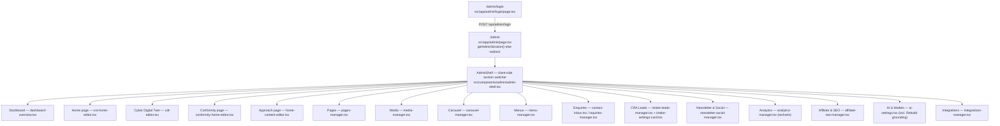
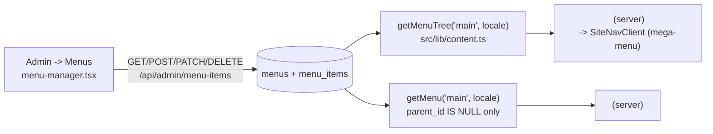
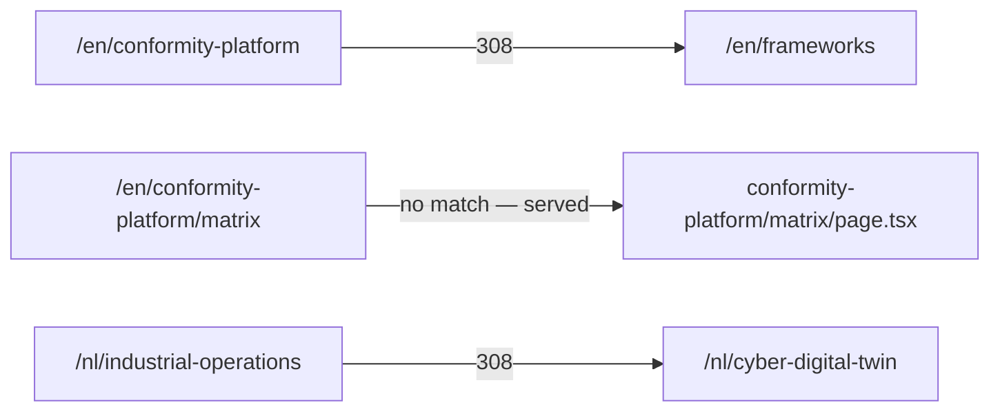
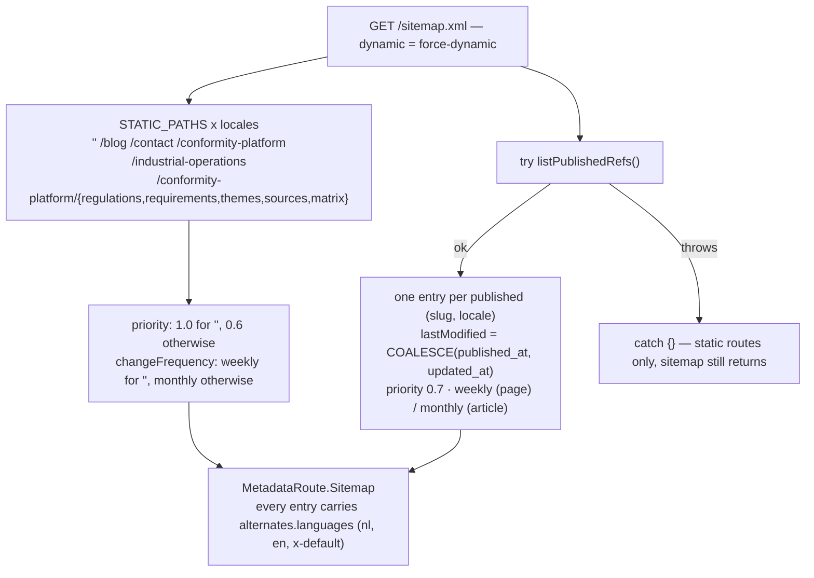

# OXOT Website — Route Map & Navigation

Complete inventory of public routes, admin routes and API endpoints, derived from
the file tree under `src/app/` and each route's source. Every public page exists
under **both** `/nl` and `/en`; there are no un-prefixed public pages.

---

## 1. How routing works

- **Locale segment is mandatory.** All public pages live under
  `src/app/[locale]/`. Every route calls `isLocale(locale)` (from
  `src/i18n/config.ts`, which allows only `"nl"` and `"en"`) and `notFound()`
  otherwise.
- **`generateStaticParams()`** in `src/app/[locale]/layout.tsx` returns both
  locales, but every route also sets `export const dynamic = "force-dynamic"`, so
  nothing is prerendered or cached.
- **No `middleware.ts`.** There is no locale-detection redirect from `/` — a bare
  `/` falls through to `src/app/not-found.tsx`. **[UNVERIFIED]** whether a
  platform-level redirect handles the apex path in production.
- **Coded routes shadow the `[slug]` catch-all.** Where both a static segment and
  a `pages` row exist for the same name (`cyber-digital-twin`, `contact`), Next.js
  serves the static route. The `pages` row is retained (zero-loss) and would be
  served again if the coded route were removed.

---

## 2. Public route inventory

### Coded routes

| Path (both locales) | File | Renders from |
|---|---|---|
| `/[locale]` | `src/app/[locale]/page.tsx` | `site_blocks.cra_home` via `getCraHome()`; sections from `@/components/cra-home/sections` |
| `/[locale]/conformity` | `src/app/[locale]/conformity/page.tsx` | `site_blocks.conformity_home` via `getConformityHome()` + `getSummary()`; the previous home page, preserved verbatim |
| `/[locale]/cyber-digital-twin` | `src/app/[locale]/cyber-digital-twin/page.tsx` | `site_blocks.cdt_home` via `getCdt()`; shadows the legacy `pages` row of the same slug |
| `/[locale]/industrial-operations` | `src/app/[locale]/industrial-operations/page.tsx` | `site_blocks.home` via `getHomeContent()`; the legacy "Approach" landing page |
| `/[locale]/contact` | `src/app/[locale]/contact/page.tsx` | `pages` row `slug='contact'` (markdown) **plus** the coded `<ContactForm />` |
| `/[locale]/blog` | `src/app/[locale]/blog/page.tsx` | `listArticles(locale)` — `pages WHERE content_type='article'` |
| `/[locale]/conformity-platform` | `.../conformity-platform/page.tsx` | `conformity_*` tables via `src/lib/conformity.ts` |
| `/[locale]/conformity-platform/regulations` | `.../regulations/page.tsx` | `conformity_regulations` |
| `/[locale]/conformity-platform/requirements` | `.../requirements/page.tsx` | `conformity_requirements` |
| `/[locale]/conformity-platform/themes` | `.../themes/page.tsx` | `conformity_themes`, `conformity_mappings` |
| `/[locale]/conformity-platform/matrix` | `.../matrix/page.tsx` | `getMatrixCells()` |
| `/[locale]/conformity-platform/sources` | `.../sources/page.tsx` | `conformity_sources` |
| `/[locale]/newsletter/confirmed` | `.../newsletter/confirmed/page.tsx` | static confirmation copy |
| `/[locale]/newsletter/invalid` | `.../newsletter/invalid/page.tsx` | static error copy |
| `/[locale]/newsletter/unsubscribed` | `.../newsletter/unsubscribed/page.tsx` | static confirmation copy |

All six `conformity-platform/*` routes share
`src/app/[locale]/conformity-platform/layout.tsx`, which renders a breadcrumb
(`Home › Frameworks › Platform`) and the `ConformitySubnav`.

### CMS routes — the `[slug]` catch-all

`src/app/[locale]/[slug]/page.tsx` serves any published `pages` row via
`getPublishedPage(slug, locale)`; an unpublished or missing slug yields
`notFound()`.

Slugs present in `content/pages/{en,nl}/` (both locales, seeded by
`scripts/seed-pages.mjs`):

| Group | Slugs |
|---|---|
| Hubs | `services`, `frameworks`, `about`, `cyber-digital-twin` (shadowed by the coded route) |
| Frameworks / regulations | `cra`, `nis2`, `ai-act`, `machine-act`, `iec-62443`, `ts-50701` |
| CRA reference | `cra-technical-reference`, `cra-ce-marking-pathways` |
| Individual services | `ot-security-assessments`, `ot-security-programmes`, `architecture-segmentation`, `secure-remote-access`, `ot-security-baseline`, `capability-transfer` |
| Article | `cdt-fooled-by-randomness` (`content_type='article'`) |

Additional slugs seeded by migration only (no markdown file):
`contact` (003/016) and the legal pages `privacy`, `terms`, `cookies` (026).

`[slug]/page.tsx` applies a per-slug **kicker** map (`KICKER`) for the article
header, computes reading time (`words / 200`), counts external link sources from
the markdown, extracts a TOC (`extractToc`), and renders
`<FrameworkPlatformLink>` to cross-link framework pages into the conformity
platform.

### Error and metadata routes

| Path | File |
|---|---|
| `/[locale]/*` (unmatched) | `src/app/[locale]/not-found.tsx` — bilingual 404 |
| `/*` (outside a locale) | `src/app/not-found.tsx` |
| `/[locale]` loading state | `src/app/[locale]/loading.tsx`, `.../blog/loading.tsx` |
| `/sitemap.xml` | `src/app/sitemap.ts` |
| `/robots.txt` | `src/app/robots.ts` |
| `/manifest.webmanifest` | `src/app/manifest.ts` |
| `/favicon.ico`, `/icon.svg`, `/apple-icon.png` | file conventions in `src/app/` |

---

## 3. Site map

```mermaid
flowchart TD
    ROOT["/[locale]<br/><b>Home — CRA readiness</b><br/>site_blocks.cra_home"]

    ROOT --> SVC["/services<br/>CMS page"]
    SVC --> S1["/ot-security-assessments"]
    SVC --> S2["/ot-security-programmes"]
    SVC --> S3["/architecture-segmentation"]
    SVC --> S4["/secure-remote-access"]
    SVC --> S5["/ot-security-baseline"]
    SVC --> S6["/capability-transfer"]

    ROOT --> CDT["/cyber-digital-twin<br/><b>coded</b> — site_blocks.cdt_home<br/>(Approach folded in, migration 040)"]

    ROOT --> FW["/frameworks<br/>CMS hub"]
    FW --> F1["/cra"]
    FW --> F2["/nis2"]
    FW --> F3["/ai-act"]
    FW --> F4["/machine-act"]
    FW --> F5["/iec-62443"]
    FW --> F6["/ts-50701"]
    FW --> CM["/conformity-platform/matrix<br/><i>Coverage Matrix</i>"]
    FW --> CR["/conformity-platform/requirements<br/><i>Requirements</i>"]
    FW --> CT["/conformity-platform/themes<br/><i>Themes</i>"]
    FW --> CS["/conformity-platform/sources<br/><i>Resources</i>"]

    ROOT --> BLOG["/blog<br/>Insights — pages WHERE content_type='article'"]
    BLOG --> ART["/cdt-fooled-by-randomness"]

    ROOT --> ABOUT["/about<br/>CMS page"]
    ROOT --> CONTACT["/contact<br/>coded route + CMS body"]

    ROOT -. "not in main nav" .-> CONF["/conformity<br/>preserved conformity home"]
    ROOT -. "not in main nav" .-> IO["/industrial-operations<br/>legacy Approach page"]
    ROOT -. "not in main nav" .-> CPO["/conformity-platform<br/>overview (redirected)"]
    ROOT -. "footer only" .-> LEGAL["/privacy · /terms · /cookies"]
    ROOT -. "callback landings" .-> NL["/newsletter/confirmed · /invalid · /unsubscribed"]

    style ROOT fill:#F07000,color:#102030
    style CDT fill:#F07000,color:#102030
    style FW fill:#F07000,color:#102030
```



The four *Coverage Matrix / Requirements / Themes / Resources* items live at
`/conformity-platform/*` URLs but are **children of Frameworks in the nav** —
migration `038` re-parented them (positions 7–10) before deleting the old
top-level "Conformity Platform" parent.

### Admin console (separate tree)



The admin is a **single route** (`/admin`) with a client-side section switcher —
there are no `/admin/<section>` URLs. Section keys come from the `NAV` array in
`admin-shell.tsx`. `/admin` and `/api` are both disallowed in `robots.ts`.

---

## 4. DB-driven navigation

**The main navigation is data, not code.** Editing it means editing rows, not
editing a component.



- `getMenuTree(key, locale)` selects `id, parent_id, label, href, description,
  position` ordered by `position`, then builds a `MenuNode[]` tree in memory
  (`byId` map + roots). Orphans whose `parent_id` is not in the result set are
  promoted to roots.
- `getMenu(key, locale)` returns the flat top level only
  (`WHERE mi.parent_id IS NULL`) — used by the footer.
- `src/components/site-nav.tsx` wraps the call in `try/catch` and passes an empty
  array on DB failure, so nav loss never 500s a page.
- `menu_items.href` values are **absolute and locale-prefixed** (`/en/frameworks`,
  `/nl/kaders` is *not* used — the NL rows use `/nl/frameworks` with a Dutch
  label). Adding a locale means adding rows, not changing the component.

Current top-level `main` menu (seeded by `005`, amended by `038`/`040`):

| Position | EN label | NL label | href |
|---|---|---|---|
| 0 | Home | Home | `/{locale}` |
| 1 | Services | Diensten | `/{locale}/services` |
| 2 | Cyber Digital Twin | Cyber Digital Twin | `/{locale}/cyber-digital-twin` |
| 3 | Frameworks | Kaders | `/{locale}/frameworks` |
| 4 | Insights | Kennisbank | `/{locale}/blog` |
| 5 | About | Over ons | `/{locale}/about` |
| 6 | Contact | Contact | `/{locale}/contact` |

Frameworks children (from `012` and, re-parented, `038`):
`/cra`, `/nis2`, `/ai-act`, `/machine-act`, `/iec-62443`, `/ts-50701`, plus
Coverage Matrix (`Dekkingsmatrix`), Requirements (`Vereisten`),
Themes (`Thema's`), Resources at positions 7–10.

Services children: `013` seeded the hub link, `014` switched them to
`/services#anchor` fragments, and `015` moved them to standalone
`/{locale}/<service-slug>` pages.

The "Approach" / "Onze aanpak" top-level item (added by `023`, pointing at
`/industrial-operations`) was **removed** by `040`; the page itself is untouched.

Footer links (`src/components/site-footer.tsx`): the flat `main` menu, plus
hard-coded `/{locale}/privacy` and `/{locale}/terms`, plus the admin-managed
social links from `getPublicSocials()`.

---

## 5. Redirects

Configured in `next.config.mjs` `redirects()`:

| Source | Destination | Type | Rationale |
|---|---|---|---|
| `/:locale(en\|nl)/conformity-platform` | `/:locale/frameworks` | permanent (308) | Migration `038` folded the Conformity Platform overview into Frameworks |
| `/:locale(en\|nl)/industrial-operations` | `/:locale/cyber-digital-twin` | permanent (308) | Migration `040` folded Approach into the coded CDT page |

**Both patterns are bare — no trailing wildcard.** This is deliberate and
documented in the config: `/:locale(en|nl)/conformity-platform` matches only the
exact overview path, so `/en/conformity-platform/matrix`, `/requirements`,
`/themes` and `/sources` continue to resolve normally.



**Preserved routes.** Both source pages still exist in the codebase and are
reachable if the redirect is removed:

- `src/app/[locale]/conformity-platform/page.tsx` — the CP overview, still
  rendered by the file and still listed in `sitemap.ts`.
- `src/app/[locale]/industrial-operations/page.tsx` — the legacy Approach page,
  reading `site_blocks.home`, still editable in Admin → *Approach page*.
- `src/app/[locale]/conformity/page.tsx` — the previous home page, never
  redirected, still the target of Admin → *Conformity page*.

> **Inconsistency to be aware of:** `sitemap.ts` still emits
> `/{locale}/conformity-platform` and `/{locale}/industrial-operations` in
> `STATIC_PATHS`, so the sitemap advertises two URLs that immediately 308. It
> does **not** list `/{locale}/conformity`, `/{locale}/cyber-digital-twin`,
> `/{locale}/newsletter/*`, or the CMS-only legal pages beyond what
> `listPublishedRefs()` returns. Worth reconciling.

---

## 6. API route inventory

All handlers set `runtime = "nodejs"` where declared. "Admin" means the handler
calls `getAdminSession()` (`src/lib/auth.ts`) and returns 401 without a valid
`oxot_admin` cookie.

### Public endpoints

| Route | Methods | Auth | Protections |
|---|---|---|---|
| `/api/agent` | POST | public | consent required (`visitor_sessions.consent_at`), rate limit 20/min/IP |
| `/api/session` | POST, PATCH | public | creates a session / grants consent |
| `/api/events` | POST | public | consent required, rate limit 600/min/IP, `meta` capped at 4 KB, type ∈ `page\|click\|scroll\|dwell` |
| `/api/track` | POST | public | rate limit 300/min/IP, bot-UA filtered, **always acks** |
| `/api/contact` | POST | public | honeypot, IP-hash rate limit |
| `/api/intake` | POST | public | honeypot (fake 200), IP-hash rate limit, best-effort embed |
| `/api/newsletter/subscribe` | POST | public | rate limited, double opt-in token |
| `/api/newsletter/confirm` | GET | public | `confirm_token` → `/newsletter/confirmed` or `/invalid` |
| `/api/newsletter/unsubscribe` | GET | public | `unsubscribe_token` → `/newsletter/unsubscribed` |
| `/api/carousel` | GET | public | active slides for the hero |
| `/api/media/[id]` | GET | public | streams `media.bytes` with its `mime` |
| `/api/go/[id]` | GET | public | affiliate click-tracking redirect (writes `link_clicks`) |
| `/api/cron` | POST, GET | **`CRON_SECRET`** via `x-cron-secret` header or `?key=` | scheduled newsletter sends + LinkedIn token-expiry check; disabled when the secret is unset |

### Auth endpoints

| Route | Methods | Auth |
|---|---|---|
| `/api/admin/login` | POST | public (verifies password, sets the session cookie) |
| `/api/admin/logout` | POST | public (clears the cookie) |
| `/api/admin/email/oauth/callback` | GET | public — OAuth provider callback; validated by `src/lib/oauth-state.ts` |
| `/api/admin/social/linkedin/oauth/callback` | GET | public — same pattern |

### Admin endpoints (all require a valid admin session)

| Route | Methods | Purpose |
|---|---|---|
| `/api/admin/stats` | GET | dashboard counters |
| `/api/admin/pages` | GET, POST, DELETE | CMS page CRUD (snapshots + `queueReindex`) |
| `/api/admin/pages/versions` | GET | version list for a slug/locale |
| `/api/admin/pages/versions/[id]` | GET | one full version |
| `/api/admin/pages/restore` | POST | transactional restore (snapshot-first) |
| `/api/admin/pages/translate` | POST | AI EN↔NL translation (`translation_model`) |
| `/api/admin/seo` | GET, PUT | per-page SEO fields (snapshots first) |
| `/api/admin/site-content` | GET, POST | `site_blocks.home` |
| `/api/admin/cra-home` | GET, PUT | `site_blocks.cra_home` |
| `/api/admin/cdt` | GET, PUT | `site_blocks.cdt_home` |
| `/api/admin/conformity-home` | GET, PUT | `site_blocks.conformity_home` |
| `/api/admin/menu-items` | GET, POST, PATCH, DELETE | navigation editing |
| `/api/admin/media` | GET, POST, DELETE | media library |
| `/api/admin/carousel` | GET, POST | hero slides |
| `/api/admin/carousel/[id]` | PUT, DELETE | one slide |
| `/api/admin/carousel/reorder` | PUT | bulk `sort_order` |
| `/api/admin/contact` | GET, PATCH | enquiry inbox / triage |
| `/api/admin/intake` | GET, PATCH | CRA leads: stage, tags, notes |
| `/api/admin/intake-settings` | GET, PUT | notify email, segment autosend, PDF map, scheduling |
| `/api/admin/content/reindex` | POST, GET | start background grounding rebuild / poll progress |
| `/api/admin/ai-settings` | GET, PUT | providers, keys, per-role models |
| `/api/admin/ai-settings/models` | GET | OpenRouter model catalog (`src/lib/ai-catalog.ts`) |
| `/api/admin/integrations` | GET, PUT | SMTP / LinkedIn / X settings (masked on read) |
| `/api/admin/integrations/health` | GET | connectivity checks |
| `/api/admin/integrations/activity` | GET | merged `integration_events` + `social_posts` feed |
| `/api/admin/integrations/test-email` | POST | send a test message |
| `/api/admin/email/oauth/start` | GET | begin Gmail OAuth2 |
| `/api/admin/social` | GET, POST | social config / manual post |
| `/api/admin/social/linkedin/oauth/start` | GET | begin LinkedIn OAuth |
| `/api/admin/social/linkedin/oauth/redirect-uri` | GET | show the exact redirect URI to register |
| `/api/admin/social/linkedin/test` | POST | LinkedIn connectivity test |
| `/api/admin/social/x/test` | POST | X connectivity test |
| `/api/admin/newsletters` | GET, POST | drafts |
| `/api/admin/newsletters/[id]` | GET, PUT, DELETE | one newsletter |
| `/api/admin/newsletters/[id]/send` | POST | send now |
| `/api/admin/newsletters/[id]/schedule` | POST | schedule (picked up by `/api/cron`) |
| `/api/admin/newsletter-subscribers` | GET, DELETE, PATCH | subscriber list |
| `/api/admin/analytics` | GET | `page_views` + `link_clicks` aggregates |
| `/api/admin/affiliate` | GET, POST | affiliate links |
| `/api/admin/affiliate/[id]` | PUT, DELETE | one link |
| `/api/admin/affiliate/apply` | POST | insert links into page bodies (snapshots + reindex) |
| `/api/admin/affiliate/suggest` | POST | AI keyword suggestions |

---

## 7. SEO surface

### `generateMetadata`

Every public route exports an async `generateMetadata`. Two patterns:

- **Coded routes** pull title/description from the dictionary's `meta` object
  (e.g. `getDictionary(locale).craHome.meta`, `.cdt.meta`,
  `.conformityHome.meta`, `.conformity`) and call `alternates(locale, path)`.
- **`[slug]` CMS pages** build metadata from the row, with a documented fallback
  chain:

  | Field | Resolution |
  |---|---|
  | `title` | `meta_title ?? title` |
  | `description` | `meta_description ?? excerpt` |
  | `openGraph.title` | `og_title ?? title` |
  | `openGraph.description` | `og_description ?? description` |
  | `openGraph.type` | `article` when `content_type='article'`, else `website` |
  | `keywords` | `meta_keywords` split on `,`, trimmed, empties dropped |
  | `alternates.canonical` | `canonical_url` if non-blank, else `alternates()` default |
  | `robots` | `{ index: !noindex, follow: !noindex }` |
  | `twitter` | `summary_large_image` with the same title/description/image |

### `alternates()` / hreflang — `src/lib/seo.ts`

```ts
export function alternates(locale: Locale, path: string): Metadata["alternates"] {
  const clean = path && !path.startsWith("/") ? `/${path}` : path;
  const languages: Record<string, string> = {};
  for (const l of locales) languages[l] = `${SITE_URL}/${l}${clean}`;
  languages["x-default"] = `${SITE_URL}/en${clean}`;
  return { canonical: `${SITE_URL}/${locale}${clean}`, languages };
}
```

So every page emits `nl`, `en` and `x-default` (pointing at the English URL)
alternates plus a self-canonical. `SITE_URL` resolves from
`SITE_URL ?? NEXT_PUBLIC_SITE_URL ?? "https://oxot.nl"`, trailing slash stripped,
and is also set as `metadataBase` in `src/app/layout.tsx`.

### JSON-LD

| Schema | Emitted by | Scope |
|---|---|---|
| `Organization` | `organizationJsonLd({ sameAs })` in `src/app/layout.tsx` | every page; `sameAs` populated from `getPublicSocials()` (admin-managed LinkedIn/X) |
| `WebSite` | `websiteJsonLd()` in `src/app/layout.tsx` | every page |
| `Article` | `articleJsonLd()` in `src/app/[locale]/[slug]/page.tsx` | only when `content_type='article'` |

All are serialized by `jsonLdScript()`, which JSON-stringifies the object and
replaces every `<` with its `<` escape before injection via
`dangerouslySetInnerHTML` (preventing a `</script>` breakout).

### `sitemap.ts`



### `robots.ts`

```ts
rules:   [{ userAgent: "*", allow: "/", disallow: ["/admin", "/api"] }],
sitemap: `${SITE_URL}/sitemap.xml`,
host:    SITE_URL
```

Per-page `noindex` is handled separately, in `[slug]`'s `generateMetadata` robots
field, not in `robots.txt`.

### Other head surface

- **`manifest.ts`** — name, `short_name: "OXOT"`, `display: "standalone"`,
  `background_color`/`theme_color` `#102030`, 192/512/512-maskable icons.
- **`viewport.themeColor`** in `src/app/layout.tsx` — `#faf9f5` (light) /
  `#102030` (dark).
- **Fonts** — preconnect to `fonts.googleapis.com` / `fonts.gstatic.com`, then a
  single stylesheet for IBM Plex Mono, Instrument Sans and Newsreader.
- **Default OG image** — `/og/oxot-default.png` (`DEFAULT_OG_IMAGE`), made
  absolute by `ogImageUrl()`.

---

## 8. Uncertainties

1. **No apex redirect.** Nothing in `src/` redirects `/` to `/en` or `/nl`.
   **[UNVERIFIED]** whether Railway or a CDN handles it; the healthcheck targets
   `/en` directly.
2. **Sitemap/redirect mismatch** — `STATIC_PATHS` still advertises the two
   redirected paths and omits `/conformity`, `/cyber-digital-twin` and the
   newsletter landings (§5).
3. `menus.key = 'footer'` — the footer uses the `main` menu; no footer menu row
   was located. **[UNVERIFIED]**.
4. **Admin section deep-linking** — `AdminShell` switches sections in client
   state; **[UNVERIFIED]** whether the active section is reflected in the URL
   (hash or query) or is lost on reload.
5. Legal page slugs (`privacy`, `terms`, `cookies`) come from migration `026`
   only; they have no `content/pages/**` markdown source and so are not
   re-seedable via `npm run seed:pages`.
