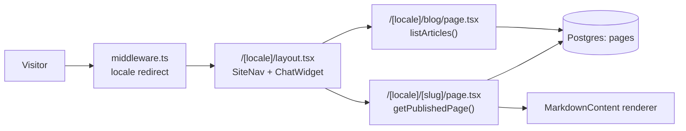
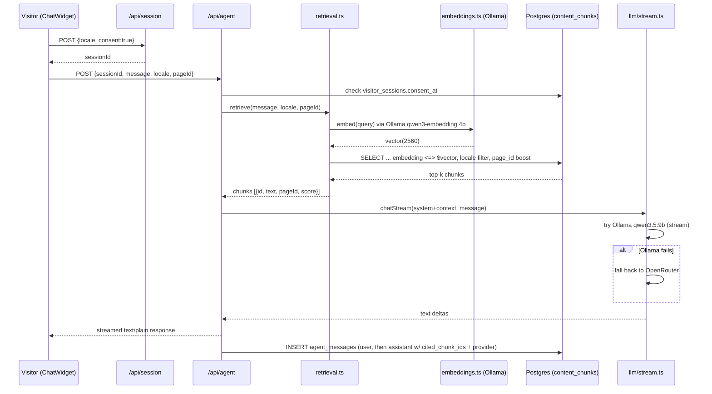
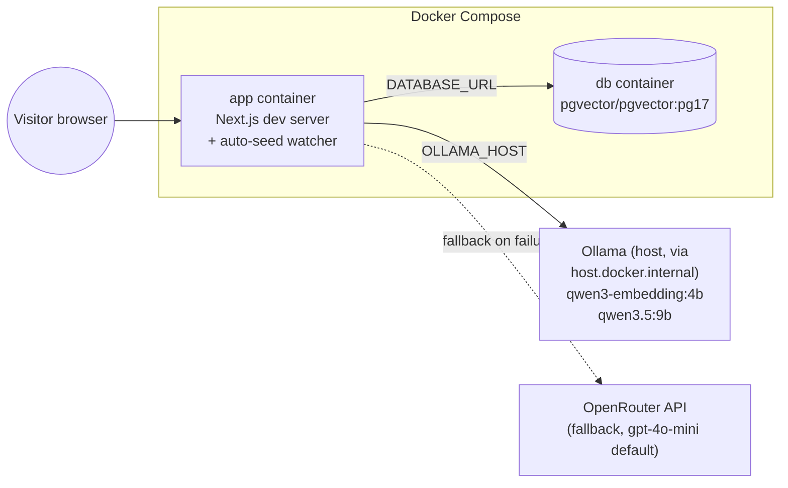

For: developers — system design reference.

# Architecture

See also: [Home](Home.md) · [Stack](Stack.md) · [Backend](Backend.md) · [Frontend](Frontend.md)

This page distills [`docs/ARCHITECTURE.md`](../ARCHITECTURE.md) (the original design doc) plus what's actually implemented in `src/`.

## 1. Request → render flow

Every public path is locale-prefixed (`/nl`, `/en`). `src/middleware.ts` redirects locale-less paths based on `Accept-Language` (defaults to `en`; `/admin` and `/api` are exempt).



- `src/app/[locale]/layout.tsx` resolves the locale, loads the i18n dictionary (`getDictionary`), renders `SiteNav` (queries `menus`/`menu_items` via `getMenu`) and mounts the `ChatWidget`.
- `src/app/[locale]/[slug]/page.tsx` calls `getPublishedPage(slug, locale)` (`src/lib/content.ts`) and 404s if the row doesn't exist or isn't published. `generateMetadata` derives `<title>`/`<meta description>`/OpenGraph from the SEO columns (falling back to `title`/`excerpt`).
- Both the CMS page route and the layout are `export const dynamic = "force-dynamic"` — pages are DB-driven and always fresh (trade-off: no static caching yet, see §6).

## 2. Data model (Postgres + pgvector)

Schema is built by 5 migrations in `db/migrations/`, applied in order by `scripts/migrate.mjs`.

| Table | Migration | Purpose | Key columns |
|---|---|---|---|
| `content_chunks` | 001 | embedded site content for AI-agent retrieval | `page_id text, locale text CHECK(nl,en), text, embedding vector(2560), source_ref, created_at`; index on `locale` |
| `visitor_sessions` | 001 | consent-gated visitor session | `id uuid, locale, consent_at, created_at` |
| `visitor_events` | 001 | behavioral signal stream | `session_id → visitor_sessions, type (page\|click\|scroll\|dwell), page_id, element, meta jsonb, ts` |
| `agent_messages` | 001 | agent conversation + provenance | `session_id, role CHECK(system,user,assistant), text, cited_chunk_ids bigint[], provider, ts` |
| `files` | 001 | file storage inside Postgres (brief requirement) | `id uuid, filename, content_type, bytes bytea, created_at` |
| `admin_users` | 002 | CMS auth (small team) | `id uuid, email unique, password_hash` (scrypt `salt:hash`) |
| `pages` | 002 (+004 adds SEO cols) | CMS pages, one row per (slug, locale) | `slug, locale CHECK(nl,en), title, body, published bool, updated_at`, **`UNIQUE(slug, locale)`**; 004 adds `meta_title, meta_description, excerpt, og_image, content_type CHECK(page,article), published_at` |
| `menus` | 002 | navigation containers | `id, key unique` (e.g. `'main'`) |
| `menu_items` | 002 | nav links per locale | `menu_id → menus, locale CHECK(nl,en), label, href, position`; index on `(menu_id, locale, position)` |

Migration 003 seeds the initial `main` menu and the six core pages (nl+en). Migration 005 re-seeds the menu to add the "Insights" (blog) link. Both are idempotent (`ON CONFLICT` upserts / `DELETE` + re-`INSERT`).

## 3. The AI visitor agent: retrieval + generation



**Retrieval** (`src/lib/retrieval.ts`): embeds the query, then runs one SQL query against `content_chunks` —

```sql
SELECT id, text, page_id,
   (embedding <=> $1::vector)
     - (CASE WHEN page_id = $3 THEN 0.05 ELSE 0 END) AS score
FROM content_chunks
WHERE locale = $2
ORDER BY score ASC
LIMIT $4
```

Two properties: **locale-filtered** (`WHERE locale = $2`, so an `nl` visitor only gets `nl` chunks) and **current-page boosted** (a flat `0.05` cosine-distance bonus is subtracted when `page_id` matches the page the visitor is on, pulling same-page chunks toward the top without excluding others).

**Generation** (`src/lib/llm/`): a single `LLMProvider` interface (`provider.ts`) is implemented by `OllamaProvider` and `OpenRouterProvider`. `stream.ts`'s `chatStream()` tries local Ollama first (`stream:true`, NDJSON decoded line-by-line); on any fetch/HTTP failure it falls back to a non-streamed OpenRouter call and yields the whole response as one chunk. `llm/index.ts`'s non-streaming `chat()` applies the same try/fallback policy for callers that don't need streaming. There is one fallback policy, not scattered conditionals, per `CLAUDE.md` §4.

**Grounding**: `/api/agent`'s `systemPrompt()` injects retrieved chunks labeled `[id]`, instructs the model to answer only from context, answer in the visitor's locale, cite `[id]`s, and admit uncertainty instead of inventing (Karpathy rule 6). `agent_messages.cited_chunk_ids` and `.provider` persist which chunks and which provider served each assistant turn — also echoed in the `x-agent-citations` response header.

## 4. The content pipeline

There are **two independent Markdown pipelines** — do not confuse them:

```mermaid
flowchart TD
  subgraph CMS pipeline - what visitors see as pages
    A1["content/pages/{en,nl}/*.md\n+ frontmatter"] -->|"npm run seed:pages\n(scripts/seed-pages.mjs)"| B1[(pages table)]
    B1 -->|"getPublishedPage()"| C1["/[locale]/[slug] renderer\n(MarkdownContent)"]
  end
  subgraph Agent corpus - what the AI agent can cite
    A2["content/{nl,en}/*.md\n(no frontmatter)"] -->|"npm run ingest\n(scripts/ingest.mjs)"| B2[(content_chunks table,\nchunked + embedded)]
    B2 -->|"retrieve()"| C2[/api/agent grounding]
  end
```

- **CMS pipeline**: `content/pages/{en,nl}/<slug>.md` files with YAML-ish frontmatter (`title`, `meta_title`, `meta_description`, `excerpt`, `og_image`, `content_type`, `published`) are parsed and upserted into `pages` by `scripts/seed-pages.mjs` (`ON CONFLICT (slug, locale) DO UPDATE`). In local dev, `docker-compose.override.yml` runs a watcher loop that re-runs `seed:pages` whenever a file under `content/pages/**` changes — edits publish themselves within ~5s.
- **Agent corpus**: `content/{nl,en}/*.md` (plain text, no frontmatter) is chunked (`chunk()`, splits on blank lines, ~800 chars/chunk) and embedded by `scripts/ingest.mjs` (or the equivalent `src/lib/ingest.ts` for in-app use) into `content_chunks`. This is what `retrieve()` searches — it is **not** the same text as what's rendered on the page, so keep both in sync manually when content changes materially.

## 5. Architecture diagram (containers)



`docker-compose.yml` defines `app` (Next.js + Claude Code dev toolchain, `sleep infinity` by default) and `db` (`pgvector/pgvector:pg17`, not host-published). An optional `ollama` service exists behind the `with-ollama` profile but is disabled by default — `docker-compose.override.yml` instead points `OLLAMA_HOST` at the Mac's own Ollama (`host.docker.internal:11434`) to avoid a 7GB re-download, and makes the Next dev server the container's main process. See [Deployment-Operations](Deployment-Operations.md).

## 6. Key trade-offs

| Decision | Why | Cost / caveat |
|---|---|---|
| **Exact cosine search, no ANN index, at 2560-dim** | pgvector's HNSW/IVFFlat indexes cap at 2000 dimensions; `EMBED_DIM=2560` exceeds that. Migration 001's comment: exact `embedding <=> query` search is correct and fast for this small corpus. | Won't scale indefinitely — the documented upgrade path is to cast the column to `halfvec(2560)` (HNSW supports halfvec up to 4000 dims) and add an HNSW cosine index once `content_chunks` grows large enough that exact search is slow. |
| **2560-dim, not the 4096 in the original brief** | Matches the real output of the installed `qwen3-embedding:4b` model. | `EMBED_DIM` must stay consistent across `.env.local`, migration 001 (`__EMBED_DIM__` template var), and the runtime assertion in `embeddings.ts` — changing the model requires changing all three and re-migrating. |
| **Files stored as `bytea` in Postgres** | Brief requirement: one backup surface, transactional. | Bloats the DB; no CDN. Revisit with object storage if media volume grows (see `public/media/` for the one PDF/video currently shipped as static assets instead). |
| **Signed-cookie admin sessions, no auth library** | Zero dependencies, simple for a 1–2 person admin team. | No server-side revocation list (logout only clears the client cookie); acceptable at this scale — see [Backend](Backend.md) §Auth. |
| **`force-dynamic` on locale/CMS routes** | Pages and menus are DB-driven and must reflect the latest publish state immediately. | No static caching/ISR yet; add if traffic grows. |
| **Local Ollama primary, OpenRouter fallback** | Privacy (EU/NL), zero per-token cost, low latency on-box. | Single Ollama host is a capacity ceiling for concurrent chats; fallback exists but isn't yet proactive (only triggers on failure, not on load). |

## 7. What's explicitly not built yet

From `docs/ARCHITECTURE.md` §8 and `docs/HANDOFF.md`: automated tests, a contact form, scroll/dwell event beacons (only `page` and `click` are wired in `ChatWidget`), proactive (vs. purely reactive) agent behavior, ISR/caching, and health/latency monitoring on `/api/agent`.
