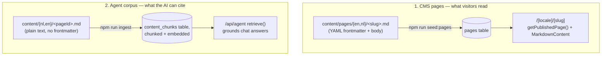

For: admins + developers — how content becomes a live page vs. an AI-agent-citable fact.

# Content Authoring

See also: [Home](Home.md) · [Architecture](Architecture.md) · [Backend](Backend.md) · [Admin-Guide](Admin-Guide.md)

There are **two separate content pipelines** in this repo. They look similar (both are Markdown files under `content/`) but feed completely different systems — mixing them up is the most common confusion point.



## 1. CMS pages (what visitors see rendered as pages)

**Location:** `content/pages/en/<slug>.md` and `content/pages/nl/<slug>.md` — one file per slug per locale, e.g. `content/pages/en/ai-act.md` and `content/pages/nl/ai-act.md`.

**Frontmatter** (parsed by `scripts/seed-pages.mjs`, a simple `key: value` block between `---` lines):

```markdown
---
title: The EU AI Act and Industrial AI
meta_title: EU AI Act for Industrial & OT AI | OXOT
meta_description: The EU AI Act (Regulation (EU) 2024/1689) for industry and OT...
excerpt: How the EU AI Act applies when AI enters the plant...
content_type: page
published: true
---

Artificial intelligence arrived on the plant floor without a launch date...
```

Recognized frontmatter keys: `title`, `meta_title`, `meta_description`, `excerpt`, `og_image`, `content_type` (`page` or `article`; anything else falls back to `page`), `published` (any value except the literal string `"false"` counts as published — so omitting the key defaults to published).

**Import:** `npm run seed:pages` (`scripts/seed-pages.mjs`) walks `content/pages/en/` and `content/pages/nl/`, parses each `.md`, and upserts into `pages`:

```sql
INSERT INTO pages (slug, locale, title, body, published, meta_title, meta_description,
                    excerpt, og_image, content_type, published_at, updated_at)
VALUES (...)
ON CONFLICT (slug, locale) DO UPDATE SET
  title=EXCLUDED.title, body=EXCLUDED.body, published=EXCLUDED.published,
  meta_title=EXCLUDED.meta_title, meta_description=EXCLUDED.meta_description,
  excerpt=EXCLUDED.excerpt, og_image=EXCLUDED.og_image, content_type=EXCLUDED.content_type,
  published_at=COALESCE(pages.published_at, EXCLUDED.published_at), updated_at=now()
```

The slug is taken from the filename (`ai-act.md` → slug `ai-act`); title falls back to the slug if `title` is missing from frontmatter.

**Auto-publish in dev**: `docker-compose.override.yml` runs a background loop inside the `app` container that re-runs `npm run seed:pages` whenever any file under `content/pages/**` is newer than a timestamp file, checked every 5 seconds — so editing and saving a Markdown file publishes it within seconds without a manual command. In production/CI, run `npm run seed:pages` explicitly as a deploy step instead.

**Rendering:** `getPublishedPage(slug, locale)` (`src/lib/content.ts`) fetches the row where `published = true`; `src/app/[locale]/[slug]/page.tsx` renders `page.body` through `MarkdownContent` (see [Frontend](Frontend.md) for what Markdown features it supports — headings/TOC, tables, callouts, SVG diagrams, carousels, etc.) and derives `<title>`/OpenGraph metadata from `metaTitle`/`metaDescription`/`excerpt`/`ogImage`.

**Bilingual publish rule**: whether you edit via Markdown file or the admin UI, a page cannot be marked `published` unless a row for the *other* locale already exists for the same slug (enforced in `POST /api/admin/pages`, see [Backend](Backend.md)). `seed-pages.mjs` itself does not enforce this guard (it upserts directly) — so it's possible to seed an `en`-only Markdown file as published via the script even without an `nl` sibling; the guard is admin-UI-only today. Keep both locale files present when authoring via Markdown to stay consistent with the CMS UI's rule.

## 2. Agent corpus (what the AI chat widget can cite)

**Location:** `content/en/<pageId>.md` and `content/nl/<pageId>.md` — plain text, **no frontmatter**. `<pageId>` is an arbitrary identifier (doesn't have to match a CMS slug, though keeping them aligned — e.g. `home.md`, `services.md`, `about.md`, `cyber-digital-twin.md` — makes the current-page retrieval boost meaningful).

**Import/embed:** `npm run ingest` (`scripts/ingest.mjs`) walks `content/nl/` and `content/en/`, and for each file:

1. Splits the text into chunks on blank lines, capped at ~800 characters (`chunk()` — same logic duplicated in `src/lib/ingest.ts` for in-app use).
2. Deletes any existing chunks for that `(page_id, locale)` pair.
3. Embeds each chunk via Ollama (`qwen3-embedding:4b`, must return exactly `EMBED_DIM` dimensions — see [Backend](Backend.md) for the dim-mismatch assertion) and inserts into `content_chunks` with `source_ref = content/{locale}/{file}`.

```bash
docker compose exec app npm run ingest
```

Output looks like:
```
ingested en/services.md: 4 chunks
ingested nl/services.md: 4 chunks
Done: 16 chunks embedded.
```

**Retrieval:** `/api/agent` calls `retrieve(message, locale, pageId)`, which embeds the visitor's question and does a locale-filtered, current-page-boosted cosine search over `content_chunks` (see [Architecture](Architecture.md) §3 and [Backend](Backend.md) for the exact SQL). Retrieved chunks are injected into the system prompt as `[id] (pageId) text`, and the model is instructed to answer only from that context and cite `[id]`s.

**This corpus is not automatically kept in sync with CMS pages.** If you materially change a CMS page's content (`content/pages/{en,nl}/*.md` or via the admin UI), also update the matching `content/{en,nl}/*.md` file and re-run `npm run ingest`, or the chat widget will answer from stale or missing information for that topic.

## Practical authoring checklist

- [ ] Write both `content/pages/en/<slug>.md` and `content/pages/nl/<slug>.md` (bilingual, non-negotiable per `CLAUDE.md` §3).
- [ ] Fill in `meta_title`/`meta_description`/`excerpt` frontmatter for SEO (see [Admin-Guide](Admin-Guide.md) for guidance on lengths).
- [ ] Set `content_type: article` if it should appear in the Insights/Kennisbank blog index (`listArticles`); leave as `page` (or omit) otherwise.
- [ ] Run `npm run seed:pages` (or let the dev-container watcher pick it up) and verify at `/en/<slug>` and `/nl/<slug>`.
- [ ] If the content should be answerable by the AI chat widget, also add/update `content/en/<pageId>.md` and `content/nl/<pageId>.md`, then run `npm run ingest`.
- [ ] If you added a new page that should appear in navigation, add a `menu_items` row (via admin UI or `POST /api/admin/menu-items`) for both locales.
